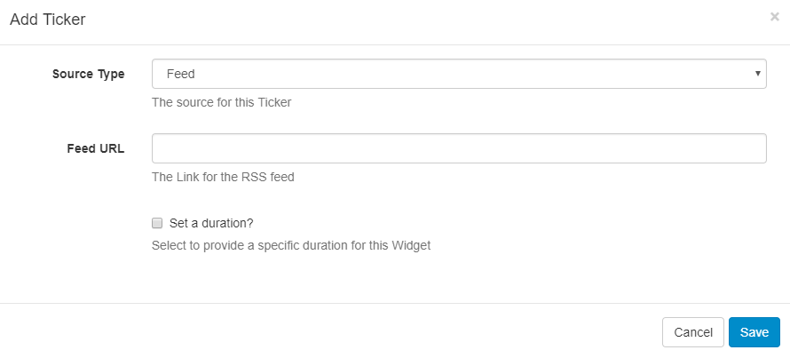

<!--toc=widgets-->

# Ticker

The Ticker Widget allows **dynamic Feed** and **DataSet** content to be added to a Layout.

{version}
NOTE: If you are using a later version than 1.8.x of the CMS, please use the following link: [Dataset Ticker](media_module_ticker.html)
{/version}

{feat}Ticker Widget|v1{/feat}

 The Ticker module primarily consists of a data source location and a template to apply to each data item retrieved from that data source.
{tip}
For example, if the data source is an RSS Feed, the feed will have multiple items and the template will be applied to each of these items.
{/tip}
Tickers are specific to a Layout and not saved in the Library - this means that text items are **not** reusable and will need to be copied/pasted between Layouts if the same text is required on more than one.

## Add Ticker

When adding a new Ticker the CMS provides a simple form asking for the Data Source and duration of the Ticker. These items cannot be changed without re-creating the Ticker.

**Source Type** - Use the drop-down menu to select whether the Ticker uses a **Feed** (RSS/Atom/XML) or a CMS **DataSet** as its Data Source.

- Feed as Source Type - **Specify the Feed URL**.
- DataSet as Source Type - **Select the DataSet** from the drop-down menu you wish to use. 

**Set a duration** - tick to override the default duration.

Once saved the Edit Ticker form will open to provide further options.

## Edit Ticker

Depending on the selected Source Type, options will be presented to configure:

1. Ticker with a DataSet
2. Ticker with an RSS Feed

### Edit Ticker with a DataSet as selected Source

### General

**Name** - give an optional name

**Set a Duration** - tick to optionally override the default duration

**Effect** - use the drop down to select an Effect to be used to transition between items.

**Speed** - Set the speed for the Effect selected.

### Appearance

Use the Text Editor to format your Ticker. The available columns to use in the template can be found under **Available Substitutions**, double-click on the tags you wish to use to insert into the editing area. 

### Order 

Order the DataSet results by using the clause builder or by using an advanced filter clause using SQL syntax, e.g. Name DESC

### Filter

Filter the DataSet to exclude/include results by using the clause builder or by using an advanced filter cause using the SQL syntax.

### Format

Select how many Items should appear on each page if an effect to split items has been selected and if they should show side by side.

### Advanced

**Background Colour** - optionally select a background colour

**Duration is per item** - if selected, the configured Duration will be extended by the number of items returned by the Data Source.

{tip}
This should be used with caution as it can create long-running Media items. It is recommended to use this setting in conjunction with a setting to limit the number of items shown.
{/tip}

**Update Interval** - Display clients can **cache** the content of this Media type to prevent repeated downloads and off-line playback. Keep this number as high as possible.

**Lower Row Limit** - lower row count (0 = unlimited)

**Upper Row Limit** - upper row count (0 = unlimited)

### Edit Ticker with an RSS Feed as selected Source

### General

**Name** - give an optional name

**Set a Duration** - tick to optionally override the default duration

**Effect** - use the drop down to select an Effect to be used to transition between items.

### Appearance

Use the drop-down menu to select a template.

Select to override the template to show available keywords that can be used in the template. Double click to add to the text editor. 

{tip}
A special notation is available where the User can specify the Tag|Namespace within the feed for [[PRODUCTNAME]] to extract content.
{/tip}

### Format

**Speed** - set the transition speed for the selected Effect.

**Text Direction** - select the direction of the text.

**Number of items** - choose how many RSS items should be returned.

**Items per page** - use with a selected Effect to split items

**Take items from** - select to start with items from the beginning or end of the list.

**Duration is per item** - tick to configure the Duration to be extended by the number of items. 

{tip}
Use with caution as this can create long-running media items. Use in conjunction with ‘Number of items’ to limit this.
{/tip}

**Randomise** - random feeds work offline; the entire feed is parsed, rendered and downloaded to the Player and then sorted in a random fashion for display. We use a Durstenfeld shuffle to randomise the order of items. Randomise works on the full feed, "Number of items" and "Take items from" options.

### Advanced

**Background Colour** - optionally select a background colour.

**Update Interval** - Display clients can **cache** the content of this Media type to prevent repeated downloads and off-line playback. Keep this number as high as possible.

**Copyright** - display a Copyright notice at the end of the feed.

**Show item side by side** - opt to display returned results side by side.

**Data Format** - apply a Date Format to apply to all returned date results. 

**Allowable Attributes** - a comma-separated list of attributes that will not be stripped from the incoming feed.

**Strip Tags** - a comma-separated list of HTML tags to be stripped from the feed.

**Disable Date Sort** - disable the date sort for the feed.

## Optional Style Sheet

This is applied to the entire Ticker media item when shown on Display Clients.

{tip}
This is intended for advanced users to ‘tweak’ the CMS generated output.
{/tip}