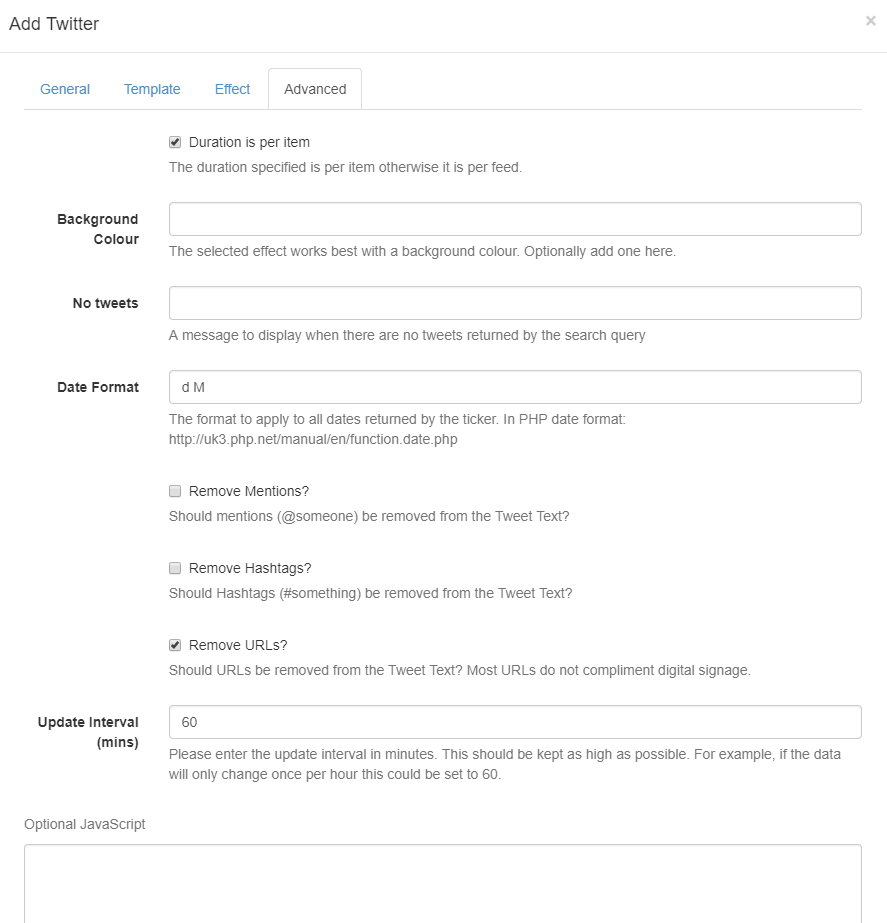

<!--toc=widgets-->
# Twitter

The Twitter Module provides access to the [Twitter Search API](https://dev.twitter.com/rest/public/search). Add the Twitter Widget to Layouts to display Twitter feeds.

<tip>

Granted access is to **read data** only.

</tip>

<nonwhite>
<cloud>

The main set-up is provided as part of the service for **Xibo in the Cloud** customers. Please follow the simplified process below to connect to the Twitter API.

- Select Modules from the Administration section of the Menu.
- Click on the row menu for the Twitter Provider (Twitter Search) Module and select **Connect to Twitter**.
- A form will open which has a **Login with Twitter** button which allows authorisation for the CMS to connect via a Twitter account.
- Follow the on-screen instructions to authorise.

Skip the Installation section below and go straight to the **Add Twitter Widget** section.

</cloud>

**Non-Xibo in the Cloud customers please follow the full Installation steps as detailed below.**

</nonwhite>

## Installation

Access to the Twitter API is protected and so Users must register for an **API key** which is then entered into the Twitter Module in the [[PRODUCTNAME]] CMS. 

### Connecting to Twitter

- Obtain an **API key** and **API secret** from [Twitter](https://apps.twitter.com) and then log in to your Twitter account. 

**Please note:** You will need to apply for a **Twitter developer account** if you are not already approved, using the above Twitter link.

- Complete the required fields and accept the Terms of Service.
- Solve the CAPTCHA and submit the form.
- Make a note of the generated consumer key (API key) and consumer secret (API secret).

### Twitter Module Installation

- Select the Modules page under the Administration section and install the Twitter Module.
- Once installed click on the row menu for the Twitter Module and click **Edit**.
- Enter the generated **API key** and **API secret**.
- Optionally adjust the Cache Period to determine how long to cache a results set for each Twitter search.

<tip>

Setting a low value can cause your access to the Twitter API to be disabled for generating too many requests.

</tip>

## Add Twitter Widget

#### **General**

- Provide an optional name
- Choose to override the default duration
- Provide a search term to return applicable Tweets
- Select Language
- Choose to return Tweets based on popularity, most recent or mixed
- Select a Distance that Tweets should be returned from or 0 for no restrictions
- Select the number of Tweets to return, left blank will return the default number of 15

<tip>

To return Tweets from a specific account rather than all Tweets that contain the accounts @ handle, use `from:` before the name of the account in the Search Term field.

</tip>

#### **Template**

Select a Template from the many selections using the drop-down menu.

<tip>

If you opt to Override the template to use your own, the following substitutions are available for use:
[Tweet][User]
[ScreenName][Date]
[ProfileImage][Photo]

</tip>

#### **Effect**

Select an optional Effect/Speed to be used to transition between Tweets.

#### **Advanced**

- Optionally add a background colour
- Provide a message that will be shown when there are no Tweets to return, based on the search query
- Apply a Date Format to be used for returned results, in PHP date format
- Toggle to add/remove Mentions from returned Tweet text
- Toggle to add/remove Hashtags from returned Tweet text
- Toggle to add/remove URLs from returned Tweet Text
- Enter the Update Interval in minutes, keeping this as high as possible

<tip>

Most URL’s do not compliment digital signage and so we would recommend having this ticked to Remove URLs.

</tip>