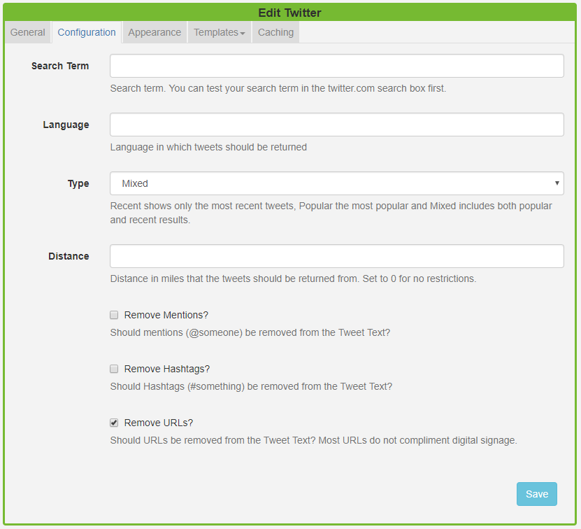
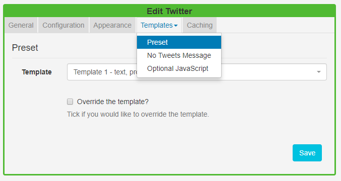
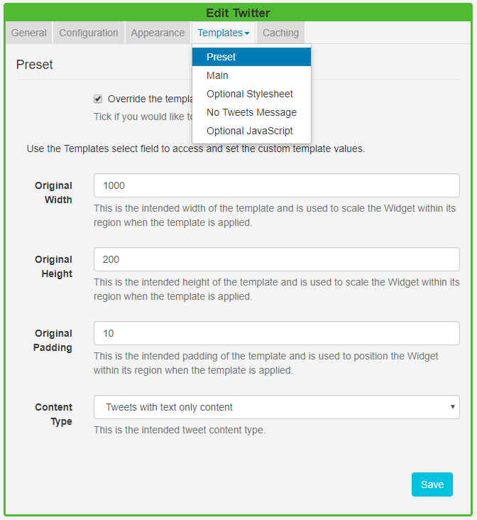

<!--toc=widgets-->

# Twitter

The Twitter Module provides access to the [Twitter Search API](https://dev.twitter.com/rest/public/search). Add the Twitter Widget to Layouts to display Twitter feeds.

{tip}

Granted access is to **read data** only.

{/tip}

{nonwhite}
{cloud}

The main set-up is provided as part of the service for **Xibo in the Cloud** customers. Please follow the simplified process below to connect to the Twitter API.

- Select Modules from the Administration section of the menu.
- Click on the row menu for the Twitter Provider (Twitter Search) Module and select **Connect to Twitter**.
- A form will open which has a **Login with Twitter** button which allows authorisation for the CMS to connect via a Twitter account.
- Follow the on-screen instructions to authorise.

Skip the installation section below and go straight to the **Add Twitter Widget** section.

{/cloud}

**Non-Xibo in the Cloud customers please follow the full installation steps as detailed below.**

{/nonwhite}

## Installation

Access to the Twitter API is protected and so users must register for an **API key** which is then entered into the Twitter Module in the [[PRODUCTNAME]] CMS. 

### Connecting to Twitter

- Obtain an **API key** and **API secret** from [Twitter](https://apps.twitter.com) and then log in to your Twitter account. 

**Please note:** You will need to apply for a **Twitter developer account** if you are not already approved, using the above Twitter link.

- Complete the required fields and accept the Terms of Service.
- Solve the CAPTCHA and submit the form.
- Make a note of the generated consumer key (API key) and consumer secret (API secret).

### Twitter Module Installation

- Select the Modules page under the Administration section and install the Twitter Module.
- Once installed click on the row menu for the Twitter Module and click **Edit**.
- Enter the generated **API key** and **API secret**.
- Optionally adjust the Cache Period to determine how long to cache a results set for each Twitter search.

{tip}

Setting a low value can cause your access to the Twitter API to be disabled for generating too many requests.

{/tip}

## Add Twitter Widget

Click on the **Twitter Widget** on the toolbar, add / drag to the target **Region**. 

{tip}
If you are using 1.8, select **Twitter** from the Widget Toolbox to add to your Region Timeline and complete the form fields as explained below. 
{/tip}

### General

- Provide an optional name
- Choose to override the default duration
- Select whether the duration is per item, unticked the duration will be per feed.

### Configuration

- Provide a search term to return applicable Tweets
- Select the language to use
- Choose to return Tweets based on popularity, most recent or a mixture of results
- Select how many miles away from your location Tweets should be returned from. 0 has no restrictions
- Select to remove Mentions from returned Tweet text
- Select to remove Hashtags from returned Tweet text
- Select to remove URLs from returned Tweet Text

{tip}
To return Tweets from a specific account rather than all Tweets that contain the accounts @ handle, use `from:` before the name of the account in the **Search Term** field.
{/tip}

{tip}
Most URL’s do not compliment digital signage and so we would recommend having **Remove URLs** selected.
{/tip}

### Appearance

- Optionally add a background colour
- Select the number of Tweets to return, left blank will return the default number of 15
- Select the number of Tweets to show per page, left blank will show the default number of 5 Tweets.
- Apply a date format to be used for returned results, in PHP date format (see bottom of page)
- Select an optional effect/speed to be used to transition between Tweets.

### Templates

Select **Preset** templates or provide your own using JavaScript.  

**Preset** - Use the drop-down to select an appropriate template.

**Override the template** - Tick in the box to edit the selected template. Please see the section on [Overriding Templates](media_module_twitter.html#overriding_templates) below for further information.

{tip}
Provide a **No Tweets Message** to display when there are no Tweets to return, based on the search query.
{/tip}

### Caching

Include a suitable time for the Update Interval in minutes, keeping it as high as possible. This determines how often the Module will request data from your feed.

## Overriding Templates

Templates can be edited by selecting a template and using the drop-down. Use the tick box to **Override the template**. 

Click again on the **Templates** tab to see the available templates to edit:

### Main Template

Toggle **On** the Visual editor to access the inline editor. Click in the preview window to open.

Use the inline editor to enter text and formatting. Use the **Snippets** menu to include merge text fields. 

{tip}
If you are using 1.8 the following substitutions are available for use:
[Tweet][User]
[ScreenName][Date]
[ProfileImage][Photo]
{/tip}

### PHP - Date Format

[[PRODUCTNAME]] should accept any date format that is in a correct PHP date format, the following characters are recognised and can be used:

| Format Character | Description                                                  | Example returned values                 |
| ---------------- | :----------------------------------------------------------- | --------------------------------------- |
|                  | **Day**                                                      |                                         |
| d                | Day of the month, 2 digits with leading zeros                | 01 to 31                                |
| D                | A textual representation of a day, three  letters            | Mon through Sun                         |
| j                | Day of the month without leading zeros                       | 1 to 31                                 |
| l                | (lowercase ‘L’) A full textual representation of the day of the week | Sunday through Saturday                 |
| N                | ISO-8601 numeric representation of the day of the week (added in PHP 5.1.0) | 1 (for Monday) through 7 (for Sunday)   |
| S                | English ordinal suffix for the day of the month, 2 characters | st, nd, rd or th. Works well with j     |
| w                | Numeric representation of the day of the week                | 0 (for Sunday) through 6 (for Saturday) |
| z                | The day of the year (starting from 0)                        | 0 through 365                           |
|                  | **Week**                                                     |                                         |
| W                | ISO-8601 week number of year, weeks starting on Monday (added in PHP 4.1.0) | 42 (the 42nd week in the year)          |
|                  | **Month**                                                    |                                         |
| F                | A full textual representation of a month, such as January or March | January through December                |
| m                | Numeric representation of a month, with leading zeros        | 01 through 12                           |
| M                | A short textual representation of a month, three letters     | Jan through Dec                         |
| n                | Numeric representation of a month, without leading zeros     | 1 through 12                            |
| t                | Number of days in the given month                            | 28 through 31                           |
|                  | **Year**                                                     |                                         |
| L                | Whether it’s a leap year                                     | 1 if it is a leap year, 0 otherwise.    |
| o                | ISO-8601 year number. This has the same value as Y, except that if the ISO     week number (W) belongs to the previous or next year, that year is used instead. (added in  PHP 5.1.0) | 1999 or 2003                            |
| Y                | A full numeric representation of a year, 4 digits            | 1999 or 2003                            |
| y                | A two digit representation of a year                         | 99 or 0                                 |
|                  | **Time**                                                     |                                         |
| a                | Lowercase Ante meridiem and Post meridiem                    | am or pm                                |
| A                | Uppercase Ante meridiem and Post meridiem                    | AM or PM                                |
| B                | Swatch Internet time                                         | 000 through 999                         |
| g                | 12-hour format of an hour without leading zeros              | 1 through 12                            |
| G                | 24-hour format of an hour without leading zeros              | 0 through 23                            |
| h                | 12-hour format of an hour with leading zeros                 | 01 through 12                           |
| H                | 24-hour format of an hour with leading zeros                 | 00 through 23                           |
| i                | Minutes with leading zeros                                   | 00 to 59                                |
| s                | Seconds, with leading zeros                                  | 00 through 59                           |
| u                | Microseconds (added in PHP 5.2.2). Note that date() will always generate 000000 since it takes an integer parameter, whereas DateTime::format() does support microseconds if DateTime was created with microseconds. | 654321                                  |
|                  | **Timezone**                                                 |                                         |
| e                | Timezone identifier (added in PHP 5.1.0)                     | UTC, GMT, Atlantic/Azores               |
| I                | (capital i) Whether or not the date is in daylight saving time | 1 if Daylight Saving Time, 0 otherwise. |
| O                | Difference to Greenwich time (GMT) in hours                  | +0200                                   |
| P                | Difference to Greenwich time (GMT) with colon between hours and minutes (added in PHP 5.1.3) | +02:00                                  |
| T                | Timezone abbreviation                                        | EST, MDT …                              |
| Z                | Timezone offset in seconds. The offset for timezones west of UTC is always negative, and for those east of UTC is always positive. | -43200 through 50400                    |
|                  | **Full Date/Time**                                           |                                         |
| c                | ISO 8601 date (added in PHP 5)                               | 2004-02-12T15:19:21+00:00               |
| r                | » RFC 2822 formatted date                                    | Thu, 21 Dec 2000 16:01:07 +0200         |