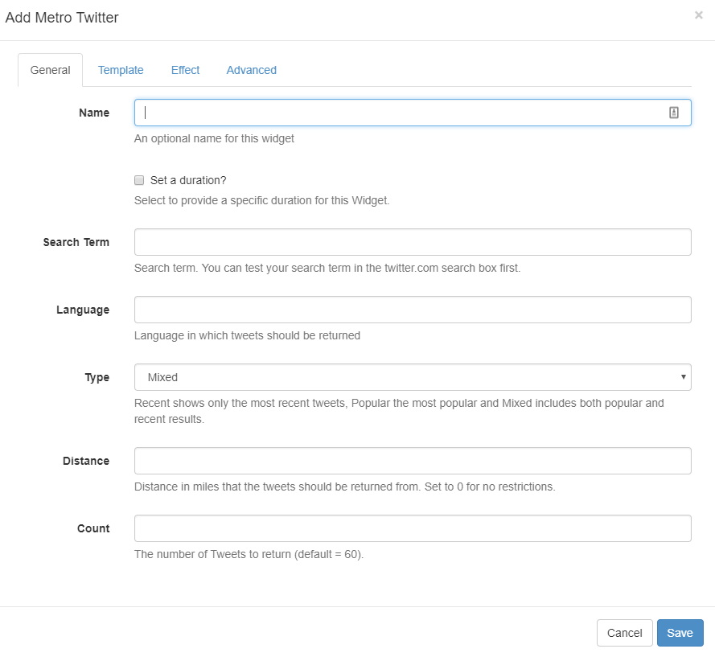

<!--toc=widgets-->
# Twitter Metro

The Twitter Metro Module provides access to the [Twitter Search API](https://dev.twitter.com/rest/public/search). Add the Twitter Metro Widget to Layouts to display Metro tiles of Twitter feeds.

{nonwhite}
{cloud}

As the main set-up is provided as part of the service for Xibo  in the Cloud customers, please ensure you have already provided the steps as detailed on the [Twitter Module](media_module_twitter.html) page. Once completed please start at the **Add Twitter Metro Widget** section.
{/cloud}

**Non-Xibo in the Cloud customers please follow the Installation steps as detailed below.**

{/nonwhite}

## Installation

Please ensure that the Installation steps **Connecting to Twitter** have been taken as detailed on the [Twitter Module](media_module_twitter.html#Installation) page.

### Twitter Metro Module Installation

- Select the Modules page under the Administration section and install the Twitter Metro Module.
- Once installed click on the row menu for the Twitter Metro Module and click **Edit**.
- Enter the generated **API key** and **API secret**, you can use the same generated key/secret as before.
- Optionally adjust the Cache Period.

## Add Twitter Metro Widget

#### General

Complete the form options as required, refer to the [Twitter Module](media_module_twitter.html#Add_Twitter_Widget) page 

#### Template

This form allows you to specify a **colour pallet** to be applied to the Metro tiles. 

{tip}

Tick to Override the template and specify your own colour pallets to use for the Metro tiles.

{/tip}

#### Effect

Select an optional Effect/Speed to be used to transition between Tweets, which will be applied to each tile.

#### Advanced

Complete the form fields as required, refer to the [Twitter Module](media_module_twitter.html) page

{tip}

The Twitter Metro Widget will automatically size portrait/landscape based on the size of the Region that it is added to. It will resize as if it were an image for best consistency across all Display resolutions.

{/tip}