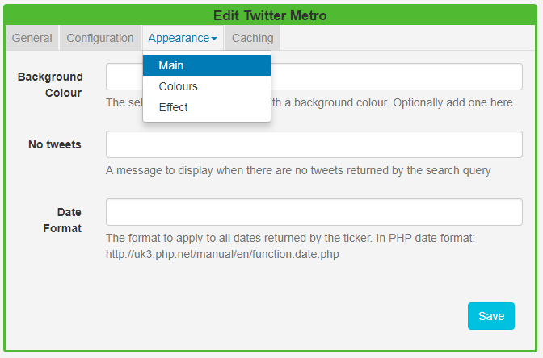
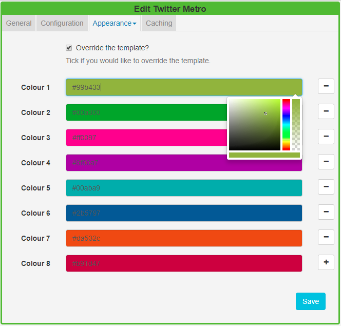

<!--toc=widgets-->

# Twitter Metro

The Twitter Metro Module provides access to the [Twitter Search API](https://dev.twitter.com/rest/public/search). Add the Twitter Metro Widget to Layouts to display metro tiles of Twitter feeds.

{nonwhite}
{cloud}

As the main set-up is provided as part of the service for Xibo  in the Cloud customers, please ensure you have already provided the steps as detailed on the [Twitter Module](media_module_twitter.html) page. Once completed please start at the **Add Twitter Metro Widget** section.
{/cloud}

**Non-Xibo in the Cloud customers please follow the installation steps as detailed below.**

{/nonwhite}

## Installation

Please ensure that the installation steps **Connecting to Twitter** have been taken as detailed on the [Twitter Module](media_module_twitter.html#Installation) page.

### Twitter Metro Module Installation

- Select the Modules page under the Administration section and install the Twitter Metro Module.
- Once installed click on the row menu for the Twitter Metro Module and click **Edit**.
- Enter the generated **API key** and **API secret**, you can use the same generated key/secret as before.
- Optionally adjust the Cache Period.

## Add Twitter Metro Widget

Click on the **Twitter Metro Widget** on the  toolbar, add / drag to the target **Region**. 

{tip}
If you are using 1.8, select **Twitter Metro** from the Widget Toolbox to add to your Region Timeline and complete the form fields as explained below. 
{/tip}

{tip}
The Twitter Metro Widget will automatically size portrait/landscape based on the size of the Region that it is added to. It will resize as if it were an image for best consistency across all display resolutions.
{/tip}

### General

- Provide an optional name.
- Choose to override the default duration.

### Configuration

Complete the form options as required, refer to the [Twitter](media_module_twitter.html#Add_Twitter_Widget) page.

### Appearance

Use the **Appearance** tab to edit the **Main** template, **Colours** to be applied and the **Effect** to be used to transition between Tweets.

#### Main

- Optionally add a background colour.
- Provide a **No Tweets** message to display when there are no Tweets to return, based on the search query.
- Apply a date format to be used for returned results, in PHP date format 9refer to the [Twitter](media_module_twitter.html#Add_Twitter_Widget) page. 

#### Colours

- Use the drop-down menu to specify a colour pallet to be applied to the metro tiles.
- Tick to **Override the template** and specify your own colour pallets to use for the metro tiles

- Click in the colour bars to re-select using the colour picker, remove by clicking `-` or add using `+`
- Ensure that you **Save** your changes.

#### Effect

- Select an optional effect/speed to be used to transition between Tweets, to be applied to each tile.

### Caching

Include a suitable time for the Update Interval in minutes, keeping it as high as possible. This determines how often the Module will request data from your feed.