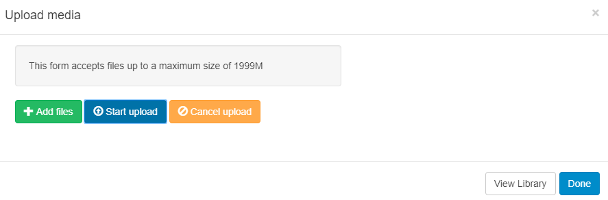
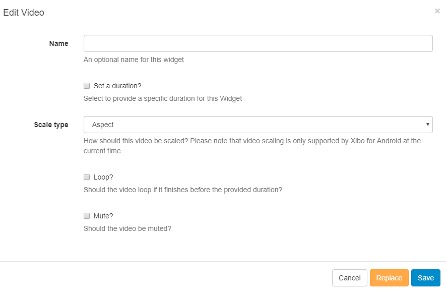

<!--toc=widgets-->

# Video

Add the Video Widget to Layouts to play Videos uploaded to the CMS on Displays. 

Use the Upload Media form to Add files to Upload to the CMS.

{tip}

We recommend a H264 MP4 file format.

{/tip}

### Edit Video

Once assigned to the Region Timeline the Video Widget can be edited. 

- Choose to override the default duration
- Select a **Scale** type (currently supported for Android and webOS only)
- Toggle whether the video should loop (start from the beginning again) if it finishes before the set duration.
- Toggle to mute/unmute the video.

{tip}

Videos uploaded to the CMS are cached for off-line playback on Displays.

{/tip}