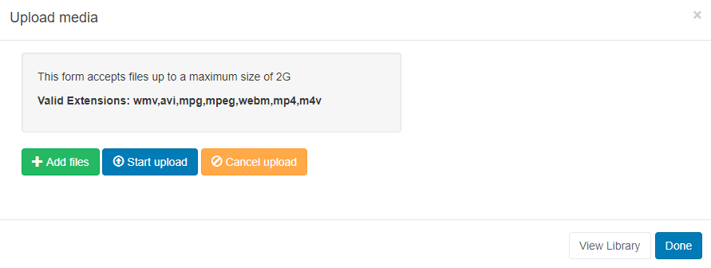
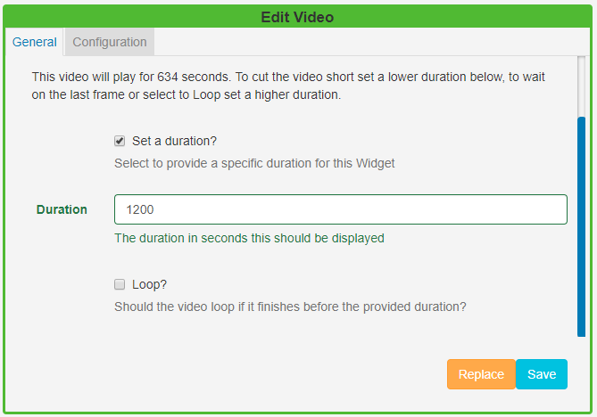

<!--toc=widgets-->

# Video

The Video Module allows for videos to be uploaded to the Library which are then cached for off-line playback.

{tip}
If the video file has already been uploaded to the Library use the [Library Search](layouts_library_search.html) tab to quickly and simply add to a Region.
{/tip}

Click on the **Video Widget** on the  toolbar, add / drag to the target **Region**. 

{tip}
If you are using 1.8, select **Video** from the Widget Toolbox to add to your Region Timeline.
{/tip}

Click on **Add files** to upload to the Library or click on View Library to select an uploaded file.

{tip}
We recommend a H264 MP4 file format.
{/tip}

Once assigned to a Region, **Edit** options are available.

Choose to provide a specific duration:

- The video can be cut short by providing a lower duration.
- Wait on the last frame of the video or set the video to **Loop** (start from the beginning again) by providing a higher duration.

- Select a **scale** type (currently supported for Android and webOS Players only).
- Opt to mute the video by using the tick box.
- Tick to expand the video so that it shows in full screen.

{tip}
If you tick **Show Full Screen** the video will show full screen whilst it is playing. When the next item in the Region is shown it will revert back to the size of the Region.
{/tip}