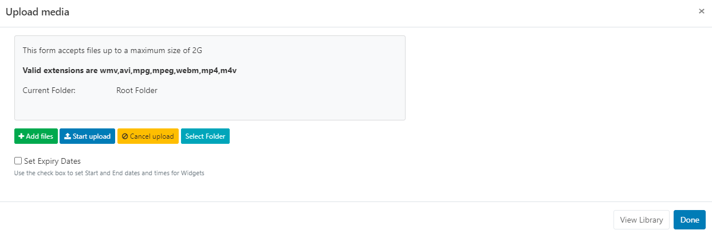
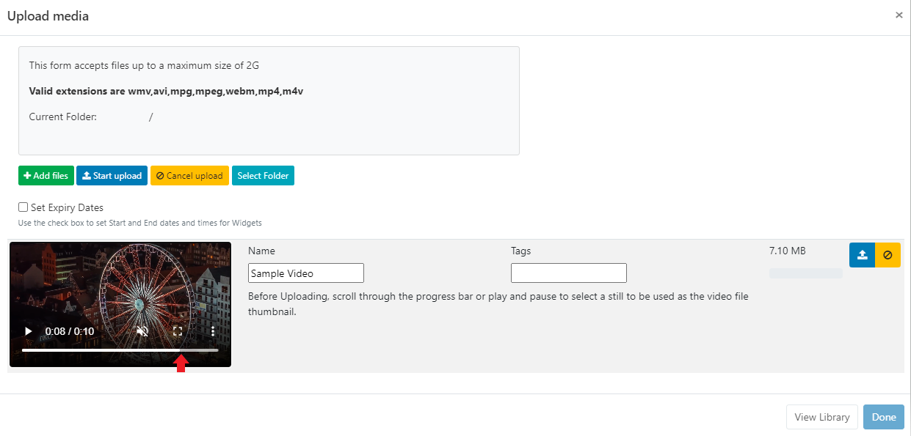
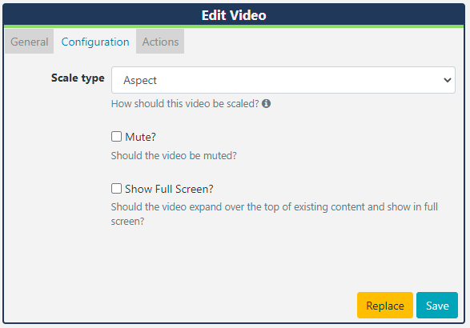

# Video 

{tip}

**Please note:**

- If you are using a v3.1.x CMS, please click [here](media_modules_video.html)
- If you are using a CMS earlier than v3.0.0 please click [here](media_modules_video_2.html)

{/tip}

The Video Module allows for video files to be played when assigned to a Timeline. Video files are uploaded to the [Library](media_library) which are then cached for off-line playback.

## Add Widget

Click on **Video** from the [Widget](layouts_widgets.html) toolbar and click to add or drag and drop 

{tip}
If the Image file has already been uploaded to the Library use the [Library Search](layouts_library_search.html) tab to quickly and simply add!
{/tip}

## Upload Media File

The file uploader will open on adding the Video Widget:

- Click on **Add files** and select the file(s) to upload

{tip}
We recommend an H264 MP4 file format!
{/tip}

{tip}
Files can also be added via drag and drop!
{/tip}

- Give your file a **Name** for easier identification in the CMS and an optional **Tag**.

{tip}
If the Name field is left blank, the file will be named as per the original file name on upload!
{/tip}

- Use the scroll bar or press play and stop on your chosen frame to be used as the thumbnail for this video file!

{tip}
The thumbnail will be used in the Library media grid for easier identification as well as being used for the Region preview when **Preview Enabled** has been ticked in the Video Module settings!
{/tip}

Video files can also be directly uploaded to a specified **Folder** location.

{tip}
Video files that are saved in Folders will inherit the View, Edit, Delete [Share](users_features_and_sharing.html) options that have been applied to the destination Folder for User/User Group access!
{/tip}

- Click on the **Select Folder** button and expand to select a Folder to save in.

Users can also right click a Folder to access further options.

{tip}
Available Folder options are based on enabled [Feature and Sharing](users_features_and_sharing.html) options for a User/User Group.
{/tip}

- Click in the folder you wish to upload the file to and click **Done**. 
- The **Current Folder** will show the selected file path:

{nonwhite}
Further information for Administrators regarding Folder access and set-up can be found [here](https://xibo.org.uk/docs/setup/folders-administration)
{/nonwhite}

{white}
For further information regarding Folder access and set-up, please speak to your Administrator.
{/white}

There is an option to set expiry dates and times for files uploaded to this particular Widget.

{tip}
This is particularly useful should you need to preload videos to be shown at a later date/time!
{/tip}

{tip}
**Please note:** Expiry Dates are currently not supported for the Linux Player!
{/tip}

- Tick the **Set Expiry Dates** box.

- Use the date picker to select **Start** and **End** dates and times.

- There are further options to remove the Widget from the Playlist on expiry and to delete the media file from the Library.

- Click the **Start upload** button to begin the upload of all files added. If a Folder/Expiry Dates have been selected and there are multiple files to be added, all files will be uploaded to the specified location and have the same Expiry Dates set.
- Once successfully uploaded, click **Done**.

Files can also be uploaded individually and have different Folder locations/Expiry dates and times specified.
Instead of clicking on the Start upload button, click on the **blue upload** button shown at the end of the row for an added file. 

Change the Folder location using the **Select Folder** button as before and then click the blue button at the end of the row to upload just that singular file.

- Once all files have been successfully uploaded, click **Done**.

{tip}
View or make changes to Expiry Dates by clicking on the icon on the Widget from the Timeline!
{/tip}

## Configuration Options

Click on the added **Video Widget** from the **Timeline** to open configuration options in the **Edit Video** form:

- Make edits to naming of the Widget if required
- Here you can see how long the video will play for. Tick the **Set a duration** to provide a specific duration.

{tip}
Set a lower duration than shown to cut the video short or select a higher duration and use the Loop function!
{/tip}

- Use the **Configuration** tab to select scaling options for the video.

{tip}
**Please note:** Scaling is currently supported by Android, webOS and Tizen Players (from v2 R200) and Windows Players (from v2 R253).
{/tip} 

- If the video has audio this can be muted by ticking the box.
- If you tick to Show Full Screen, the video will show full screen whilst it is playing. When the next item in the Timeline is shown it will revert back to the size of the Region.

### Actions

Actions can be attached to this Widget, please see the [Interactive Actions](layouts_interactive_actions.html) page for more information.

**As [[PRODUCTNAME]] takes no measures to control what content is put on your displays, it is your responsibility to ensure that any videos used are appropriately attributed if you do not own the rights.**