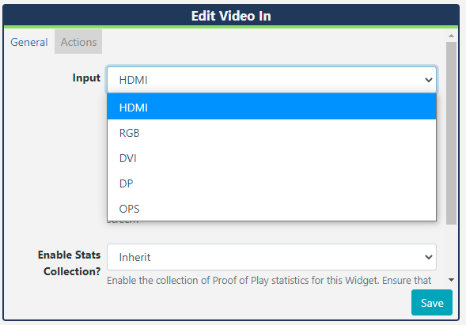

<!--toc=widgets-->

# Video In (webOS, Tizen and Philips)

**Please note: This Module is compatible for webOS and Tizen Players. Philips monitors are supported from v3 R303**

The Video In Widget is used to show input from an external source.

### Add Widget

Click on **Video In** from the  [Widget](layouts_widgets.html)  toolbar and click to add or drag and drop . 

{tip}
If you are using a 1.8.x CMS, select Video In from the Widget Toolbox to add. 
{/tip}

- Use the drop down menu to select which device input should be shown.

{tip}
HDMI input will only support **HDMI 1**
{/tip}

- Choose to override the default duration if necessary.
- Tick to expand the video over existing content and therefore play in full screen.

### Actions 

**Available from v3.0.0**

Actions can be attached to this Widget, please see the [Interactive Actions](layouts_interactive_actions.html)  page for more information.

{tip}
To seamlessly show content alongside **Live TV** create an Overlay Layout with the **Video In** Widget added, this will allow for your layout of content ‘underneath’ to display and rotate freely. This will prevent the TV signal from skipping with each Layout load if on the same Layout.
{/tip}

{tip}
**Please note:** Transitions are not supported for the Tizen Player when using the Video In Widget.
{/tip}