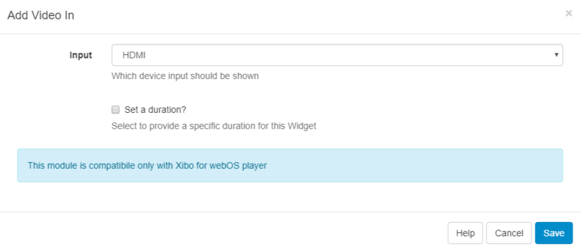
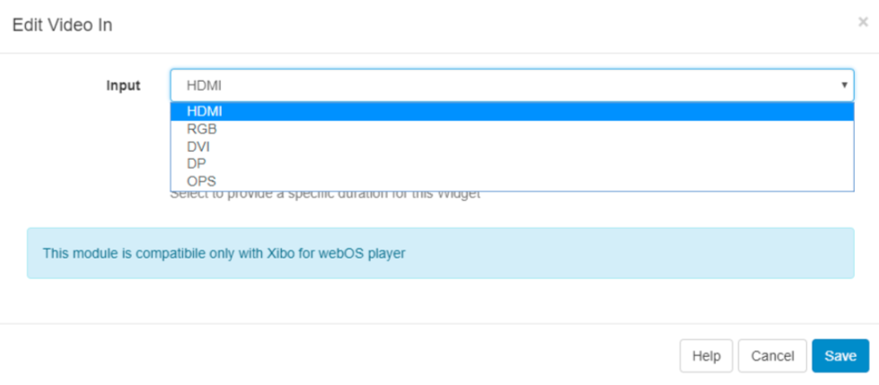

<!--toc=widgets-->

# Video In (webOS)

The Video In Widget can show input from an external source when added to a Layout. 

**Please note: This feature is for webOS only.**

Use the drop-down to select which device input should be shown.

Choose to override the default duration.

## Edit Video In

Once assigned to the Region Timeline the Video In Widget can be edited if necessary.

{tip}

To seamlessly show content alongside **Live TV** create an Overlay Layout with the **Video In** Widget added, this will allow for your Layout of content ‘underneath’ to Display and rotate freely. This will prevent the TV signal from skipping with each Layout load if on the same Layout.

{/tip}