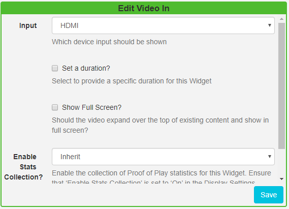

<!--toc=widgets-->

# Video In (webOS and Tizen only)

The Video In Widget can show input from an external source when added to a Layout. 

**Please note: This feature is supported for webOS and Tizen Players only.**

Click on the **Video In Widget** on the toolbar, add / drag to the target **Region**. 

{tip}
If you are using 1.8, select **Video In** from the Widget Toolbox to add to your Region Timeline.
{/tip}

- Use the drop-down to select which device input should be shown.

- Choose to override the default duration if necessary.
- Tick to expand the video over existing content and therefore play in full screen.

{tip}
To seamlessly show content alongside **Live TV** create an Overlay Layout with the **Video In** Widget added, this will allow for your layout of content ‘underneath’ to display and rotate freely. This will prevent the TV signal from skipping with each Layout load if on the same Layout.
{/tip}