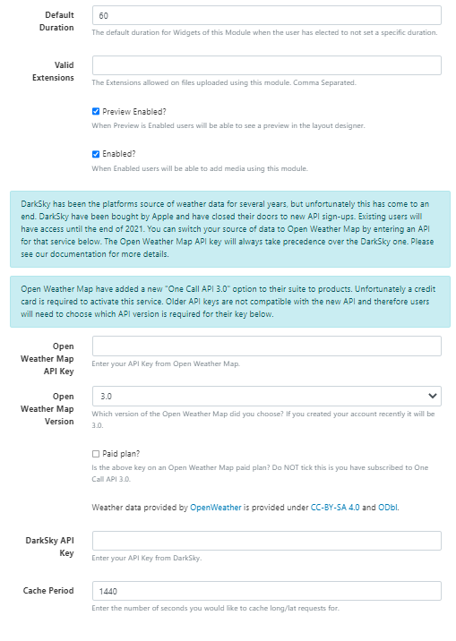
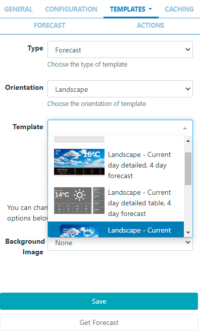
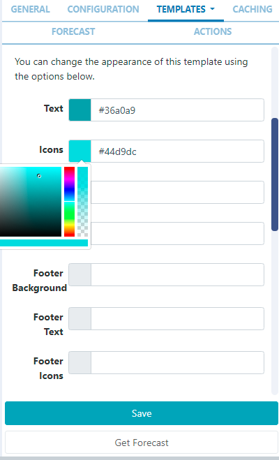

<!--toc=widgets-->

# Weather

Display daily weather forecasts on Layouts.

{version}
NOTE: If you are using a CMS earlier than v3.1, please click [here](media_module_weather_3.html)
{/version}

{feat}Weather Widget|v3{/feat}

The Weather Widget provides current daily weather forecasts worldwide using a service called [Open Weather Map](https://openweathermap.org/) as a source of weather data.

{nonwhite}
{cloud}

The Weather Module is fully configured for **Xibo Cloud** hosted customers and is provided as part of the service. 

{/cloud}

{/nonwhite}

## Installation

Weather data is provided by [OpenWeather](https://openweathermap.org/) which is provided under [CC-BY-SA](https://creativecommons.org/licenses/by-sa/4.0/) and [ODbL](https://opendatacommons.org/licenses/odbl/)

To get an API key please visit [Open Weather Map](https://openweathermap.org/api) to create an account.

{tip}
**Please note:** Since the release of Open Weather's One Call 3.0, new users must enter credit card details to use the free x number of calls Key or opt for a paid subscription!

Open Weather Map allows 1000 requests for a forecast, per day before charging a small fee for each subsequent request.

**Paid plans** unlock a 16 day forecast as well as other optimisations in the way the data is pulled through.

{/tip}

The Weather Module is installed from the **Modules** page, under the **Administration** section of the main CMS menu:

- Click on the **Install Module** button and select the Weather Module to install.

Once installed: 

- Select the Weather Module from the grid and use the row menu to select **Edit**.

- Complete the form fields and include the **API Key**:

- Once you have entered your API Key use the drop down menu to select the **Open Weather Map Version**.
- If you have subscribed to a **Paid Plan** ensure that you tick the box.
- The CMS allows a Cache period to be specified which will create a delay between requests for each geographic location.

## Add Widget

The Open Weather Map Terms of Service https://openweathermap.org/terms should be read and understood before using this Widget. 

Locate **Agenda** from the [Widget](layouts_widgets.html) toolbar and click to **Add** or **Grab** to drag and drop to a Region.

On adding, configuration options are shown in the properties panel:

- Provide a **Name** for ease of identification.
- Choose to override the default **duration** if required.

### Configuration

- Tick to use the **Display Location** or untick to manually enter **Latitude** and **Longitude** to be used for this Widget.
- Use the drop down menu to select the **Unit** of measurement or opt for the automatic selection (first item) which will be based on the geographic location.
- Select the **Language** to be used.
- Use the checkbox to **Only show Daytime weather conditions**.
- Use the **Horizontal** and **Vertical** alignment options to position the Widget within its Region.

### Templates

[[PRODUCTNAME]] provides a selection of **Preset Templates** for ease of use.

On selecting **Preset**, choose the **Type** and **Orientation** and use the drop down to select an available **Template** matching your entered criteria:

On selecting a **Template**, options will be made available to change the appearance of the template using the colour picker or providing the Hex if known:

When a **Background Image** has been selected, images uploaded to the Library can be used to replace the images provided by default:

## Editing Preset Templates (Advanced Use)

Preset templates can be edited by clicking in the **Override the template** checkbox.

{tip}
The template will be automatically scaled and should be designed for the intended output resolution. The following guidelines should be considered when editing templates:

- Templates must be designed at a fixed size
- All elements must use absolute sizing in px, including fonts, margins, widths, heights, etc
- If positioning is used, it must be from top,left
- Templates can use bootstrap
- The aspect ratio will be fixed by [[PRODUCTNAME]] and sized to fit the Region
- Templates are treated the same as a static image
  {/tip}

With override template selected, you can enter text, HTML and CSS.

Once override has been selected, click back on the **Templates tab** to select templates to edit:

### Current Forecast Template

Also known as the main template, used for the current weather conditions and as the basis for the repeating Daily Forecast Template.

Toggle **On** the Visual editor to access the inline editor to enter text and formatting or provide text/HTML in the box provided. 

Use the drop down to include **Snippets**.

{tip}
Click on **Get Forecast** to see available substitutions to use.
{/tip}

### Daily Forecast Template

This is the **repeating template** that should be provided for the 7 day forecast. It will be repeated each day and then substituted into the special `[dailyForecast]` tag (which should feature on the main Current Forecast template). 

The `[dailyForecast]` tag has 2 optional settings which can be added to the tag by including the`|` character. These are `[dailyForecast|Number of days|Start day]` and default to 7 days, starting at tomorrow (day 2). If you wanted to see the next 3 days you would use `[dailyForecast|3]` and for a 3 day forecast starting the day after tomorrow you could use `[dailyForecast|3|3]`.
{tip}  
A common example is to ignore the "Current Template" and produce a full 7 day forecast using the Daily Forecast - this is achieved with `[dailyForecast|7|1]`.
{/tip}

### Style Sheet

This is the CSS to apply to the template structure above.

{tip}
This optional template is intended for advanced users to 'tweak' the CMS generated output!
{/tip}

### Attribution

All Layouts that use the Weather Widget need to include attribution, available by using the `[Attribution]` tag. All preset templates contain this tag by default, please ensure that this tag is included when editing/overriding default templates.

### Caching

Enter the Update Interval to be applied, in minutes, kept as high as possible. 

{tip}
If the data will only change once per hour the Update Interval could be set to 60.
{/tip}

### Get Forecast

It is possible to **request a forecast** at any time to see what forecast data is returned. Any field is available as a substitute in the template by entering the field name between square 
brackets - for example `[nearestStormDistance]`.

## Actions

Interactive Actions can be attached to this Weather Widget from the **Actions** tab in the properties panel. Please see the [Interactive Actions](layouts_interactive_actions.html) page for more information.

## Date Format - PHP

[[PRODUCTNAME]] should accept any date format that is in a correct PHP date format, the following characters are recognised and can be used:

| Format Character | Description                                                  | Example returned values                 |
| ---------------- | :----------------------------------------------------------- | --------------------------------------- |
|                  | **Day**                                                      |                                         |
| d                | Day of the month, 2 digits with leading zeros                | 01 to 31                                |
| D                | A textual representation of a day, three  letters            | Mon through Sun                         |
| j                | Day of the month without leading zeros                       | 1 to 31                                 |
| l                | (lowercase ‘L’) A full textual representation of the day of the week | Sunday through Saturday                 |
| N                | ISO-8601 numeric representation of the day of the week (added in PHP 5.1.0) | 1 (for Monday) through 7 (for Sunday)   |
| S                | English ordinal suffix for the day of the month, 2 characters | st, nd, rd or th. Works well with j     |
| w                | Numeric representation of the day of the week                | 0 (for Sunday) through 6 (for Saturday) |
| z                | The day of the year (starting from 0)                        | 0 through 365                           |
|                  | **Week**                                                     |                                         |
| W                | ISO-8601 week number of year, weeks starting on Monday (added in PHP 4.1.0) | 42 (the 42nd week in the year)          |
|                  | **Month**                                                    |                                         |
| F                | A full textual representation of a month, such as January or March | January through December                |
| m                | Numeric representation of a month, with leading zeros        | 01 through 12                           |
| M                | A short textual representation of a month, three letters     | Jan through Dec                         |
| n                | Numeric representation of a month, without leading zeros     | 1 through 12                            |
| t                | Number of days in the given month                            | 28 through 31                           |
|                  | **Year**                                                     |                                         |
| L                | Whether it’s a leap year                                     | 1 if it is a leap year, 0 otherwise.    |
| o                | ISO-8601 year number. This has the same value as Y, except that if the ISO     week number (W) belongs to the previous or next year, that year is used instead. (added in  PHP 5.1.0) | 1999 or 2003                            |
| Y                | A full numeric representation of a year, 4 digits            | 1999 or 2003                            |
| y                | A two digit representation of a year                         | 99 or 0                                 |
|                  | **Time**                                                     |                                         |
| a                | Lowercase Ante meridiem and Post meridiem                    | am or pm                                |
| A                | Uppercase Ante meridiem and Post meridiem                    | AM or PM                                |
| B                | Swatch Internet time                                         | 000 through 999                         |
| g                | 12-hour format of an hour without leading zeros              | 1 through 12                            |
| G                | 24-hour format of an hour without leading zeros              | 0 through 23                            |
| h                | 12-hour format of an hour with leading zeros                 | 01 through 12                           |
| H                | 24-hour format of an hour with leading zeros                 | 00 through 23                           |
| i                | Minutes with leading zeros                                   | 00 to 59                                |
| s                | Seconds, with leading zeros                                  | 00 through 59                           |
| u                | Microseconds (added in PHP 5.2.2). Note that date() will always generate 000000 since it takes an integer parameter, whereas DateTime::format() does support microseconds if DateTime was created with microseconds. | 654321                                  |
|                  | **Timezone**                                                 |                                         |
| e                | Timezone identifier (added in PHP 5.1.0)                     | UTC, GMT, Atlantic/Azores               |
| I                | (capital i) Whether or not the date is in daylight saving time | 1 if Daylight Saving Time, 0 otherwise. |
| O                | Difference to Greenwich time (GMT) in hours                  | +0200                                   |
| P                | Difference to Greenwich time (GMT) with colon between hours and minutes (added in PHP 5.1.3) | +02:00                                  |
| T                | Timezone abbreviation                                        | EST, MDT …                              |
| Z                | Timezone offset in seconds. The offset for timezones west of UTC is always negative, and for those east of UTC is always positive. | -43200 through 50400                    |
|                  | **Full Date/Time**                                           |                                         |
| c                | ISO 8601 date (added in PHP 5)                               | 2004-02-12T15:19:21+00:00               |
| r                | » RFC 2822 formatted date                                    | Thu, 21 Dec 2000 16:01:07 +0200         |

