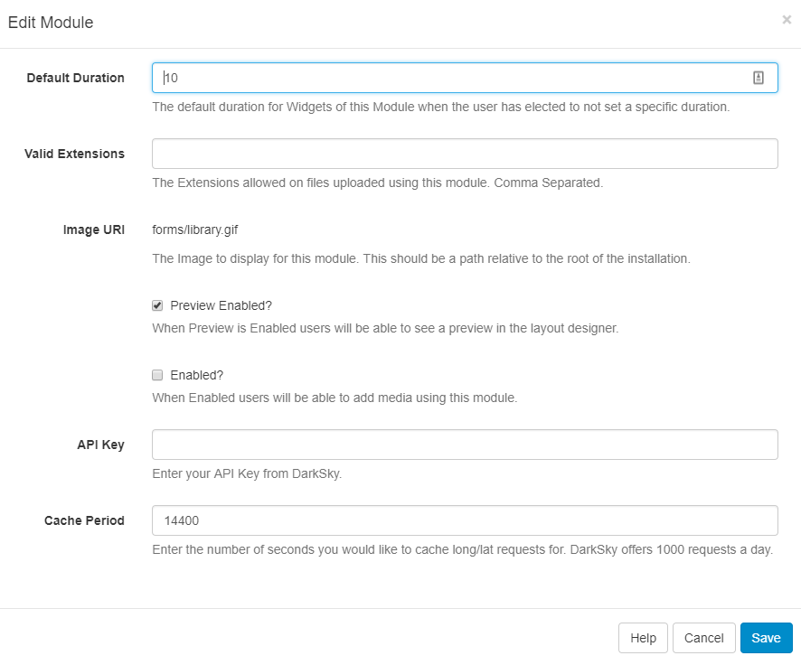
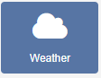
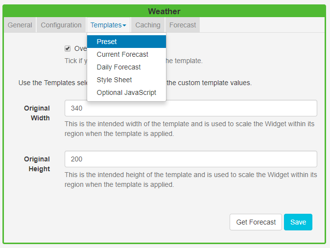

<!--toc=widgets-->

# Weather

The Weather Widget provides current daily weather forecasts worldwide using the [DarkSky API](https://darksky.net/) as a source of weather data.

{nonwhite}
{cloud}

The Weather Module is configured for **Xibo in the Cloud** customers and is provided as part of the service. Please skip the installation steps detailed below and proceed with the set-up at the **Add Weather Widget** section.
{/cloud}

**Non-Xibo in the Cloud customers please follow the installation steps as detailed below.**

{/nonwhite}

## Installation

To get an API key please visit [DarkSky](https://darksky.net) to create an account.

(If you are going to exceed 1000 calls per day you will also need to enter your billing information).

The Weather Module is installed from the Modules page, under the Administration section of the menu. Click on the **Install Module** button and select the Module to install.

After installation,  select the Module from the grid and use the row menu to select **Edit**.

Complete the form fields and include the **API key**. The CMS allows a Cache period to be specified which will create a delay between requests for each geographic location.

DarkSky allows 1000 requests for a forecast, per day before charging a small fee for each subsequent request.

## Add Weather Widget

The DarkSky Terms of Service <https://darksky.net/tos> should be read and understood before using this Widget. 

Click on the **Weather Widget** on the  toolbar, add / drag to the target **Region**. 

{tip}
If you are using 1.8, select **Weather** or **Forecast IO** from the Widget Toolbox to add to your Region Timeline and complete the form fields as explained below. Please note: The Visual editor is not available in 1.8.
{/tip}

### General

- Provide an optional name
- Choose to override the default duration

### Configuration

- Use the display location for the lat/long recorded on the **Display** rather than specifying manually.
- Select the unit of measurement using the drop-down menu.
- Choose the language to use.
- Use the checkbox to only show daytime weather conditions.

### Templates

Select **Preset** templates or provide your own using JavaScript.

#### Preset

- Use the drop-down to select an appropriate template.
- Tick to edit the selected template. Please see the section on [Editing default templates](media_module_weather.html#editing_default_templates) below for further information.

### Caching

Enter the Update Interval in minutes.

## Attribution

All Layouts that use the Weather Widget need to include the text “Powered by DarkSky” as per the [DarkSky Terms of Service](<https://darksky.net/tos>) . 

## Editing default templates

Default templates can be edited by selecting a template using the drop-down and clicking in the **Override the template** checkbox. 

{tip}
The template will be automatically scaled and should be designed for the intended output resolution. The following guidelines should be considered when editing templates:

- Templates must be designed at a fixed size
- All elements must use absolute sizing in px, including fonts, margins, widths, heights, etc
- If positioning is used, it must be from top,left
- Templates can use bootstrap
- The aspect ratio will be fixed by [[PRODUCTNAME]] and sized to fit the Region
- Templates are treated the same as a static image
  {/tip}

Click again on the **Templates** tab and select to edit:

### Current forecast template

Also known as the **main template** as it is used for the current weather conditions and as the basis for the repeating Daily forecast template.

{tip}
Click on **Get Forecast** to see available substitutions to use.
{/tip}

{tip}
Toggle **On** the Visual editor to use the Inline Editor to provide text and formatting.
{/tip}

### Daily forecast template

This is the **repeating template** that should be provided for the 7 day forecast. It will be repeated each day and then substituted into the special `[dailyForecast]` tag (which should feature on the main template). 

The `[dailyForecast]` tag has 2 optional settings which can be added to the tag by including the`|` character. These are `[dailyForecast|Number of days|Start day]` and default to 7 days, starting at tomorrow (day 2). If you wanted to see the next 3 days you would use [dailyForecast|3]` and for a 3 day forecast starting the day after tomorrow you could use `[dailyForecast|3|3]`.
{tip}  

 A common example is to ignore the "Current Template" and produce a full 7 day forecast using the daily forecast - this is achieved with `[dailyForecast|7|1]`.

{/tip}

### CSS

This is the CSS to apply to the template structure above. It will be augmented with a colour 
attribute and has a special `[[ICONS]]` which will be replaced with a selected icon sprite. 

### Get Forecast

It is possible to **request a forecast** at any time to see what forecast data is returned. Any field is available as a substitute in the template by entering the field name between square 
brackets - for example `[nearestStormDistance]`.

### Extending with new icons

New icons can be added by an Administrator who has access to the file system. Any PNG file in `modules/theme/forecastio/weather_icons` will be made available for selection in the Icons selector.

Weather icons are provided as a sprite, each icon is 128x128 and should represent the same weather conditions as the shipped icon sprite.
{tip}
For example, a "clear-day" is represented by the icon in position 1, a "windy day" is represented by the icon in position 11.

{/tip}

{tip}
You may have a Layout Status `! There are items on this Layout that can only be assessed by the client`This is a normal Layout Status if you have online content which will be assessed on the Player side. 

{/tip}