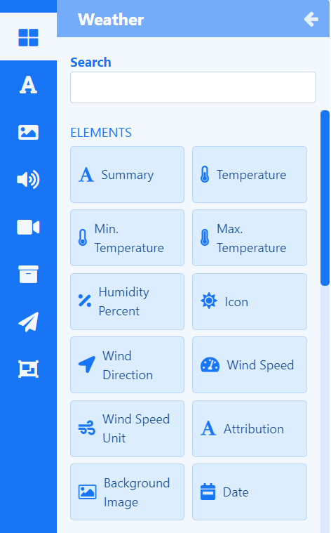

# Weather

Display daily weather forecast data anywhere on a Layout using **Elements** or select a **Static Template** to display results in Layouts/Playlists.

{feat}Weather|v4{/feat}

Weather data is provided by [OpenWeather](https://openweathermap.org/) which is provided under [CC-BY-SA](https://creativecommons.org/licenses/by-sa/4.0/) and [ODbL](https://opendatacommons.org/licenses/odbl/) which provides current worldwide daily weather forecasts which feed into configured Elements and Static Templates.

{tip}

Please ensure that you are using a v3.2.1 or later CMS to account for API changes.

Visit [Open Weather Map](https://openweathermap.org/api) to create an account and obtain an API key to enter into the Open Weather [Connector.](media_modules.html#content-connectors)

**NOTE:** Since the release of Open Weather's One Call 3.0, new users must enter credit card details to use the free x number of calls Key or opt for a paid subscription!

Open Weather Map allows 1000 requests for a forecast, per day before charging a small fee for each subsequent request.

**Paid plans** unlock a 16 day forecast as well as other optimisations in the way the data is pulled through.

{/tip}

{noncloud}
{version}
Existing users currently using the One Call API 2.5 should transfer to the One Call API 3.0 in order to continue using this service. Access to One Call 2.5 will no longer be possible after June 2024. Further details on how to transfer can be found [here.](https://openweathermap.org/one-call-transfer)

After transferring to a new key, please ensure you clear the cache for Weather using the row menu from the **Modules** page!

{/version}
{/noncloud}

{nonwhite}
{cloud}
The Weather Module is configured for **Xibo Cloud** hosted customers with an API key provided as part of the service.
{/cloud}
{/nonwhite}

The Open Weather Map Terms of Service https://openweathermap.org/terms should be read and understood before using this Widget. 

## Weather Elements

[Elements](layouts_editor#content-data-widgets-and-elements) are available for selection when adding the Weather Widget to a [Layout](layouts_editor.html) to give Users more control over what components of the Weather Widget to use and where they can be placed.

Each Element has a set of configuration options in the Properties Panel.  Enter the geographical location and units to return results from the **Configure** tab.

Control how items should be cycled by specifying a [Data Slot](layouts_editor.html#content-data-slots) to use for each of the added Elements. Data Elements can be further complimented by adding [Global Elements](layouts_editor.html#content-global-elements) to add shapes and text which can all be put into an [Element Group](layouts_editor.html#content-grouping-elements) for easier configuration and positioning.

{tip}
All Layouts that use the Weather Widget need to include attribution, available by using the Attribution Element.  Static Templates contain this tag by default.
{/tip}

## Weather Static Templates

[Static Templates](layouts_editor.html#content-static-templates) define how returned results should be laid out and styled and are a simple way to show your data using pre-styled templates.

Templates can be configured to make changes to the design appearance using a range of options in the Properties Panel. Enter geographical locations and units to return results from the **Configure** tab for each Template added to the Layout/Playlist.

## Overview

- Return results based on the Display Location.
- Automatically set the unit of measurement to use to be based on the geographical location. 
- Automatically select weather forecasts based on Display Location.
- Specify which Language to use.
- Opt to show only daytime weather conditions.
- Replace Background Images with images from the [Library](media_library.html)
- Data for this media is cached by the Players for off-line playback.
