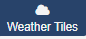
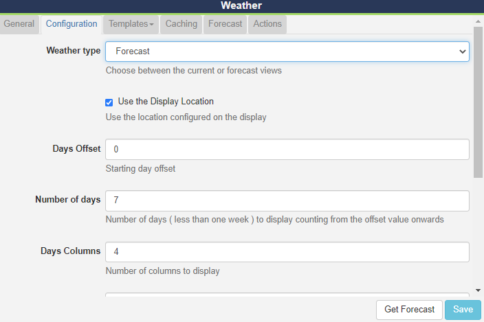
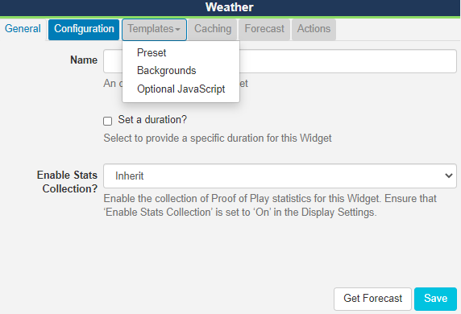
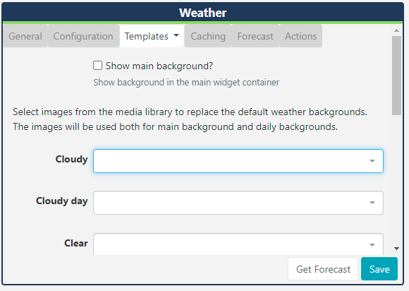
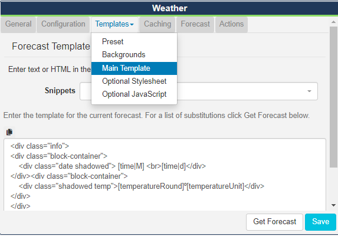

# Weather Tiles

### Please note: This preview module has now been removed from the CMS and will no longer work. Please move to the [Weather](media_module_weather) widget to continue to provide weather information in Layouts.

The Weather Tiles Widget allows you to display current daily weather events as well as weekly forecasts using a service called [Open Weather Map](https://openweathermap.org/) as a source of weather data.

## Installation

Weather data is provided by [OpenWeather](https://openweathermap.org/) which is provided under [CC-BY-SA](https://creativecommons.org/licenses/by-sa/4.0/) and [ODbL](https://opendatacommons.org/licenses/odbl/)

To get an API key please visit [Open Weather Map](https://openweathermap.org/api) to create an account.

(If you are going to exceed 1000 calls per day you will also need to enter your billing information).

The Weather Tiles Module is installed from the Modules page, under the Administration section of the menu. Click on the **Install Module** button and select the Module to install.

After installation, select the Module from the grid and use the row menu to select **Edit**.

Complete the form fields and include the **API key**. The CMS allows a Cache period to be specified which will create a delay between requests for each geographic location.

Open Weather Map allows 1000 requests for a forecast, per day before charging a small fee for each subsequent request.

{tip}
**Paid plans** unlock a 16 day forecast as well as other optimisations in the way the data is pulled through.
{/tip}

## Add Widget

The Open Weather Map Terms of Service https://openweathermap.org/terms should be read and understood before using this Widget. 

Click on **Weather Tiles** from the [Widget](layouts_widgets.html)  toolbar and click to add or drag and drop 

On adding, configuration options are shown in the Edit Weather Tiles form:

- Provide a **Name** for ease of identification.
- Choose to override the default **duration** if required.

### Configuration

- Tick to use the **Display Location** or untick to manually enter **Latitude** and **Longitude** to be used for this Widget.
- Use the drop down menu to select the **Unit** of measurement or opt for the automatic selection (first item) which will be based on the geographic location.
- Select the **Language** to be used.
- Use the checkbox to only show daytime weather conditions.

### Weather type - Forecast

Selecting **Forecast** as the Weather type will show further configuration options:

- Provide **Days Offset** to specify a starting day for the forecast

- Specify the **Number of days** you wish to display, up to 7 days (counting from the offset value entered)

- Enter the number of **Days Columns** and **Days Rows** to specify how you wish to present your forecast. (You may need to adjust this depending on the Template selected, for best results)

## Templates

Select from the available Templates:

### Preset

- Use the drop down to select from the available templates.

- Tick to edit the selected template if required. Please see the section on **Editing Preset Templates** below for further information.

### Backgrounds

Click to open **Background** options:

- Use the check box to show a default background image for the selected template.

  or

- Upload your own image files to the library to replace the default image that will be shown. Use the drop down menus for each field to select the file to be used. 

## Editing Preset Templates

Preset templates can be edited by clicking in the **Override the template** checkbox.

{tip}
The template will be automatically scaled and should be designed for the intended output resolution. The following guidelines should be considered when editing templates:

- Templates must be designed at a fixed size
- All elements must use absolute sizing in px, including fonts, margins, widths, heights, etc
- If positioning is used, it must be from top,left
- Templates can use bootstrap
- The aspect ratio will be fixed by [[PRODUCTNAME]] and sized to fit the Region
- Templates are treated the same as a static image
  {/tip}

With override template selected, you can enter HTML and CSS.

Once override has been selected, click back on the **Templates tab** to select templates to edit:

### CSS Style Sheet

This is the CSS to apply to the template structure above.

## Attribution

All Layouts that use the Weather Widget need to include attribution, available by using the `[Attribution]` tag. All preset templates contain this tag by default, please ensure that this tag is included when editing/overriding default templates.

### Caching

Enter the Update Interval to be applied, in minutes, kept as high as possible. 

{tip}
If the data will only change once per hour the Update Interval could be set to 60.
{/tip}

### Get Forecast

It is possible to **request a forecast** at any time to see what forecast data is returned. Any field is available as a substitute in the template by entering the field name between square brackets - for example `[nearestStormDistance]`.

## Actions

Actions can be attached to this Widget, please see the [Interactive Actions](layouts_interactive_actions.html)  page for more information.

## Additional Information

[[PRODUCTNAME]] should accept any date format that is in a correct PHP date format, the following characters are recognised and can be used:

| Format Character | Description                                                  | Example returned values                 |
| ---------------- | :----------------------------------------------------------- | --------------------------------------- |
|                  | **Day**                                                      |                                         |
| d                | Day of the month, 2 digits with leading zeros                | 01 to 31                                |
| D                | A textual representation of a day, three  letters            | Mon through Sun                         |
| j                | Day of the month without leading zeros                       | 1 to 31                                 |
| l                | (lowercase ‘L’) A full textual representation of the day of the week | Sunday through Saturday                 |
| N                | ISO-8601 numeric representation of the day of the week (added in PHP 5.1.0) | 1 (for Monday) through 7 (for Sunday)   |
| S                | English ordinal suffix for the day of the month, 2 characters | st, nd, rd or th. Works well with j     |
| w                | Numeric representation of the day of the week                | 0 (for Sunday) through 6 (for Saturday) |
| z                | The day of the year (starting from 0)                        | 0 through 365                           |
|                  | **Week**                                                     |                                         |
| W                | ISO-8601 week number of year, weeks starting on Monday (added in PHP 4.1.0) | 42 (the 42nd week in the year)          |
|                  | **Month**                                                    |                                         |
| F                | A full textual representation of a month, such as January or March | January through December                |
| m                | Numeric representation of a month, with leading zeros        | 01 through 12                           |
| M                | A short textual representation of a month, three letters     | Jan through Dec                         |
| n                | Numeric representation of a month, without leading zeros     | 1 through 12                            |
| t                | Number of days in the given month                            | 28 through 31                           |
|                  | **Year**                                                     |                                         |
| L                | Whether it’s a leap year                                     | 1 if it is a leap year, 0 otherwise.    |
| o                | ISO-8601 year number. This has the same value as Y, except that if the ISO     week number (W) belongs to the previous or next year, that year is used instead. (added in  PHP 5.1.0) | 1999 or 2003                            |
| Y                | A full numeric representation of a year, 4 digits            | 1999 or 2003                            |
| y                | A two digit representation of a year                         | 99 or 0                                 |
|                  | **Time**                                                     |                                         |
| a                | Lowercase Ante meridiem and Post meridiem                    | am or pm                                |
| A                | Uppercase Ante meridiem and Post meridiem                    | AM or PM                                |
| B                | Swatch Internet time                                         | 000 through 999                         |
| g                | 12-hour format of an hour without leading zeros              | 1 through 12                            |
| G                | 24-hour format of an hour without leading zeros              | 0 through 23                            |
| h                | 12-hour format of an hour with leading zeros                 | 01 through 12                           |
| H                | 24-hour format of an hour with leading zeros                 | 00 through 23                           |
| i                | Minutes with leading zeros                                   | 00 to 59                                |
| s                | Seconds, with leading zeros                                  | 00 through 59                           |
| u                | Microseconds (added in PHP 5.2.2). Note that date() will always generate 000000 since it takes an integer parameter, whereas DateTime::format() does support microseconds if DateTime was created with microseconds. | 654321                                  |
|                  | **Timezone**                                                 |                                         |
| e                | Timezone identifier (added in PHP 5.1.0)                     | UTC, GMT, Atlantic/Azores               |
| I                | (capital i) Whether or not the date is in daylight saving time | 1 if Daylight Saving Time, 0 otherwise. |
| O                | Difference to Greenwich time (GMT) in hours                  | +0200                                   |
| P                | Difference to Greenwich time (GMT) with colon between hours and minutes (added in PHP 5.1.3) | +02:00                                  |
| T                | Timezone abbreviation                                        | EST, MDT …                              |
| Z                | Timezone offset in seconds. The offset for timezones west of UTC is always negative, and for those east of UTC is always positive. | -43200 through 50400                    |
|                  | **Full Date/Time**                                           |                                         |
| c                | ISO 8601 date (added in PHP 5)                               | 2004-02-12T15:19:21+00:00               |
| r                | » RFC 2822 formatted date                                    | Thu, 21 Dec 2000 16:01:07 +0200         |

