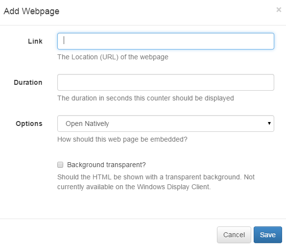

<!--toc=widgets-->
# Web Page

The Web Page module allows an entire Web Page to be embedded inside a Region on a Layout.

There is support for scaling and offsetting the target web page inside the Region so the particular section of the web page can be displayed.

- **Link**

    The URL of the Web Page - including `http://`

- **Duration**

    The duration in seconds that this item should remain in the Region.

- **Offset Top**

    The top position for the page to start.

- **Offset Left**

    The left position for the page to start.

- **Scale Percentage**

    The percentage zoom to apply to the web page.

- **Transparent?**

    Should the web page be rendered with a transparent background? [[PRODUCTNAME]] will try its best to do this when checked, however it cannot be supported on some web pages.

## Options
###Open Natively
This option tells the player to open the web page without any alterations from [[PRODUCTNAME]]. It will open and render in the browser as if the URL had been visited on the device outside of [[PRODUCTNAME]]. There isn't any Layout Designer preview available for this option.

###Manual Position
The web page will be embedded in [[PRODUCTNAME]] at the dimensions specified on the form (width, height, offset left and offset top). This can be used to force the page to fit within certain pre-set dimensions. It can also be scaled using the scale percentage option, it is always moved and then scaled. After the page is rendered [[PRODUCTNAME]] will scale the entire thing to fit within the region.

This is close to the existing functionality in 1.6.

###Best Fit
This allows you to specify a width and height for the web page, which will then be scaled so that it fits inside the region.

## Notes
Web Pages are not cached by the Display and will not operate when disconnected from the network.
