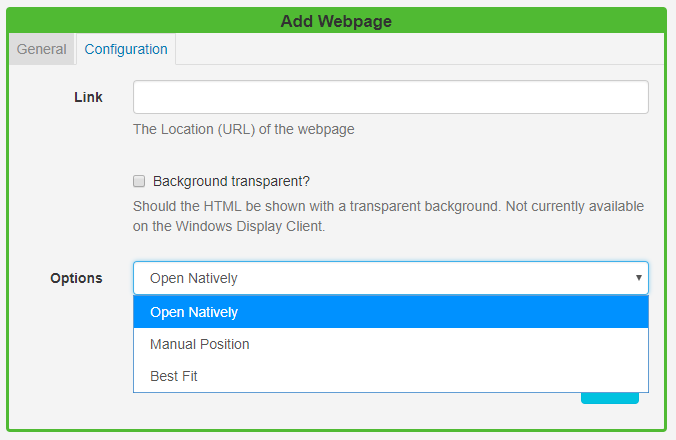

<!--toc=widgets-->

# Webpage

Add the Webpage Widget to Layouts to show an entire Webpage embedded inside a Region. 

{tip}

There is support for **scaling** and **offsetting** the target webpage to allow for a particular section of a webpage to be defined to display.

{/tip}

Click on the **Webpage Widget** on the  toolbar, add / drag to the target **Region**. 

{tip}
If you are using 1.8, select **Webpage** from the Widget Toolbox to add to your Region Timeline and complete the form fields as explained below. 
{/tip}

## General

- Provide an optional name.
- Choose to override the default duration.

## Configuration

### Link

- Provide the **URL** (including `http://`) of the webpage.
- Use the checkbox to render the webpage with a transparent background (currently not available on the Windows Player). [[PRODUCTNAME]] will try its best to do this when checked, however, it cannot be supported on some webpages.

{tip}
After the page is rendered [[PRODUCTNAME]] will scale to fit within the Region.
{/tip}

{tip}
Webpages are not cached by the Player, this Module requires a valid internet connection in order to function.
{/tip}

### Options

Select from 3 options to choose how the webpage should be embedded:

1. #### **Open Natively**

   The Player will open the webpage without any alterations and will open and render in the browser as if the URL had been visited on the device outside [[PRODUCTNAME]].
   {tip}
   **Please note:** There is no preview available for this option.
   {/tip}

2. #### **Manual Position**

   Embed the webpage by specifying dimensions which can be used to force the page to fit within certain pre-set dimensions.

   **Page Width** - specify the width of the page

   **Page Height** - specify the height of the page

   **Offset Top** - the top position for the page to start

   **Offset Left** - the left position for the page to start

   **Scale Percentage** - percentage zoom to apply to the webpage

3. #### **Best Fit**

   Specify a **page width** and **page height**.

   {tip}
   **Manual Position** and **Best Fit** options will not work with websites that set the **X-Frame-Options header**. If you are unable to see the webpage use the Open Natively option when using Windows / Linux or Android. If X-Frame-Options is set then webOS/Tizen will not work in any mode.

   If X-Frame-Options is not set then the website should show in any of the Players, using any of the above options.

   Use the [X-Frame-Options Header Checker Tool](https://tools.geekflare.com/tools/x-frame-options-test) to see if the header has been set.
   {/tip}