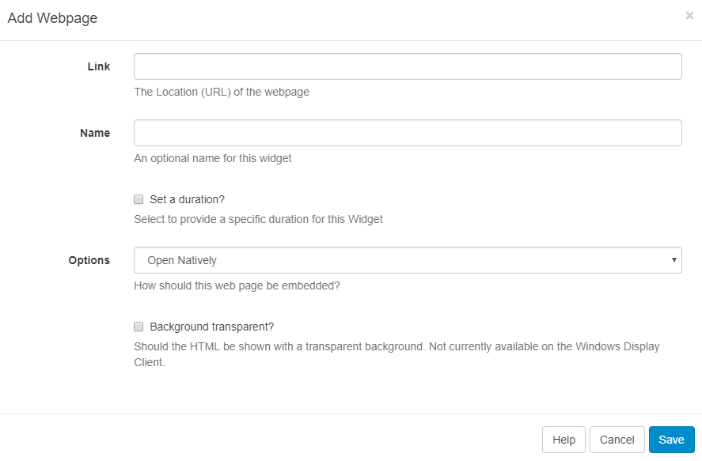

<!--toc=widgets-->
# Web Page

Include the Web Page Widget to Layouts to show an entire Web Page embedded inside a Region. 

<tip>

There is support for **scaling** and **offsetting** the target Web Page to allow for a particular section of a Web Page to be defined to display.

</tip>

#### **Link**

Provide the **URL** (including `http://`) of the Web Page.

#### **Name**

Provide an optional name.

#### **Set a duration**

Choose to override the default duration.

#### **Options**

Select from 3 options to choose how the Web Page should be embedded:

1. #### **Open Natively**

   The Player will open the Web Page without any alterations and will open and render in the browser as if the URL had been visited on the device outside [[PRODUCTNAME]].

   **Please note:** There is no Layout Designer Preview for this option.

2. #### **Manual Position**

   Embed the Web Page by specifying dimensions which can be used to force the page to fit within certain pre-set dimensions.

   **Page Width** - specify the width of the page

   **Page Height** - specify the height of the page

   **Offset Top** - the top position for the page to start

   **Offset Left** - the left position for the page to start

   **Scale Percentage** - percentage zoom to apply to the Web Page

3. #### **Best Fit**

   Specify a Page Width and Height.

#### Background Transparent

Choose to render the Web Page with a transparent background (currently not available on the Windows Player). [[PRODUCTNAME]] will try its best to do this when checked, however, it cannot be supported on some Web Pages.

<tip>

After the page is rendered [[PRODUCTNAME]] will scale to fit within the Region.

</tip>

<tip>

Web Pages are not cached by the Display, this Module requires a valid internet connection on the Player in order to function.

</tip>