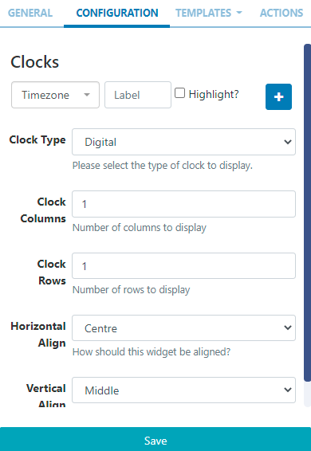
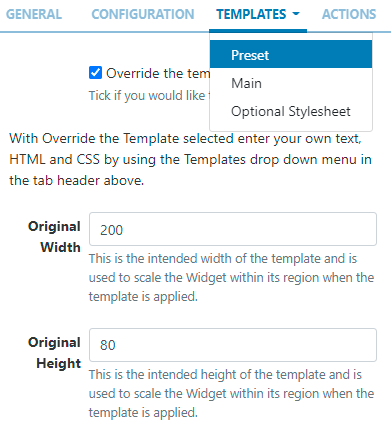

<!--toc=widgets-->

# World Clock 

Display multiple clocks and timezones on Layouts.

{feat}World Clock Widget|v3{/feat}

{nonwhite}
{version}
If you are using a v3.0.x CMS, the World Clock Widget is only available on request by contacting our Help desk via [My Account](https://xibosignage.com/my-account/tickets?open=true)
{/version}
{/nonwhite}

## Add Widget

Locate **World Clock** from the [Widget](layouts_widgets.html) toolbar and click to **Add** or **Grab** to drag and drop to a Region.

On adding, configuration options are shown in the properties panel:

- Provide a **Name** for ease of identification.
- Choose to override the default **duration** if required.

## Configuration

- Use the drop down to select a **Timezone**.

- Enter a **Label** to be shown with the selected timezone.

- Optionally select to **Highlight**. 

- Click on the `+` button to add multiple timezone clocks as required.

- Use the drop down to select from **Digital** or **Analogue** Clock Types.

- With multiple timezone clocks selected, set the number of **Clock Columns** and **Clock Rows** to display.

  {version}
  NOTE: From v3.1.0 users can set **Horizontal** and **Vertical** alignment options for this Widget!

  {/version}

- **Save**

Depending on the **Clock Type** selected, further options will be made available.

## Templates - Digital Clock Types

Use the drop down to select from the Preset Templates available to choose how the clocks will be displayed.

{tip}

Click to Override the selected template if required. 

Please see the section on Editing Preset Templates below for further information.
{/tip}

## Editing Preset Templates

Preset templates can be edited by clicking in the **Override the template** checkbox.

{tip}
The template will be automatically scaled and should be designed for the intended output resolution. The following guidelines should be considered when editing templates:

- Templates must be designed at a fixed size
- All elements must use absolute sizing in px, including fonts, margins, widths, heights, etc
- If positioning is used, it must be from top,left
- Templates can use bootstrap
- The aspect ratio will be fixed by [[PRODUCTNAME]] and sized to fit the Region
- Templates are treated the same as a static image
  {/tip}

Once override has been selected, click back on the **Templates tab** to select the template to edit:

**Main** - provide text/HTML in the box provided.

**Optional Stylesheet** - This is the CSS to apply to the template structure.

{tip}
This optional template is intended for advanced users to 'tweak' the CMS generated output!
{/tip}

## Analogue Settings - Analogue Clock Types

With the Analogue Clock Type selected, an Additional Tab will be available to allow users to set colours for elements of the clock:

- Use the colour picker for each field to define.

- To to enable further settings and define colours:

  

- **Save**

## Actions

Interactive Actions can be attached to this World Clock Widget from the **Actions** tab in the properties panel. Please see the [Interactive Actions](layouts_interactive_actions.html) page for more information.

## Date Format - PHP

[[PRODUCTNAME]] should accept any date format that is in a correct PHP date format, the following characters are recognised and can be used:

| Format Character | Description                                                  | Example returned values                 |
| ---------------- | :----------------------------------------------------------- | --------------------------------------- |
|                  | **Day**                                                      |                                         |
| d                | Day of the month, 2 digits with leading zeros                | 01 to 31                                |
| D                | A textual representation of a day, three  letters            | Mon through Sun                         |
| j                | Day of the month without leading zeros                       | 1 to 31                                 |
| l                | (lowercase ‘L’) A full textual representation of the day of the week | Sunday through Saturday                 |
| N                | ISO-8601 numeric representation of the day of the week (added in PHP 5.1.0) | 1 (for Monday) through 7 (for Sunday)   |
| S                | English ordinal suffix for the day of the month, 2 characters | st, nd, rd or th. Works well with j     |
| w                | Numeric representation of the day of the week                | 0 (for Sunday) through 6 (for Saturday) |
| z                | The day of the year (starting from 0)                        | 0 through 365                           |
|                  | **Week**                                                     |                                         |
| W                | ISO-8601 week number of year, weeks starting on Monday (added in PHP 4.1.0) | 42 (the 42nd week in the year)          |
|                  | **Month**                                                    |                                         |
| F                | A full textual representation of a month, such as January or March | January through December                |
| m                | Numeric representation of a month, with leading zeros        | 01 through 12                           |
| M                | A short textual representation of a month, three letters     | Jan through Dec                         |
| n                | Numeric representation of a month, without leading zeros     | 1 through 12                            |
| t                | Number of days in the given month                            | 28 through 31                           |
|                  | **Year**                                                     |                                         |
| L                | Whether it’s a leap year                                     | 1 if it is a leap year, 0 otherwise.    |
| o                | ISO-8601 year number. This has the same value as Y, except that if the ISO     week number (W) belongs to the previous or next year, that year is used instead. (added in  PHP 5.1.0) | 1999 or 2003                            |
| Y                | A full numeric representation of a year, 4 digits            | 1999 or 2003                            |
| y                | A two digit representation of a year                         | 99 or 0                                 |
|                  | **Time**                                                     |                                         |
| a                | Lowercase Ante meridiem and Post meridiem                    | am or pm                                |
| A                | Uppercase Ante meridiem and Post meridiem                    | AM or PM                                |
| B                | Swatch Internet time                                         | 000 through 999                         |
| g                | 12-hour format of an hour without leading zeros              | 1 through 12                            |
| G                | 24-hour format of an hour without leading zeros              | 0 through 23                            |
| h                | 12-hour format of an hour with leading zeros                 | 01 through 12                           |
| H                | 24-hour format of an hour with leading zeros                 | 00 through 23                           |
| i                | Minutes with leading zeros                                   | 00 to 59                                |
| s                | Seconds, with leading zeros                                  | 00 through 59                           |
| u                | Microseconds (added in PHP 5.2.2). Note that date() will always generate 000000 since it takes an integer parameter, whereas DateTime::format() does support microseconds if DateTime was created with microseconds. | 654321                                  |
|                  | **Timezone**                                                 |                                         |
| e                | Timezone identifier (added in PHP 5.1.0)                     | UTC, GMT, Atlantic/Azores               |
| I                | (capital i) Whether or not the date is in daylight saving time | 1 if Daylight Saving Time, 0 otherwise. |
| O                | Difference to Greenwich time (GMT) in hours                  | +0200                                   |
| P                | Difference to Greenwich time (GMT) with colon between hours and minutes (added in PHP 5.1.3) | +02:00                                  |
| T                | Timezone abbreviation                                        | EST, MDT …                              |
| Z                | Timezone offset in seconds. The offset for timezones west of UTC is always negative, and for those east of UTC is always positive. | -43200 through 50400                    |
|                  | **Full Date/Time**                                           |                                         |
| c                | ISO 8601 date (added in PHP 5)                               | 2004-02-12T15:19:21+00:00               |
| r                | » RFC 2822 formatted date                                    | Thu, 21 Dec 2000 16:01:07 +0200         |

