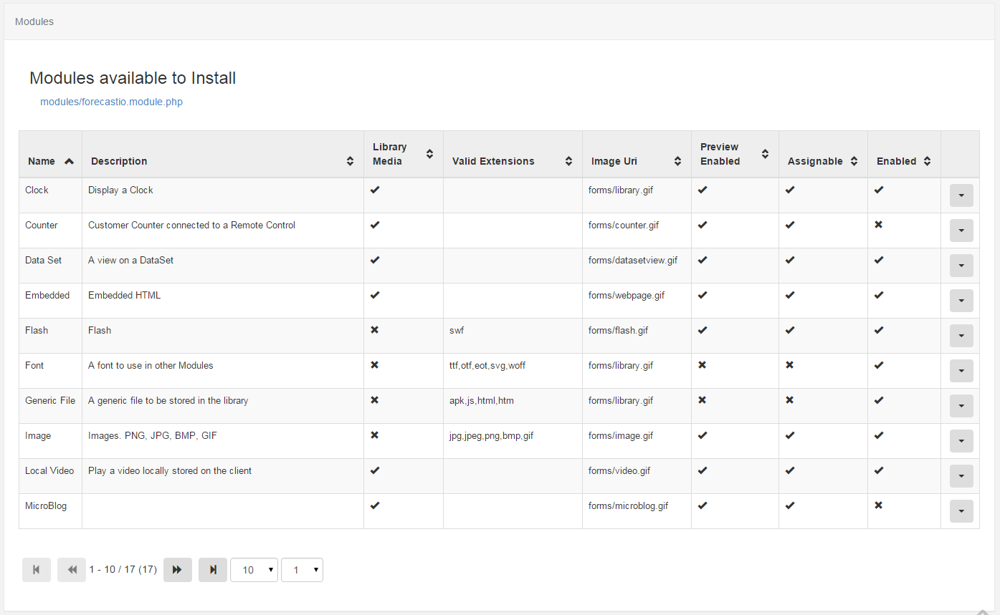

<!--toc=widgets-->
# Modules
All content displayed in [[PRODUCTNAME]] is added / edited and served by a media module. There are a wide variety of 
modules to choose from and more are being added as new releases are made.

Modules can be enabled and disabled using the CMS admin interface on the Modules page. Each module also has a range 
of settings available.

## Installing new Modules

New modules must be uploaded to the CMS manually and then installed from the Module Administration screen. Modules
which are not installed are detected automatically and will be offered as installation options on the "Install Module"
form. See the below image for an example:

Clicking on the module name will install the module and refresh the page.

### Designing a Module

More information related to designing a module can be found in the [developer section](advanced_modules.html).

## Module Settings

A Module can have a selection of its settings adjusted, exactly which ones depends on the module.

### Library Modules

At times it may be necessary to add or removed the allowed extensions on a particular file based module. A typical use case would be if a client is being used which does not support that particular type of file.

## Caching and external access
The core modules are designed to have their data cached and served from the CMS so that they can be played back without an active connection and/or without direct access to external resources that might be required.

The CMS also uses this mechanism to be a _good citizen_ when requesting 3rd party data.

For example, a ticker widget with the address `http://anexternal.com/feed` would only be accessed by the CMS and only once per `updateInterval`. The players showing the layout would not need to access that address directly.

All of the core modules adopt this approach, with the exceptions noted below.

### Notable Exceptions
The web page module does not cache from the CMS and will always attempt to open the specified web page address using the browser on the Player. This means that the player must have network access to the web address at all times.

The embedded module can be cached using library references, however the user that creates the module is free to specify external resources should they require them.

The Local Video module is rendered by the video decoder on the Player and can reference an external stream.

Flash files have the capability to reference an external file and will be run on the Player.
