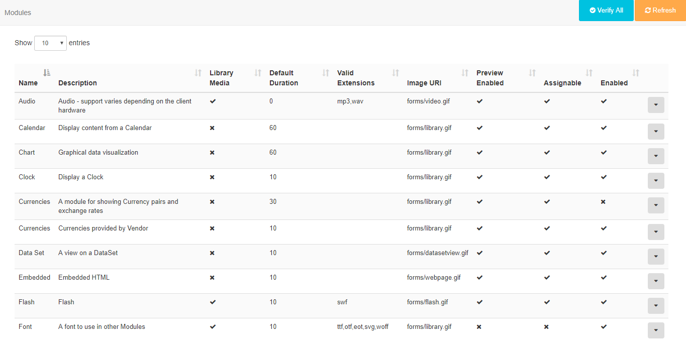

<!--toc=widgets-->
# Modules

All content displayed in [[PRODUCTNAME]] is added/edited and served by a **Media Module**. [[PRODUCTNAME]] has a wide variety of Modules to choose from with more being introduced with new releases.

Modules can be enabled/disabled from the **Modules** page under the **Administration** section of the Menu.

Modules are enabled/disabled by using the row menu for the selected Module. Selecting **Edit** will open a form where an **Enabled** checkbox can be ticked/unticked. Each Module has a range of available settings, dependent on the Module, which can be adjusted.

### Library Modules

At times it may be necessary to add or remove the allowed extensions on a particular file based Module. {tip}
A typical use case would be if a Player is being used which does not support that particular type of file.{/tip}

## Generic Files

The Generic File Module is used to send **additional files** to the Player that can then be used for other purposes. 

{tip}
This could be useful for:

- Embedded HTML - supplementary files can be provided to be used as relative paths (e.g. An up and down arrow that is dynamically shown in the embedded HTML based on the results of stock data)

  {/tip}

## Caching and external access

The core Modules are designed to have their data cached and served from the CMS so that they can be played back without an active connection and/or without direct access to external resources that might be required.

The CMS also uses this mechanism to be a _good citizen_ when requesting 3rd party data.
{tip}
For example, a Ticker Widget with the address `http://anexternal.com/feed` would only be accessed by the CMS and only once per `updateInterval`. The Players showing the Layout would not need to access that address directly.
{/tip}

All of the core modules adopt this approach, with the exceptions noted below:

### Notable Exceptions

- The **Web Page Module** does not cache from the CMS and will always attempt to open the specified web page address using the browser on the Player. This means that the Player must have network access to the web address at all times.
- The **Embedded Module** can be cached using library references, however, the User that creates the Module is free to specify external resources should they require them.
- The **Local Video Module** is rendered by the video decoder on the Player and can reference an external stream.
- **Flash** Files have the capability to reference an external file and will be run on the Player.

{nonwhite}
Xibo is shipped with all of the stock modules which can be enabled for use. 

{cloud}

We prevent the installation of your own or third-party modules with **Xibo in the Cloud.**

{/cloud}

{/nonwhite}

## Installing new Modules

New modules must be uploaded to the CMS manually and then installed from the Module Administration screen. Modules which are not installed are detected automatically and will be offered as installation options on the **Install Module** form. 

Click on the **Module** name to install and refresh the page.

## Player Support table for Widgets and Modules

{feat_cat}Widgets and Modules{/feat_cat}