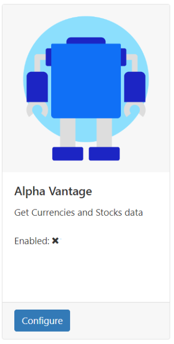

# Connectors Management

Modules that rely on a third party service for data, [Stocks](media_module_stocks.html) for example, need further configuration with API keys etc.

Once the Module has been enabled and you have the required API key:

- Go to the **Applications** page under the **Administration** section of the main CMS menu.
- Scroll down to the **Connectors** section of the page.

Here you can see all third party services which can be configured:

- Click the **Configure** button of the Connector to configure:

- Provide the **API key** you have been given and ensure that you tick the **Enabled** box to tell the Connector to start providing the service to the relevant Modules.

