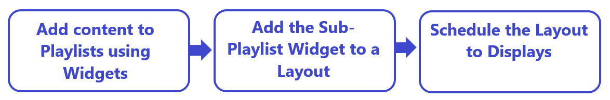
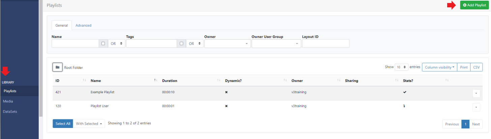
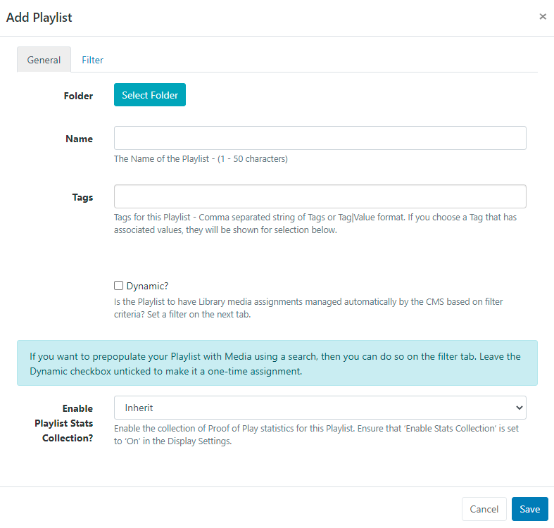
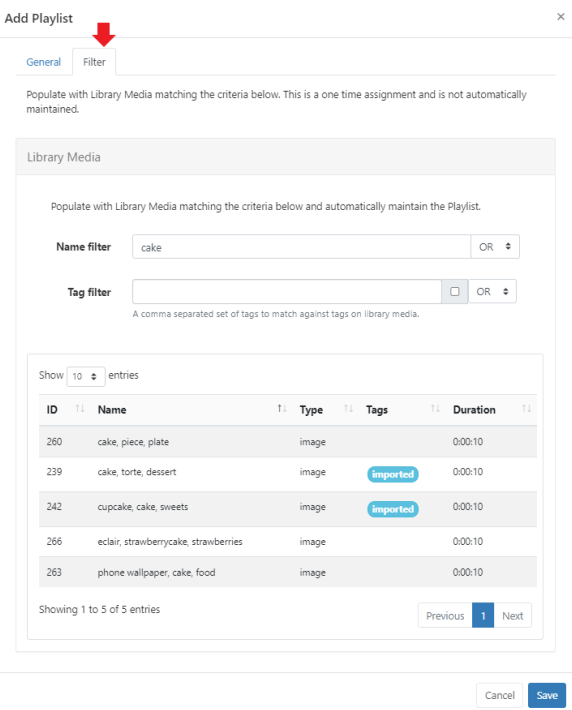
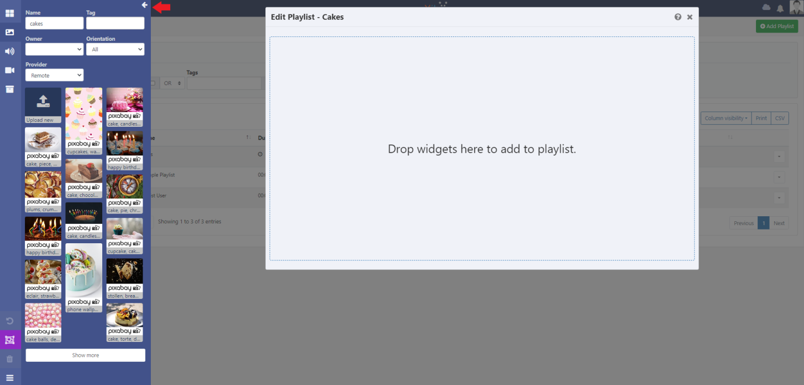
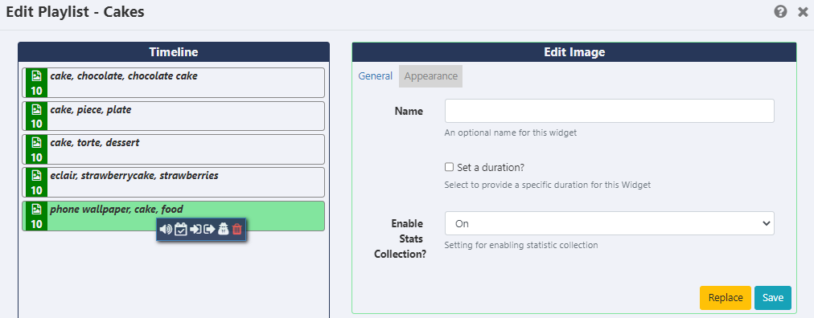
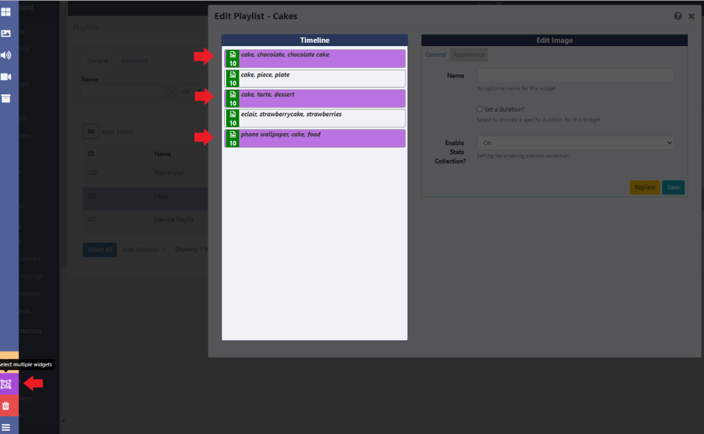
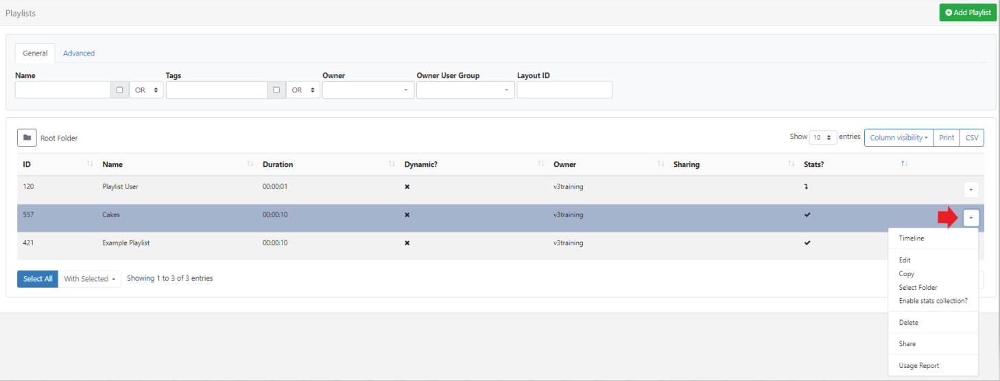

# Playlists

Playlists are reusable lists of content that are created and managed independently to [Layouts](layouts.html). Once created, Playlists are added to Layouts using the [Sub-Playlist Widget](media_module_subplaylist.html)

{version}
**Documentation Versions**

- If you are using a v3.0.x CMS, please click [here](media_playlists_3.html)
- If you are using a v2.0.x CMS, please click [here](media_playlists_2.html)

{/version}

### Feature Overview:

- Easily create a 'slide-show' of content.
- Re-use across multiple Layouts.
- Define content order.
- Add and maintain content dynamically.
- Update content without accessing Layouts.
- Add multiple Playlists to Layouts using the Sub-Playlist Widget.

Streamline resources and save time by creating Playlists to hold multiple items of content which can be used across multiple Layouts. Create Playlists to target and collate content for specific requirements, locations, categories etc. 

Playlists are created and managed independently to Layouts and therefore do not require further user access to Layouts or the Layout Designer to add or manage content. Edits made to a Playlist will update all Sub-Playlist Widgets on Layouts that the Playlist has been added to.

## Creating a Playlist

Playlists are administered from the **Playlists** page under the **Library** section of the main CMS menu:

Click on the **Add Playlist** button and complete the form fields to create a new record:

- Playlists can be optionally saved to [Folders](tour_folders.html) for easier searches, organisation and to set [Share](users_features_and_sharing.html) options for Users/User Groups.

{tip}
Folders provide an easy way to define User/User Group access to its contents. Playlists will inherit any Share access that have been applied to the destination Folder. 

**Please note:** If a User/User Group should also require access to any media files added to the Playlist, they would also need to be added to the Folder!
{/tip}

- **Name** your Playlist for easy identification for when it needs to be selected in the Sub-Playlist Widget.

- Include optional [Tags](tour_tags.html) to further organise and locate.

### Dynamically adding Media

Playlists have a **Dynamic** option to automatically assign **Library Media** files based on set criteria:

- Tick to enable the automatic management of assigning media to the Playlist.
- Once ticked, click on the **Filter** tab and set the required criteria in order to populate matching Library Media. 
- Provide a maximum number of Library Media files which can be automatically assigned.

Media already in the Library that matches the criteria set will show here.

Any future media files that are added to the Library that satisfy the set criteria for this Playlist will be automatically added to this list.

{tip}
Library Media can also be prepopulated as a one-time assignment to a Playlist by setting criteria but leaving the Dynamic option unticked!
{/tip}

### Manually adding Media

To manually add media to Playlists, **Save** the new record form without ticking the Dynamic option to open the Playlist Editor.

- From the **Toolbar**, select from available Widgets and Library Media and click to add or drag and drop to the Playlist Editor:

{tip}
Select multiple Library Media files to add to the Playlist by clicking on  `+` in the top left hand corner of the thumbnail. 

Files will be added in the order selected!
{/tip}

- Click on an item on Playlist to highlight, configuration options will load in the properties panel for the selected item.

Drag and drop items in the Playlist to re-order if required.

{tip}
As changes are autosaved use the Undo button at the bottom of the toolbar to revert a change if required!
{/tip}

A set of further options can be accessed by right clicking on an item. From this [Context Menu](layouts_designer.html#content-context-menu) you can set **Share** access, set **Audio** files, **Start and End Times** and **Transitions** for the selected item. 

Use the Select Multiple Widgets button at the bottom of the toolbar to multi-select items in the Playlist to delete with one click:

- Close the Playlist Editor window to return to the main Playlist [grid](manual/en/tour_grids).

## Editing Playlists

Playlists are edited from the Playlists page using the row menu for a selected Playlist:

- Select **Timeline** to open the Playlist Editor for manually media assigned Playlists.

From here you can add/edit/re-order or delete content for the selected Playlist.

- For Dynamic Playlists select **Edit** from the row menu and use the **Filter** tab to view the list of dynamic media assignments and make changes to the set criteria.

{tip}
If you needed to change details of any Playlist record (Manual or Dynamic) to edit the Name, set Tags etc, then use the **Edit** button from the row menu.
{/tip}

## Adding Playlists to Layouts

Once created, Playlists are added to Layouts using the Sub-Playlist Widget.

{tip}
View where Playlists are being shown and what Layouts they have been added to by using the **Usage Report** from the row menu for a selected Playlist!
{/tip}

{nonwhite}

#### Take a look at the following guides for examples of how you could utilise Playlists:

- [Utilising the Playlists Dashboard](https://community.xibo.org.uk/t/utilising-the-playlists-dashboard/21966)
- [Show Media at specified Intervals](https://community.xibo.org.uk/t/how-to-show-media-at-specified-intervals-using-playlists/20790)

{/nonwhite}

