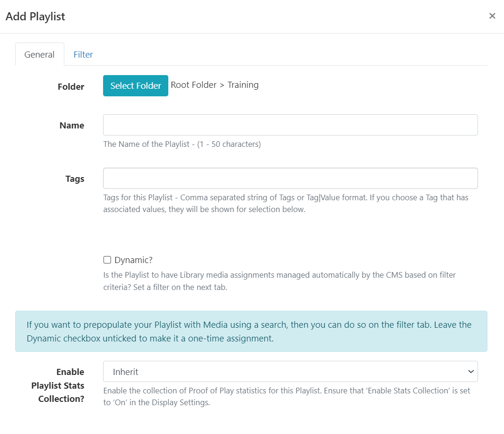
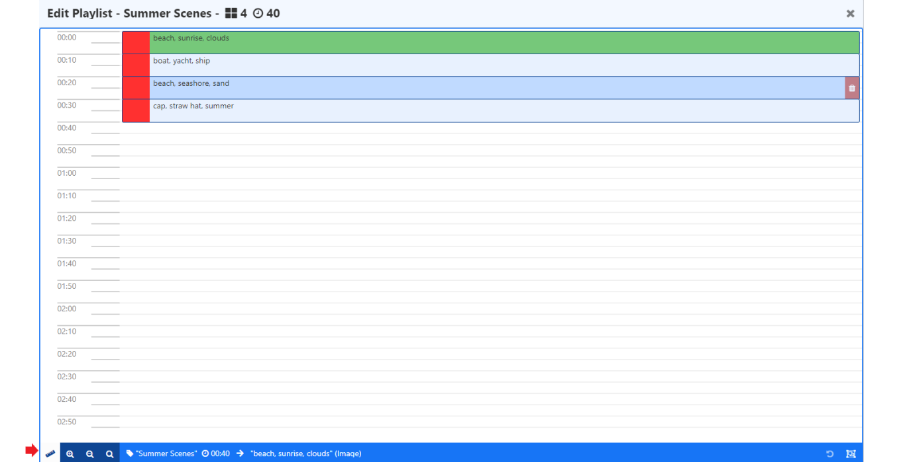
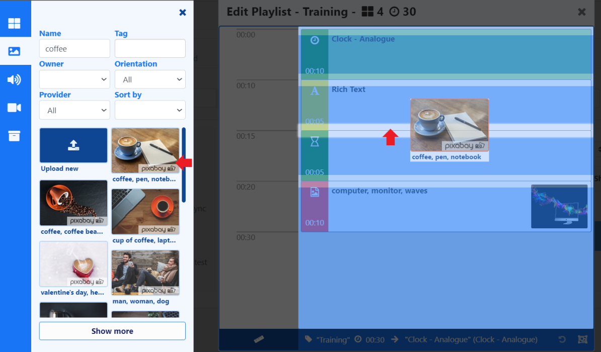
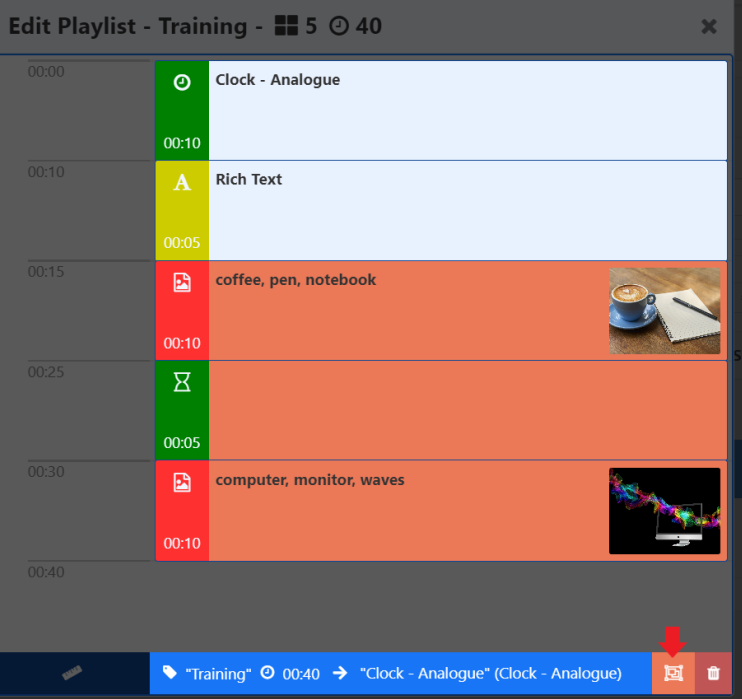
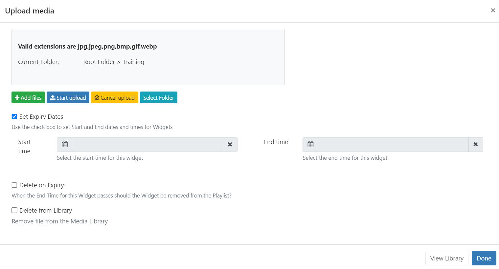
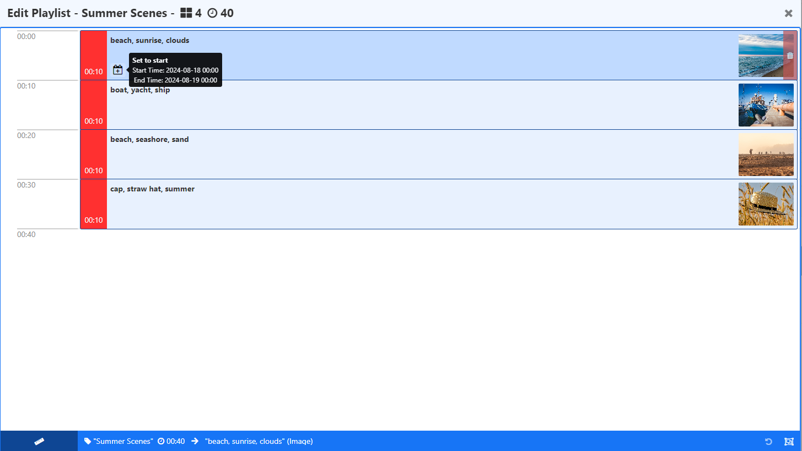
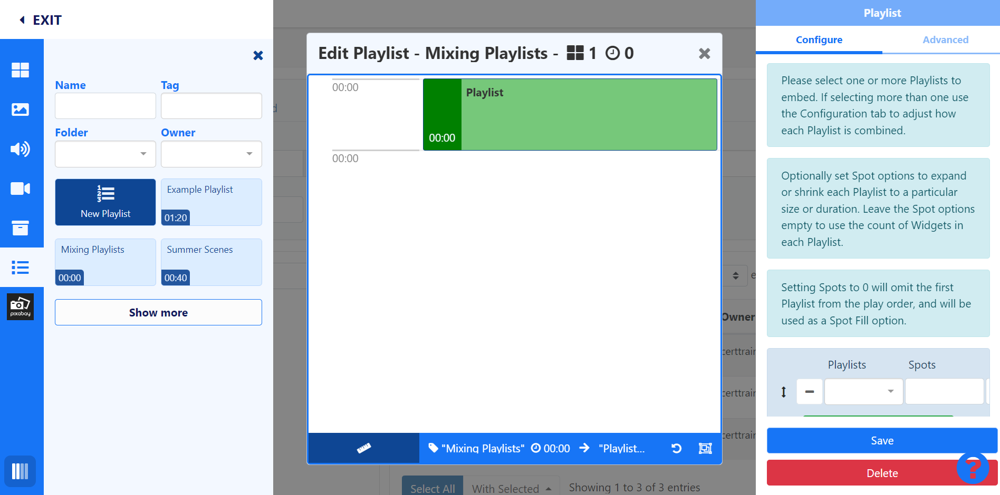
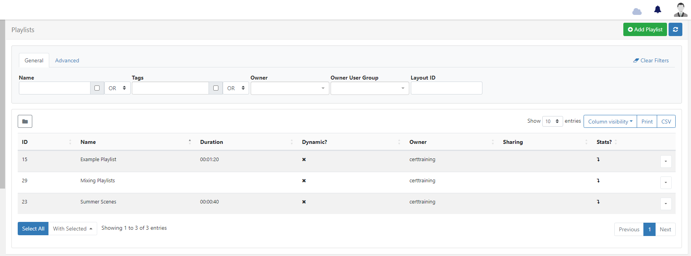

# Playlists

Playlists are used to show a sequence of media items (such as an image slideshow). There are two ways to create a Playlist:

- Create [Playlists](media_playlists) independently to a Layout. Global Playlists can be scheduled to Displays without the creation of a Layout. Playlists created outside of the Layout Editor are still shown for selection from the Add Playlist function from the Layout Editor.
- [Add Playlists](layouts_editor_playlists.html#content-add-playlists) directly to a Layout from the Layout Editor. Local Playlists can be converted to be saved for re-use as a global Playlist. Saved Playlists will be shown in the Layout Editor to add to Layouts.

## Feature Overview:

- Create and configure independently to Layouts.
- Add and maintain content [dynamically](media_playlists.html#content-dynamically-adding-media).
- Update Playlist content without accessing Layouts.
- Schedule directly from the Playlist grid without the need to add to a Layout.
- Combine content from a variety of Playlists to be shown.
- Set the maximum number of items to be shown from a Playlist.
- Control how long each item on a Playlist should show before moving onto the next item.
- Set Expiry Dates for media items added to a Playlist.

## Creating a Playlist

Streamline resources and save time by creating Playlists to hold multiple items of content to be shown on Displays. Create Playlists to target and collate content for specific requirements, locations, subject categories etc. 

Playlists that are created independently to Layouts and do not require additional User access to Layouts or the Layout Editor in order to add or manage content on Playlists.  Any changes made to a Playlist will be updated in all Layouts/Schedules that already contain that Playlist.

- Select **Playlists** under the **Library** section of the main CMS menu.

- Click the **Add Playlist** button and complete the form fields:

[Folders](https://test.xibo.org.uk/manual/en/tour_folders.html) are used to organise, search and easily [Share](https://test.xibo.org.uk/manual/en/users_features_and_sharing.html#content-share) User objects with other Users/User Groups. Playlists saved to a Folder will inherit the access options applied to that Folder. 

{tip}
If Users should also have access to the content of the Playlist (image/video media files for example), ensure that these are also saved to the same Folder!
{/tip}

- Give your Playlist a **Name** for easy identification in the CMS and include optional [Tags.](tour_tags.html) 

There are two options for adding [Media](media_library) content to Playlists:

- Automatically assigning Library based media on criteria using the [Dynamic](media_playlists.html#content-dynamically-adding-media) option.
- Manually assigning media using the [Playlist Editor](media_playlists.html#content-media-playlists), which will open on saving the form.

## Dynamically adding Media

- Once ticked, click on the **Filter** tab and set the required criteria in order to populate matching Library Media. 
- Provide a **maximum number** of Library Media files to limit the number that can be automatically assigned.

Media already in the CMS Library that matches the criteria set will be shown:

Any future media files that are added to the Library that satisfy the set criteria for this Playlist will be automatically added to this list.

{tip}
Library Media can also be prepopulated as a one-time assignment to a Playlist by setting criteria but leaving the Dynamic option unticked!
{/tip}

- Click to **Save**.

{tip}
Did you know a Dynamic Playlist can be scheduled to be shown on Displays full screen without first adding it to a Layout? Use the row menu for the Playlist and select Schedule!
{/tip}

## Playlist Editor

- From the Toolbox, select content to add to the Playlist.
- Configuration options will load in the properties panel.

{tip}
The **Playlist Editor** contains two additional Widgets, a **Rich Text Editor** to provide text, Html or JavaScript and a **Spacer** to create an empty 'slot' within a Playlist.
{/tip}

Durations will update to show the minutes/seconds as items are added to the Playlist timeline.

- Re-order the sequence by drag and drop.

- Click the ruler icon to **Change Scale mode**:

Use the scale options to zoom in and out to decrease/increase the visible time span.

Items can be added to a specific point in the list, drag or click to add content to a position marker within the Playlist.

{tip}
Use the Undo button at the bottom of the toolbar to revert a change.
{/tip}

An additional [Context Menu](layouts_editor.html#content-context-menu) of options can be accessed by right clicking on an item which includes setting [Widget Expiry Dates](media_playlists.html#content-widget-expiry-dates) and [Playlist Transitions](tour_transitions.html#content-playlist-transitions).

{tip}
When Transitions are applied to a Widget by default, the properties panel will be blank. Only manually entered Transitions will show on forms!
{/tip}

Use the **Select Multiple Widgets** button at the bottom of the Playlist Editor to delete multiple selections with one click: 

{tip}
Did you know a 'global' Playlist can be scheduled to be shown on Displays full screen without first adding it to a Layout? Use the row menu for the Playlist and select Schedule!
{/tip}

## Widget Expiry Dates

Items added to a Playlist have an additional option of setting Start and End times.

{feat}Widget Expiry Dates|v4{/feat}

- Right click on an item in a Playlist to **Edit Expiry Dates** or set when [uploading media](media_library.html#content-add-media-upload) directly to a Playlist.

Uploading from a [Library Search](layouts_editor.html#content-library-search) will have an additional **Set Expiry Date** option:

When uploading multiple media files, clicking the **Start upload** button will upload all files with the same date/time and Folder location set.

{tip}
Items can also be uploaded individually using the **blue upload** button at the end of the row for a file to have different set Expiry Dates and Folder locations for each file uploaded.
{/tip}

Any items on a Playlist that have **Expiry Dates** set show an icon, which when moused over will show further information:

{tip}
Once the End date has passed the item will be removed from the Playlist. Expired items that have not been set to Delete on Expiry will remain visible in the Playlist Editor only so that Start and End times can be re-adjusted if needed.
{/tip}

- Click on an icon to open to make any changes/remove from the item.

## Embedding Playlists

Playlists can be added to other Playlist timelines in order to define how much content should be shown, for how long as well as determine a play order.

- From the Playlist Editor select to add a New or select from the list of available 'global' Playlists from the Toolbox.
- Options for configuration are shown in the Properties Panel:

- Use the dropdown menu to select **Playlists** using the `+` button to add and configure multiple Playlists if required.

- **Spot** options are used to define how much content from Playlists should be shown and for how long.

Spots also have an option to use a Playlists content as filler only and add content from this Playlist to **Fill** or **Pad** other selected Playlists:

- This Playlist must be the **first** added Playlist in the list.
- Enter a **0** in the **Spots** field so that the entire Playlist will be ignored and omitted from the play order. Select how the content from this Playlist should be distributed with the other Playlists using **Spot Fill** options.

{version}
**Note:** Please be aware that by setting **Start Dates** to Widgets may cause fewer Spots to be shown than the total amount specified!
{/version}

Use the drop-down menu for the **Spot Fill** field to select how any remaining Spots should be filled in the event that there are not enough Widgets on the selected Playlist to fulfil the specified play spots. 

{tip}
**Spots**, **Spot Length** and **Spot Fill** are all optional and can be left blank if this functionality is not required!
{/tip}

Use the drop-down for **Playlist Ordering** to select how all Playlists should be ordered to play.

{tip}
**Auto** uses the total count of items in each list and divides it by the smallest list to determine how often to take items from each list to ensure an even play from each Playlist.
{/tip}

Select from the **Remaining Widgets** options to handle any content that is left unordered at the end of a Playlist.

{tip}
Adding Playlists to a **New Playlist** on a Layout has an additional [Cycle Based Playback](layouts_editor_playlists.html#content-cycle-based-playback) option which includes a **Random Widget** feature.
Cycle based playback is not supported when adding Playlists to a global Playlist!
{/tip}

## Playlist Grid

Saved Playlists can be viewed from **Playlists** under the **Library** section of the main CMS menu:

Each Playlist has a row menu which is used to access a menu of actions/shortcuts, notable settings are listed below: 

- **Timeline** - open the Playlist Editor to make changes to content on the timeline.
- **Edit** - use the Filter tab for Dynamic Playlists to view the list of dynamically assigned media and make changes to criteria.
- **Usage Report** - view where Playlists are being shown and what Layouts they have been included on.
- **Schedule** - directly Schedule a Playlist to be shown full screen on Displays.

{tip}
Any changes made to a Scheduled Playlist will be automatically pushed to Players as they are made.
{/tip}

