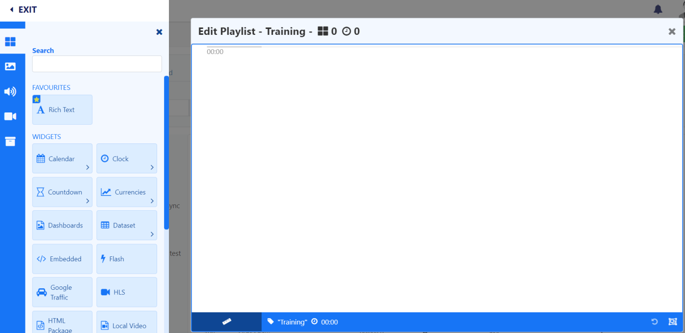
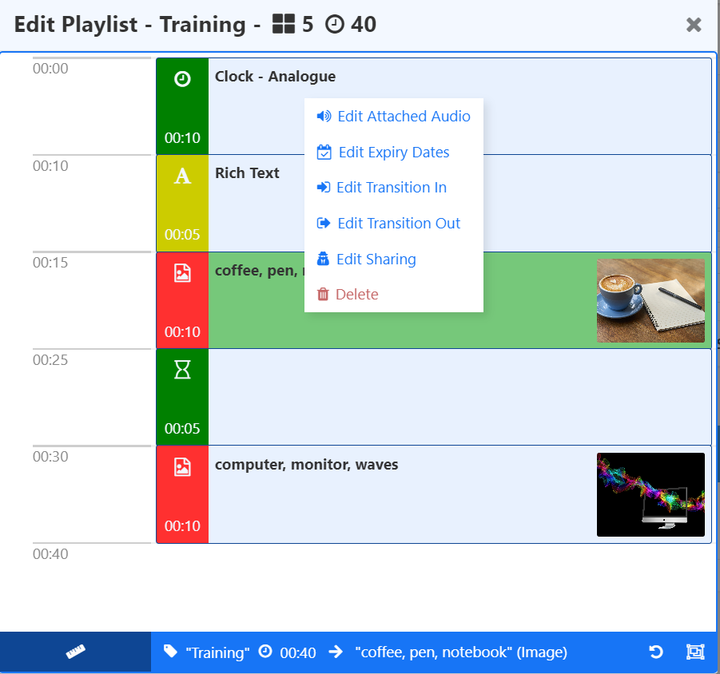

# Playlists

Playlists contain a timeline of ordered content which can be created directly on a Layout as a one time assignment using the [Playlist](media_modules_playlist.html) Widget or created and managed independently for further re-use across multiple Layouts from the Playlists page.

## Feature Overview:

- Easily create a 'slide-show' of content.
- Define content order.
- Includes a timeline to show how the sequence of content will play.
- Create a Playlist of content directly on a Layout as a one time assignment.
- Create a [re-usable list](media_playlists.html#content-creating-a-re-usable-playlist) of content independently to Layouts.
  - Re-use across multiple Layouts.
  - Add and maintain content [dynamically](media_playlists.html#content-dynamically-adding-media).
  - Update Playlist content without accessing Layouts.
  - Schedule directly from the Playlist grid without the need to add to a Layout.
  - Save to [Folders](tour_folders.html) to easily control Share options for Playlists.

## Creating a re-usable Playlist

Streamline resources and save time by creating Playlists to hold multiple items of content which can be used across multiple Layouts. Create Playlists to target and collate content for specific requirements, locations, categories etc. 

Playlists that are created and therefore managed independently to Layouts, do not require further user access to Layouts or the Layout Editor to add or manage content.  Any changes made to a Playlist will be updated in all Layouts/Schedules that contain that Playlist.

Select Playlists under the Library section of the main CMS menu.

- Select the **Add Playlist** button and complete the form fields:

(NEW)

[Folders](https://test.xibo.org.uk/manual/en/tour_folders.html) are used to organise, search and easily [Share](https://test.xibo.org.uk/manual/en/users_features_and_sharing.html#content-share) User objects with other Users/User Groups. Playlists saved to a Folder will inherit the access options applied to that Folder. 

{tip}
If Users should also have access to the content of the Playlist (image/video media files for example), ensure that these are also saved to the same Folder!
{/tip}

- Give your Playlist a **Name** for easy identification in the CMS and include optional [Tags.](tour_tags.html) 

### Dynamically adding Media

Playlists have a **Dynamic** option to automatically assign **Library Media** files based on set criteria:

- Once ticked, click on the **Filter** tab and set the required criteria in order to populate matching Library Media. 
- Provide a **maximum number** of Library Media files which can be automatically assigned.

Media already in the Library that matches the criteria set will be shown:

Any future media files that are added to the Library that satisfy the set criteria for this Playlist will be automatically added to this list.

{tip}
Library Media can also be prepopulated as a one-time assignment to a Playlist by setting criteria but leaving the Dynamic option unticked!
{/tip}

- Click to **Save** your dynamic Playlist.

{tip}
If you want to show your dynamic Playlist full screen on Displays, use the row menu and click Schedule!
{/tip}

### Playlist Editor

Saving the form **without** the **Dynamic** option selected or when adding the [Playlist](media_modules_playlist.html) Widget to a Layout, the **Playlist Editor** is used to manually add content:

- From the Toolbar, add [Widgets](layouts_widgets.html)/[Library Media](layouts_library_search.html) to the Playlist Editor.
- Configuration options will load in the properties panel.

The duration will update to show the minutes/seconds as items are added to the Playlist.

- Re-order the sequence by drag and drop.

Click the ruler icon to **Change Scale mode**:

Use the scale options to zoom in and out to decrease/increase the visible time span.

Items can be added to a specific point in the list, drag or click to add content to a position marker within the Playlist.

{tip}
Use the Undo button at the bottom of the toolbar to revert a change!
{/tip}

A set of further options can be accessed by right clicking on an item. From this [Context Menu](layouts_editor.html#content-context-menu) you can set **Share** access, set **Audio** files, **Start and End Times** and **Transitions** for the selected item on the Playlist.

Use the **Select Multiple Widgets** button at the bottom of the Playlist Editor to delete multiple selections with one click: 

Use the **X** to close the Playlist Editor and return to the Playlist grid. 

{tip}
If you want to show your Playlist full screen on Displays, use the row menu and click [Schedule](scheduling_events.html) or add to show in a Layout using the [Playlist](media_modules_playlist.html) Widget.
{/tip}

## Playlist Widgets

The Playlist Editor contains two Widgets that are only available for use with Playlists:

### Rich Text Editor

Use the inline editor to enter text and apply formatting:

- Enter text or HTML.
- Provide JavaScript.

- Optionally select a **Background Colour** to use.
- Select an **Effect** to use from the dropdown menu.
- Include a **Speed** for the selected effect.
- Include a selector to use for stacking marquee items in a line when scrolling left/right.

### Spacer

Use the Spacer to create an empty 'slot' within a Playlist.

## Row Menu

Playlists created from the Playlists grid have a row menu where Users can access a list of actions/shortcuts.

- Notable settings are listed below:

**Timeline**

Select to make changes to manually assigned content of a Playlist using the Playlist Editor.

**Edit**

For Dynamic Playlists use the Filter tab to view the list of dynamically assigned media and to make changes to criteria.

Select to change any details of a Playlist record (Manual or Dynamic) such as the Name, Tags etc.

**Usage Report**

View where Playlists are being shown and what Layouts they have been added to.

**Schedule**

Directly Schedule a Playlist to be shown full screen on Displays. 

{tip}
Any changes made to a Scheduled Playlist will be automatically pushed to Players as they are made.
{/tip}

## Creating a Playlist on a Layout

- Select the Playlist Widget and [Manually Add Media](media_playlists.html#content-manually-add-media) (as outlined above.)

