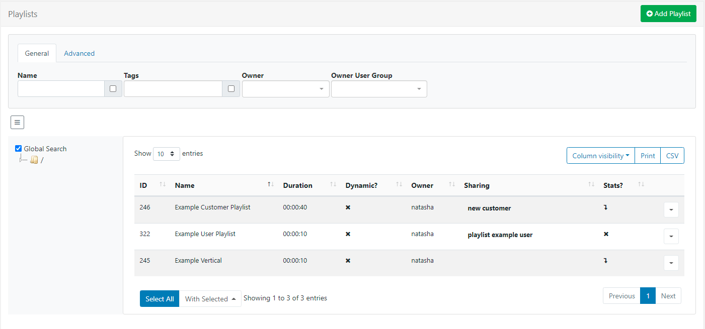
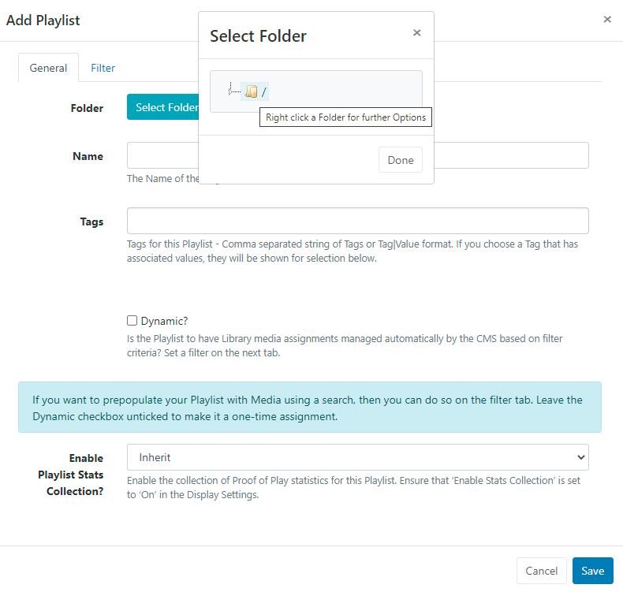
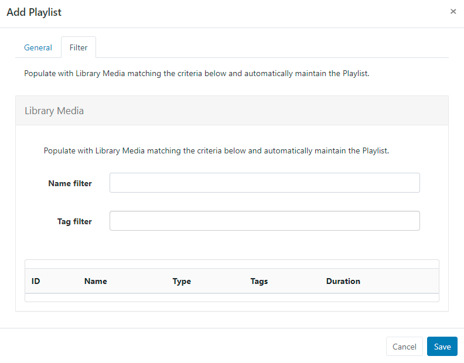
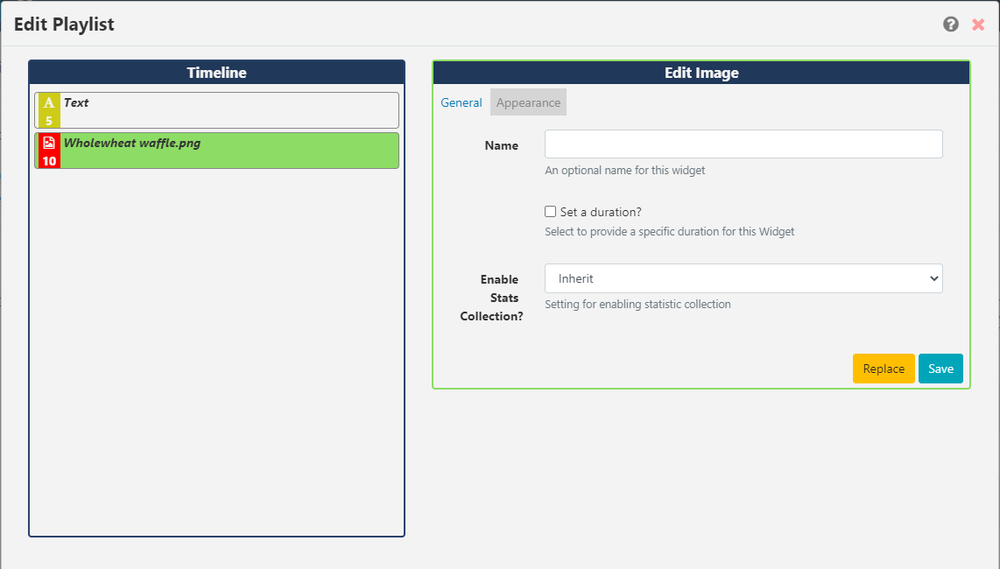
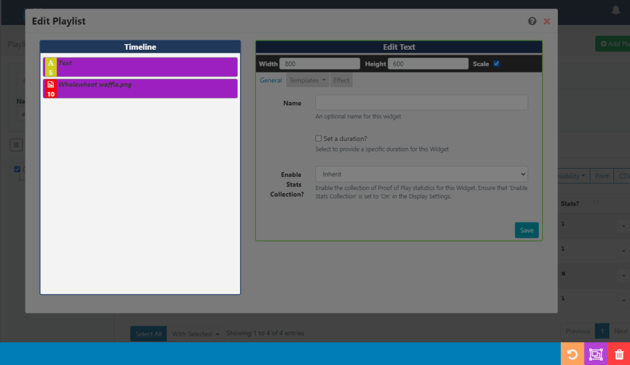

<!--toc=media-->

# Playlists

{tip}
If you are using a 2.x CMS, please use the following link: [Playlists](media_playlists_2.html)
{/tip}

Playlists allow for the creation of 'Reusable Playlists' which are created and managed independently to Layouts. Once created, Playlists can then be easily reused across multiple Regions and Layouts.

Think of Playlists as a two part process:

1. **The Playlist** (contains the content and configuration of media to be shown)
2. **The Sub-Playlist Widget** (once added to Layouts, Playlists can be selected and further configured to Play in a specified order)

Playlists are administered by clicking on Playlists under the **Library** section of the main menu:

The Playlists [Grid](tour_grid.html) allows you to edit existing and create new. The **Folder** tree will open by default:

- Click on a Folder/sub-folder to search the contents and return results based on any filters applied to the grid.

or

- Tick **All Folders** to include searching in the Root Folder and return results based on any filters applied to the grid.

{tip}
Click the Folders icon to toggle on/off from view.  When Folders are hidden from view, the file path for the selected folder will be shown!
{/tip}

### Create a new Playlist

- Click on the **Add Playlist** button and complete the appropriate form fields:

### Folders

Playlists can be optionally saved to **Folders**.

{tip}
Playlists that are saved in Folders will inherit the View, Edit, Delete **Share** options that have been applied to the destination Folder for User/User Group access!
{/tip}

- Click on the **Select Folder** button and expand to select a Folder to save in.

Users can also right click a folder to create a new folder to save in and access further options.

{tip}
Available options are based on enabled [Feature and Sharing](users_features_and_sharing.html) options for a User/User Group.
{/tip}

- The selected folder file path will be shown next to the Folder field on the form.

{nonwhite}
Further information for Administrators regarding Folder access and set-up can be found [here](https://xibo.org.uk/docs/setup/folders-administration)
{/nonwhite}

{white}
For further information regarding Folder access and set-up, please speak to your Administrator.
{/white}

### Name

- Give the Playlist a **Name** for easy identification purposes within the CMS.

### Tags

Playlists can be tagged for organisation and to make it easier to find a larger number of Playlists if grouped by Tag.  
When entering text into the Tag field on the form, an auto complete helper will show possible matches to make it easier for Users to select from.

Predefined  Values will be shown by using the **Tag value** drop down, if the Value is already known it can be typed directly into the field using the following format: `Colour|Red`

{tip}
If a Value has been set as 'Required' by an Administrator, then the Value must be entered in order to save the form!
{/tip}

Users can add an associated Value to a Tag that does not already have a predefined value by using the **Tag value** field. If a Tag value is not needed, this field can be left blank.

{tip}
Tags can also be assigned to multiple Playlists using the [With Selected](https://xibo.org.uk/manual/en/tour_grids.html#multi-select) option at the bottom of the Playlist grid!
{/tip}

For further information on what **Tag **and **Tag Values** to use, please speak with your Administrator.

{nonwhite}
Tag management information for Administrators can be found [here](https://xibo.org.uk/docs/setup/tags-adding-editing-assigning)
{/nonwhite}

### Automatic Media Assignment

Use the **Dynamic** check box if you want to automatically manage media assignments for this Playlist. 
Once selected, click on the **Filter** tab to set the criteria to use to add Library Media and automatically maintain the Playlist. 

{tip}
You can also prepopulate a Playlist with media from the Library by leaving the Dynamic checkbox unticked and just using the Filter tab to enter criteria as a one-time assignment.
{/tip}

### Manually adding Media

- Complete the form fields and click the **Save** button.

The Playlist Editor window will open:

Click on a **Widget** to add or drag and drop to add to the canvas.

{tip}
Use the [Library Search](layouts_library_search.html) tab to add media which has already been added to the Library!
{/tip}

Once Widget's have been added, configure using the available **Edit** options:

{tip}
For further information on the **Edit options** available, refer to the relevant manual page for the chosen [Widget](media_modules.html)
{/tip}

Change the order of added media items in a Playlist by clicking on a Widget in the Timeline and dragging it to the desired positioning. As changes are autosaved, use the Undo button located on the bottom right of the toolbar to revert any changes if required.

{tip}
Use the [Tools](layouts_tools.html) tab to apply further actions such as **Audio**,**Sharing** and **Expiry Dates** to Widgets added to the timeline.
{/tip}

{tip}
If you need to delete multiple Widgets on the Timeline, click the **Select Multiple Widgets** button on the bottom toolbar and then click on Widgets to highlight. Once you have made your selections click to delete with one click.

{/tip}

### Editing Playlists

Playlists are edited independently to Layouts, so there is no need to access or edit the Layout(s) the Playlist has been added to.

- To edit content on the Playlist use the row menu from the Playlist grid and select Timeline to open the Playlist editor.

{tip}
Changes will be available in the system straight away ready to be picked up by Players on their next collection, with no need to make any edits to Layouts!
{/tip}

### Row Menu

Use the **Row Menu** to access further actions/shortcuts for the selected Playlist

### Sharing

The creator (owner) of the Playlist or a Super Administrator can assign View/Edit/Delete access for other Users/User Groups.

Take a look at [Features and Sharing](users_features_and_sharing.html) for more information.

### Add Playlists to Layouts

Include the [Sub-Playlist Widget](media_module_subplaylist.html) to add Playlists to Layouts.

