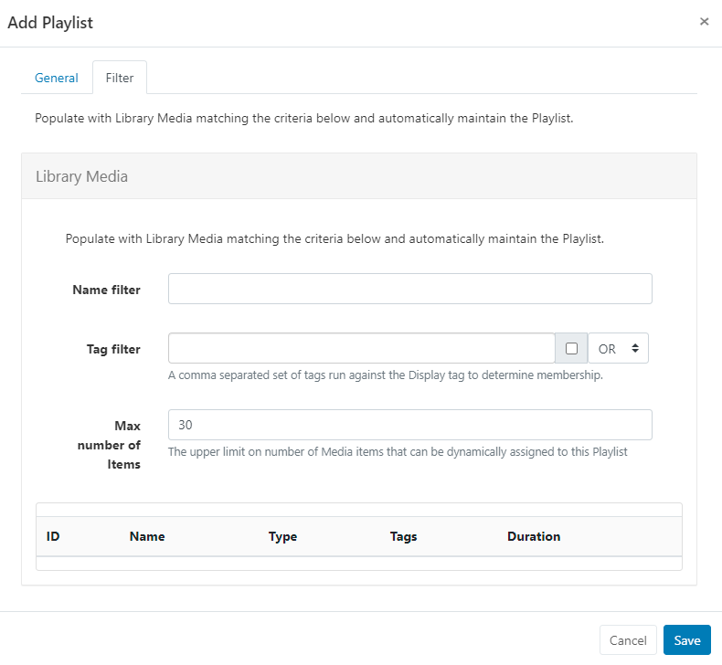
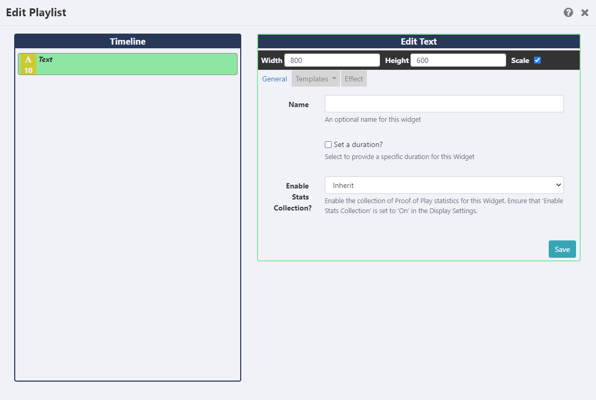

<!--toc=media-->

# Playlists

{version}

- If you are using a v3.0.x CMS, please click [here](media_playlists_3.html)
- If you are using a v2.0.x CMS, please click [here](media_playlists_2.html)
  {/version}

Playlists allow for the creation of 'Reusable Playlists' which are created and managed independently to Layouts. Once created, Playlists can then be easily reused across multiple Regions and Layouts.

Think of Playlists as a two part process:

1. **The Playlist** (contains the content and configuration of media to be shown)
2. **The Sub-Playlist Widget** (once added to Layouts, Playlists can be selected and further configured to Play in a specified order)

Playlists are administered by clicking on **Playlists** under the **Library** section of the main menu:

The Playlists [Grid](tour_grids.html) allows you to edit existing and create new. 

Click the Folders icon to toggle on/off from view.  

{tip}
When Folders are hidden from view, the file path for the selected folder will be shown!
{/tip}

- Click on a Folder/sub-folder to search the contents and return results based on any filters applied to the grid.

or

- Tick **All Folders** to include searching in the Root Folder and return results based on any filters applied to the grid.

Check out the [Folders](/manual/en/tour_folders.html) page for further information!

### Create a new Playlist

- Click on the **Add Playlist** button and complete the appropriate form fields:

- Playlists can be optionally saved to [Folders](tour_folders.html) for easier searches, organisation and to easily set [Share](users_features_and_sharing.html) options for Users/User Groups.

{tip}
Playlists that are saved in Folders will inherit the View, Edit, Delete **Share** options that have been applied to the destination Folder for User/User Group access. 
{/tip}

- Provide a **Name** for easy identification purposes within the CMS.

- Include optional [Tags](tour_tags.html) to organise and make it easier to search for.

### Automatic Media Assignment

- Use the **Dynamic** check box if you want to automatically manage media assignments for this Playlist.
- Once selected, click on the **Filter** tab to set the criteria to use to add Library Media and automatically maintain the Playlist. 

{tip}
Use the **Tag Filter** drop down to use And/Or criteria when selecting media to add!
{/tip}

- Enter a number to set the **maximum** amount of Media items that can be dynamically assigned to the Playlist.

{tip}
You can also prepopulate a Playlist with media from the Library by leaving the Dynamic checkbox unticked and just using the Filter tab and criteria to add media as a one-time assignment.
{/tip}

### Manually adding Media

- Complete the form fields and click the **Save** button:

- Use the Toolbar to add content to your Playlist using available [Widgets](layouts_widgets.html) and [Library Media](layouts_library_search.html) 
- Add to the canvas by clicking to add or drag and drop.

- Once added, configure using the available options:

{tip}
For further information on the options available, refer to the relevant manual page for the chosen [Widget](media_modules.html).
{/tip}

Change the order of added media items in a Playlist by clicking on a Widget in the Timeline and dragging it to the desired positioning. As changes are autosaved, use the Undo button located at the of the toolbar to revert any changes if required.

All Widgets/Library Media can access a **Context Menu** with a set of options that can be applied, such as **Share** access and **Transitions**. Right click a selected Widget/Media file to access. Further information regarding the Context Menu can be found on the [Layout Designer](layouts_designer.html) page of the manual.

{tip}
If you need to delete multiple Widgets on the Timeline, click the **Select Multiple Widgets** button on the bottom of the toolbar and then click on Widgets to highlight. Once you have made your selections click to delete with one click.
{/tip}

### Editing Playlists

Playlists are edited independently to Layouts, so there is no need to access or edit the Layout(s) the Playlist has been added to.

- To edit content on the Playlist use the row menu from the Playlist grid and select Timeline to open the Playlist editor.

{tip}
Changes will be available in the system straight away ready to be picked up by Players on their next collection, with no need to make any edits to Layouts!
{/tip}

### Row Menu

Use the **Row Menu** to access further actions/shortcuts for the selected Playlist

### Sharing

The creator (owner) of the Playlist or a Super Administrator can assign View/Edit/Delete access for other Users/User Groups.

Take a look at [Features and Sharing](users_features_and_sharing.html) for more information.

### Add Playlists to Layouts

Include the [Sub-Playlist Widget](media_module_subplaylist.html) to add Playlists to Layouts.

{nonwhite}
### Further Guidance

[Utilising the Playlists Dashboard](https://community.xibo.org.uk/t/utilising-the-playlists-dashboard/21966)

[How to show Media at specified intervals using Playlists](https://community.xibo.org.uk/t/how-to-show-media-at-specified-intervals-using-playlists/20790)

{/nonwhite}

