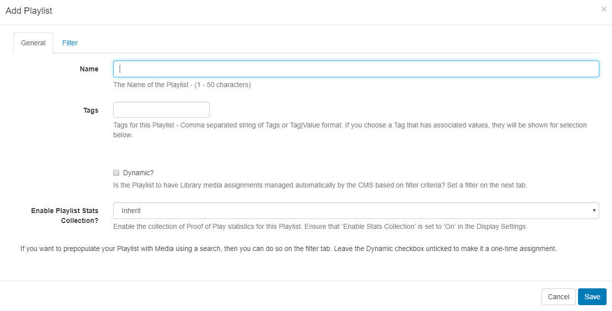
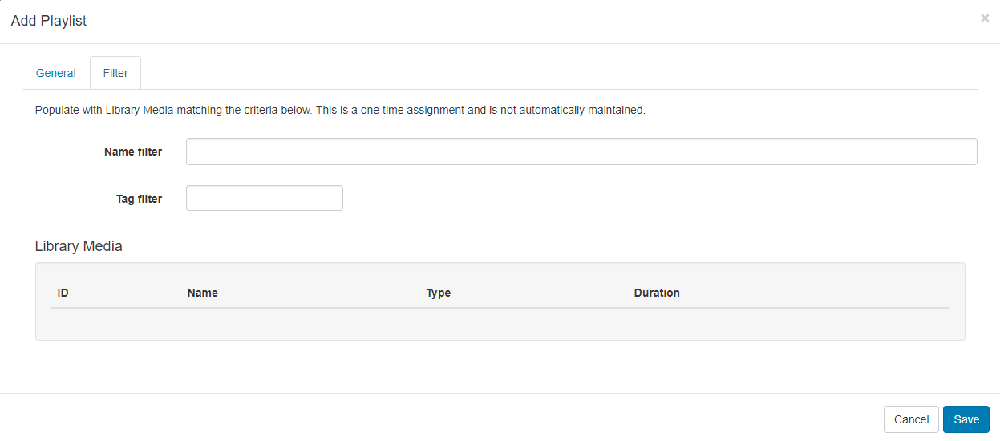
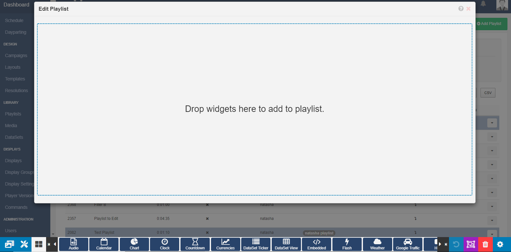
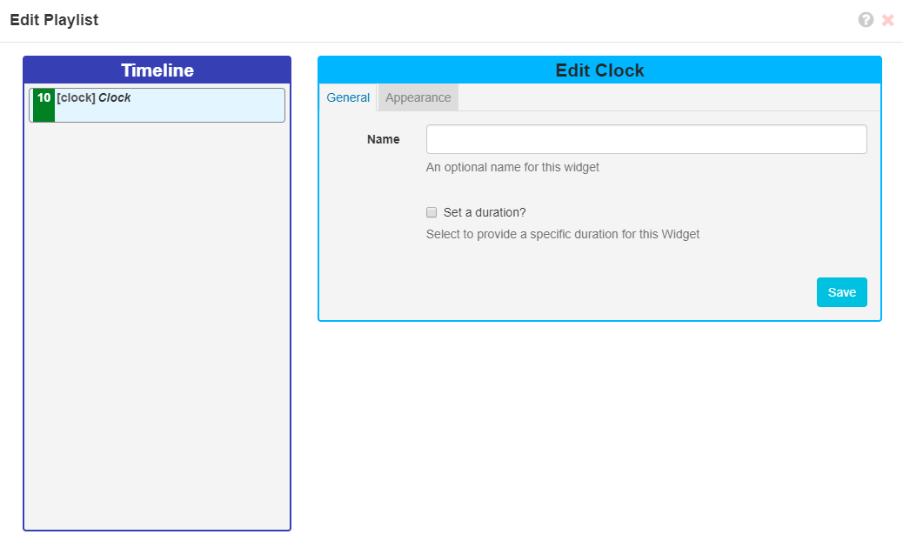
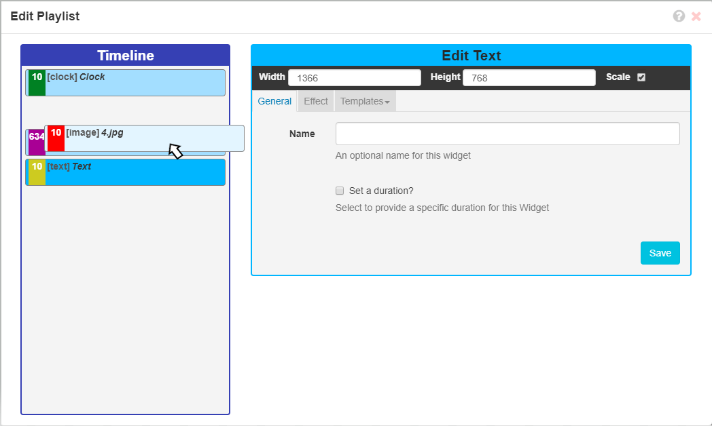
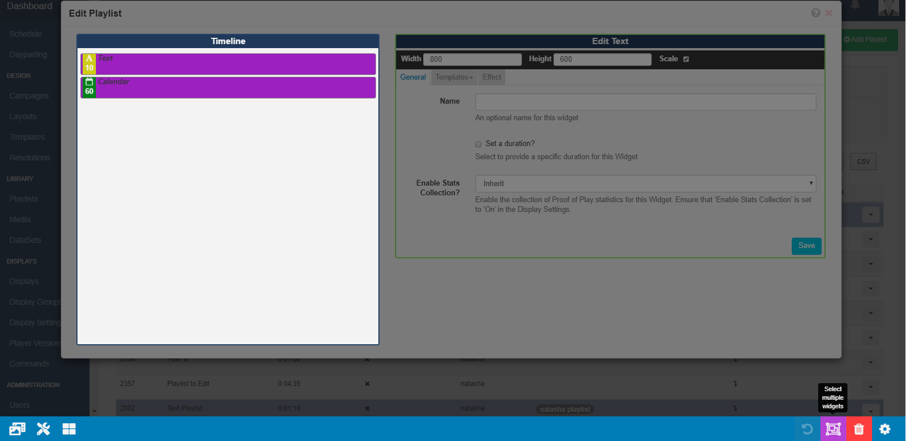

# Playlists

{tip}

**Please note:**

- If you are using a v3.0.x CMS, please click [here](media_playlists_3.html)
- If you are using a v3.1.x CMS, please click [here](media_playlists.html)
  {/tip}

**Please note:** Playlists are only available from v2.0.0

Playlists allow for the creation of reusable playlists which can be easily added to Layouts and come in two parts:

1. **The Playlist** (contains the media content and configuration)
2. **The Sub-Playlist Widget** (allows for defined Playlists to be added to Layouts)

Playlists are first defined, which can then be reused across multiple Regions and Layouts. Access by navigating to **Playlists** under the **Library** section of the menu to view the Playlists grid where you can add new and manage existing Playlists.

Click on the **Add Playlist** button and complete the form fields:

Playlists can be tagged which allows for ordering and makes it easier to find and view a large number of Playlists if grouped by a certain Tag. 

{tip}
Administrators can set certain **Tag's** to have a **Value** associated to them.   Tags that have a Tag Value will show the selections available from an additional field -  **Tag value** drop down.

From v2.3.6, you can add an associated value for Tags without an existing predefined value. Enter the Value you wish to associate with the Tag in the **Tag value** field and click enter. If you do not wish to enter a Tag value, then this field can be left blank

For further information on what Tag and Tag Values to use, please speak with your Administrator.
{/tip}

If you require media assignments to be managed automatically then tick the **Dynamic** check box and set the filter criteria to use for Library media on the **Filter** tab.

{tip}
You can prepopulate your playlist with media from the Library using the **Filter** tab, but leaving the Dynamic checkbox unticked to make it a one-time assignment.
{/tip}

Once added use the row menu for your created Playlist and click on **Timeline**.

Click on a **Widget** or drag and drop to add to the playlist. 

{tip}
Use the [Library Search](layouts_library_search.html) tab to add media already uploaded to the Library.
{/tip}

Once added configure using the **Edit** options available.

{tip}
For further information on the **Edit options** available please refer to the relevant manual page for the chosen Widget.
{/tip}

Change the playlist Timeline order by clicking on an item and dragging it to the desired positioning. As changes are autosaved use the Undo button, located on the bottom right of the toolbar to revert any changes made.

{tip}
Use the [Tools](layouts_tools.html) tab to apply **Actions** such as **Audio**/**Permissions** and **Expiry Dates** to the items added to the timeline.
{/tip}

From v2.2, use the **Select Multiple Widgets** button on the bottom toolbar to select and delete multiple items from the Playlist.

Easily make copies of Playlists by using the **Copy** button from the row menu.

Use the tick box to make **new copies** of all media assigned to the original playlist so that you can make adjustments as needed to create a new Playlist.

Include pre-defined Playlists by adding the [Sub-Playlist Widget](media_module_subplaylist.html) to Layouts.

