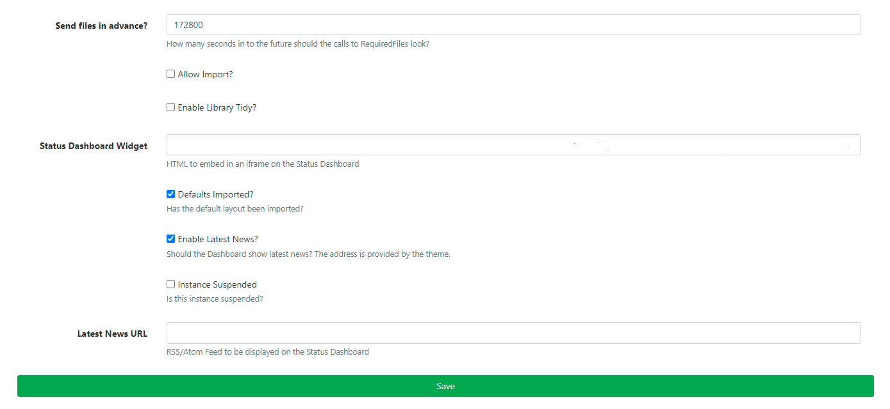
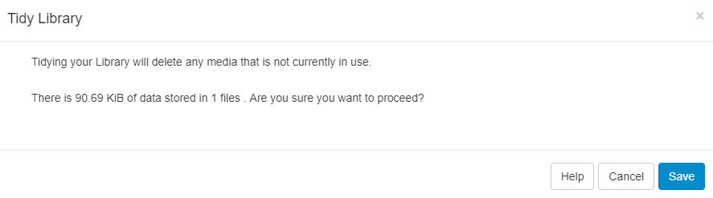

<!--toc=media-->
# Tidy Library

{nonwhite}
{cloud}
The Tidy Library function is turned off by default for **Xibo Cloud Hosting** customers as it can be potentially destructive if the options are not fully understood. This can be enabled if required by following the steps below.
{/cloud}
{/nonwhite}

As the CMS is used and Layouts/Media are added, over time the Library can become cluttered with old content that is no longer in use.

The Library can be *tidied* by a User or Super Administrator so that it is kept clean and small. 
**Actions cannot be reversed so this must be used with caution.**

{tip}
This might be of particular interest if the CMS is installed on a web server that has quotas or if Users have been assigned their own quotas.
{/tip}

There are two places where the Library can be tidied:

1. **Settings** page - available to all Super Administrators
2. **Library** page - enabled for All Users of the CMS

## Tidy from Settings

Super Administrators can initiate a system-wide Library tidy operation by navigating to the Settings page under the Administration section on the Menu. Click on the General tab and click on the **Tidy Library** button.

As this functionality is system-wide and therefore operates on **ALL** User files, confirmation is required to remove unused and old revisions.

This option is more comprehensive and removes:

- Temporary files
- Orphaned files
- Thumbnails
- Media revisions that aren't used anywhere
- Media that isn't used anywhere (on any Layouts / Display Groups / Displays)
- Generic files uploaded to the CMS

### Orphaned files

Orphaned files are a rare occurrence where a file stored on disk in the Library folder is not deleted when the Media item is deleted from the Library. This means that the file exists but the CMS doesn't know anything about it.

## Tidy from Library

Allow **ANY** User to initiate a Library tidy from the Library page by enabling the functionality in **Settings** under the Administration section of the main menu. 

- Click on the General tab and use the checkbox for **Enable Library Tidy.**

Once enabled Users can click on a **Tidy Library** button located at the top of the Library page.

 The form will show the number of files that will be deleted and how much space those files take up.

{tip}
This will only delete files that are owned by the logged in User which are no longer in use on a Layout or Assigned to a Display Group/Display.
{/tip}