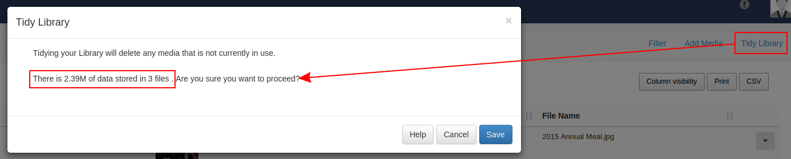
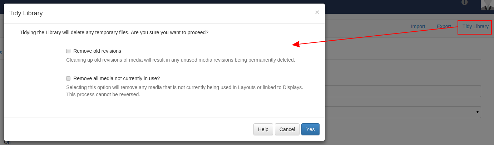

<!--toc=media-->
# Tidy Library
As the CMS is used and Layouts/Media are added, over time the library can become
cluttered with old content that is no longer in use.

The Library can be *tidied* by a user or super administrator so that it is kept
clean and small. This might be of particular interest if the CMS is installed on
a web server that has quotas or if users have been assigned their own quotas.

There are two places where the library can be tidied:

 1. Library page
 2. Settings page

### Enabling
Tidy library functionality might be disabled on the whole CMS via a checkbox in
the General tab called "Enable library tidy?".

## Tidy from the Library
Any user is able to initiate a "Tidy Library" from the Library page using the menu
item in the action bar.

The form presented will show the number of files that will be deleted as a result
of the tidy operation and how much space those files take up.

This will only delete files that are no-longer in use on a Layout or Assigned to
a Display Group/Display. It will only assess files owned by the logged in User.

## Tidy from Settings
A super administrator user can initiate a system wide library tidy operation from
the settings page.

As this functionality is **system wide** and operates on all users files confirmation
is required to remove unused and old revisions.

This option is more comprehensive and removes:

 - Temporary files
 - Orphaned files
 - Thumbnails
 - Media revisions that aren't used anywhere
 - Media that isn't used anywhere (on any Layouts / Display Groups / Displays)

#### Orphaned files
Orphaned files are a rare occurrence where a file stored on disk in the library
folder is not deleted when the media item is deleted from the library. This means
that the file exists but the CMS doesn't know anything about it.

These files are deleted in a Tidy Library Call.
