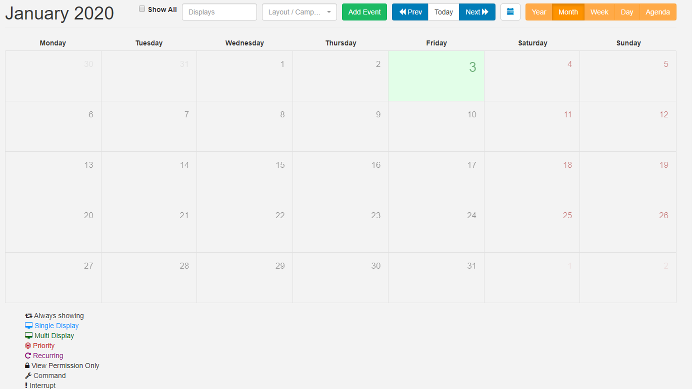

<!--toc=scheduling-->

# Scheduling

[[PRODUCTNAME]] has a sophisticated scheduling system which allows for the simple creation of complex schedules for **Events** across Displays/Display Groups. 

## Events

Events are administered from the **Schedule** section of the menu and managed from the calendar interface.

The CMS supports scheduling for 5 Event types:

1. #### Layout Event

   Select Published Layouts to schedule to Displays. 

2. #### Campaign

   Select Campaigns to schedule to Displays.

3. #### Overlay Layout Event

   Specially created Layouts are scheduled at the same time as existing Layouts to create an **overlay** of content to be displayed. 

4. #### Interrupt Layout Event (available only in the CMS from v2.2.0)

   **Please note:** We are currently working to bring this feature to all Players and will be coming soon to Android!

   A Layout that is scheduled as an Interrupt Layout will interrupt your usual schedule and play for the specified **Share of Voice** percentage set for each full hour that the Layout is scheduled.

5. #### Command Event

   A Scheduled Command can be executed by the Player at a specific point in time and therefore this type of event does not need a `toDt`.

Commands available to schedule are pre-configured by an Administrator. Available Commands can be selected using the **Command** drop-down menu on the **Schedule Event** form. If you require additional commands please contact your Administrator.
{tip}

Display Order and Priority are irrelevant when it comes to executing the Command, but may be set in the CMS for organisational purposes.

{/tip}

## Schedule Events

Events are scheduled into **Dayparts** which are selected to schedule within the selected period:

### Custom Daypart

Create your own To/From dates and times.

### Always Daypart

Select to have the event run constantly.
{tip}
Create your own defined [Dayparts](scheduling_dayparting.html) for ease of scheduling.
{/tip}

## Priority

Use Event Priority to determine whether the event should be included in the schedule for the Player or not. A 'Priority Event' is determined by a number, with 0 considered the lowest Priority.

{tip}
If a Player has a schedule containing Events which are all Priority 0, then all of the Events will be shown in rotation together. 

If 1 of the Events has a Priority of 1, then this will be the only Event shown. 

If there are some Events with Priority 0, some with Priority 1 and some with Priority 2 only the Priority 2 Events will be shown, in a rotation for that Scheduled period (as the highest Priority)

{/tip}

{tip}

A good example to use Priority would be in a way to alter the Schedule at a specific time, for example, a normal rotation during the day with a Priority Event at lunchtime which shows specific ‘lunch’ information (i.e. Lunchtime specials on a cafe menu).

{/tip}