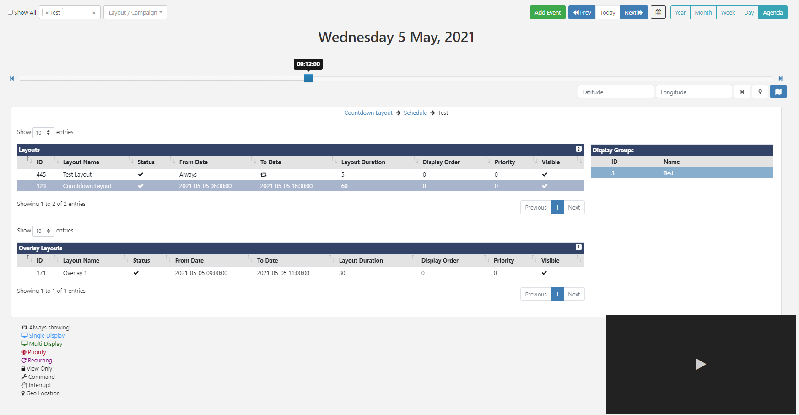

<!--toc=scheduling-->

# Schedule

Schedule content using the simple calendar interface by clicking on the **Schedule** section of the Menu. 

## Controls

Use the control bar at the top of the calendar to select **Displays**, **Add Events**, **view date periods** and **alternate Views**.

### Displays

Click in this field to select Displays/Display Groups to view the associated schedules.

{tip}
Multiple Displays/Display Groups can be added here.

Use the **Show All** option to see schedules for **all** Displays.
{/tip}

### Layout / Campaign

From CMS v2.2.0 use the field to search for Layouts/Campaigns that already exist in the Schedule for filtered Display/Display Groups.

### Add Event

Use the Add Event button to add a new Scheduled Event.

### Prev/Today/Next

Use the buttons to navigate through the calendar.

{tip}
Use the calendar icon, next to these buttons, to go directly to a selected date.
{/tip}

### Calendar Views

Each Calendar View will show the associated schedule for the selected Display/Display Group. Views show **Events** represented by Icons, with a key to explain each one, located below the calendar. 

{tip}
Click on an Event Icon to view/edit the schedule!
 {/tip}

### Year

The Year view is intended as an overview of the Events scheduled throughout the year and provides a total number of Events scheduled per month. Click in a month to view the Event details.

{tip}
Double-click to open the Month View for that particular month!
{/tip}

### Month

This View includes Icons to represent the Events that have been scheduled for that Month. Click on a particular day square to see an expanded view for that day. Double click on a day square to open the Day View for that date.

{tip}
Hover over each Icon to view the Event information!
{/tip}

### Week

This view gives a week overview of scheduled Events. Double click on a date to open the Day View.

### Day

The Day View shows all Events occurring within a single day.

### Agenda

Events can span multiple days/weeks/months so it is highly useful to be able to see a precise representation of Layouts/Campaigns that will be shown on a selected Display at a point in time.

{tip}
Select multiple Displays/Display Groups which will be presented in separate tabs!
{/tip}

Layouts/Campaigns will be shown in tabular format in the order they will cycle on the Display.

Use the slider, located above the tabs, to pinpoint the exact time of day to view. Change the date using the **Prev/Today/Next** buttons or by selecting a date using the calendar icon.

Click on a Layout to highlight the associated information (associations will turn blue) and view the breadcrumb, to show further Campaign and Display Group information. If nested Display Groups have been configured, these will show in the breadcrumb.

{tip}
From v3.0.0, use the Preview window to Play the highlighted Layout, use the buttons to minimise/maximise the viewing window or go to full screen to Play.
Click on the breadcrumb to view the selected Layout in the Layout Designer and make necessary edits to the Schedule!
{/tip}

