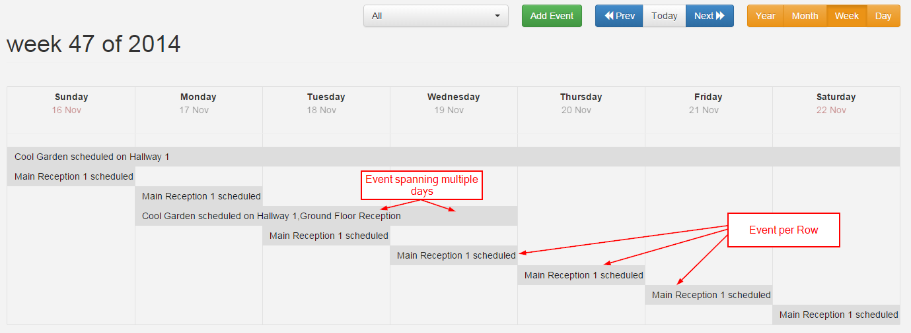
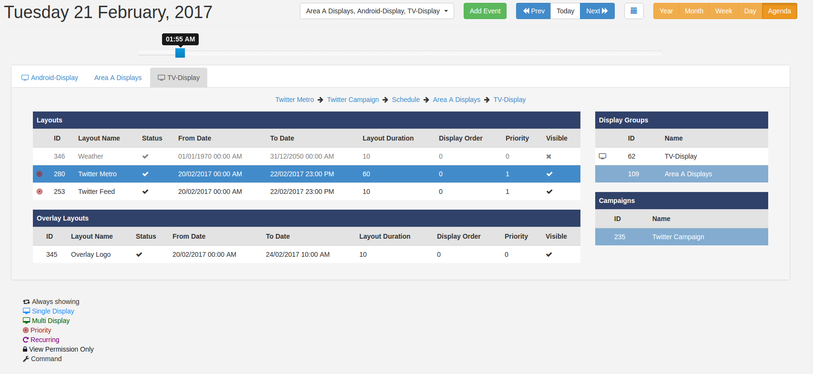

<!--toc=scheduling-->
#Calendar
The Calendar is accessible from the Scheduling link in the side bar and has 5 views:

- Year
- Month
- Week
- Day
- Agenda

Scheduling transactions can be performed when in any view.

## Controls
There is a control bar at the top of the calendar for selecting the Displays, Adding 
Events and navigating through time and the views.

## Month View
The month view is the most commonly used view of the calendar. Each day within the month
it drawn in a traditional calendar and icons representing the events on each day are
added. It is important to remember that events can usually span multiple days. A key of 
icon meanings is located below the calendar.

Clicking on an icon will open the Edit form for the related event.

Users may click on a particular day square to see an expanded view of that day, including
a textual representation of any events on that day. Clicking on the event text will open
 the Edit form for the related event.

Users may also click on the day number (i.e. 11) to jump to the day view for that day.

## Week View
The week view gives a week overview of events.

## Day View
The day view is the lowest resolution and shows all events occurring within a single day.

## Year View
The year view is intended as an overview of the events throughout the year.

## Agenda

The agenda view is used to show a precise representation of the Layouts that will be
shown on the selected Display at a point in time. The Layouts are shown in tabular
format and appear in the order they will cycle on the Display.

The Displays / Display Groups selected in the Calendar selector will be presented as 
tabs on the Agenda view.

A slider is located above the tabs to allow an exact time of day to be selected. The
date is brought through from the calendar, but can also be adjusted using the mini
calendar by clicking on the icon.

Each Layout can be selected, which will cause the associated information to be highlighted
and a breadcrumb to be shown. This can be used to trace exactly why a certain Layout
is being shown at a certain time. Associated information includes Campaigns and 
Display Groups.

If nested Display Groups have been configured, these will be shown in the breadcrumb.

