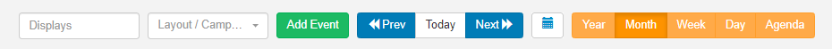
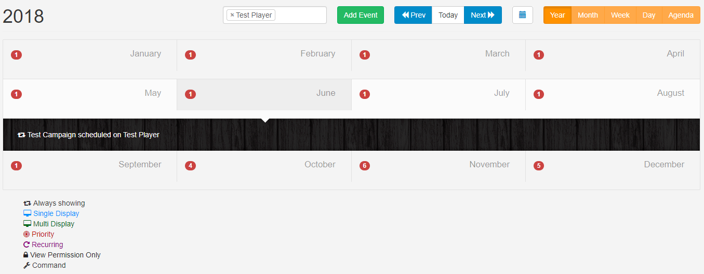
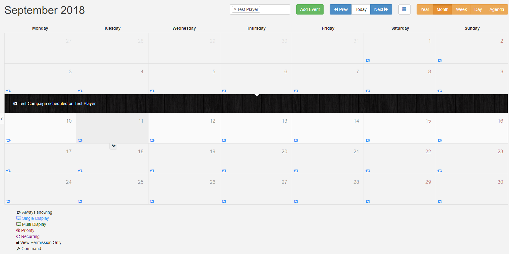

<!--toc=scheduling-->

# Schedule

Schedule content using the simple calendar interface by clicking on the Schedule section of the Menu. 

## Controls

Use the control bar at the top of the calendar to select **Displays**, **Add Events**, **view date periods** and **alternate Views**.

#### **Select Displays**

Click in this field to select Displays /Display Groups to view the associated Schedules.

#### **Add Event**

Schedule Events by completing the form fields.

#### **Prev/Today/Next**

Use to navigate through the calendar.

<tip>
Use the calendar icon, next to these buttons, to go directly to a selected date.
</tip>

### Calendar Views

Each Calendar View will show the associated Schedule for the selected Display/Display Group. Views show **Events** represented by Icons, with a key to explain each one, located below the calendar. 

<tip>
Click on an Event or Icon shown on a Calendar View to Edit the Schedule.
 </tip>

#### **Year**

The Year view is intended as an overview of the Events Scheduled throughout the year and provides a total number of Events Scheduled per month. Roll over a Month and use the black arrow to show Event details.

<tip>
Double-click to open the Month View for that particular month.
</tip>

#### **Month**

This View includes Icons to represent the Events that have been scheduled for that Month. Click on a particular day square to see an expanded view for that day. Double click on a day square to open the Day View for that date.

<tip>
Hover over each Icon to display information for that particular Event.
</tip>

#### **Week**

This view gives a week overview of Scheduled Events. Double click on a date to open the Day View.

#### **Day**

The Day View shows all Events occurring within a single day.

#### **Agenda**

Events can span multiple days/weeks/months so it is highly useful to be able to see a precise representation of Layouts/Campaigns that will be shown on a selected Display at a point in time.

The selected Displays/Display Groups will be presented as tabs with Layouts shown in tabular format which appear in the order they will cycle on the Display.

Use the slider, located above the tabs, to pinpoint the exact time of day to view. Change the date using the **Prev/Today/Next** buttons or by selecting a date using the calendar icon.

Click on a Layout to highlight the associated information (associations will turn blue) and view the breadcrumb, to show further Campaign and Display Group information. If nested Display Groups have been configured, these will show in the breadcrumb.

<tip>
This can be used to view exactly why a certain Layout is being shown at a certain time.
</tip>

<tip>
Click on the breadcrumb to view the Layout and make Edits to the Schedule.
</tip>