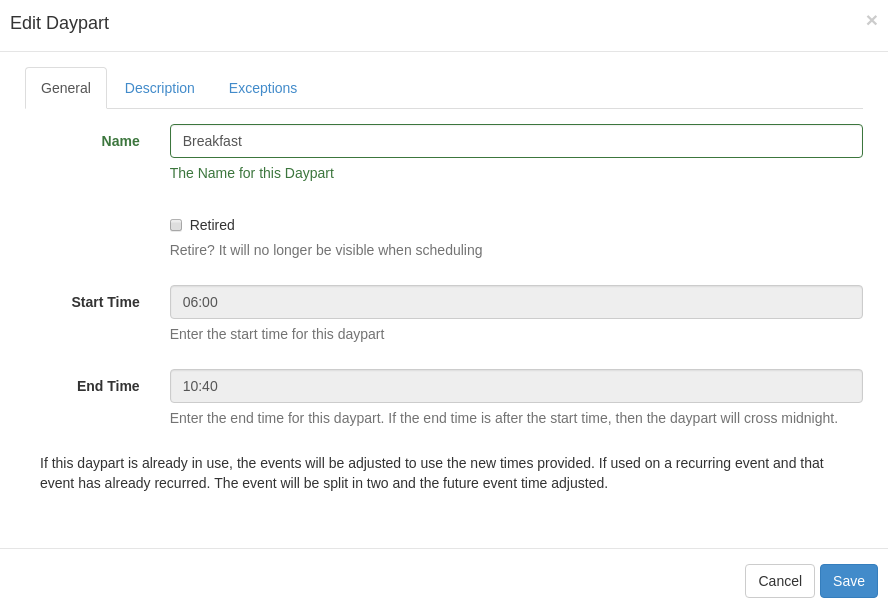
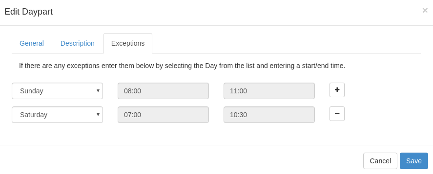

<!--toc=scheduling-->
# Dayparting

> In broadcast programming, dayparting is the practice of dividing the broadcast day into several parts, in which a 
> different type of radio or television program apropos for that time period is aired.
> -- Wikipedia

[[PRODUCTNAME]] supports creating multiple dayparts, with day of the week exceptions so that a single
day can be split into as many pre-defined parts as necessary.

A typical use case is a hospitality user who has different content to display for Breakfast, Lunch
and Dinner. Dayparting allows that user to create a Breakfast, Lunch and Dinner daypart, each of which start
and end on a different day.

Users with permissions to administer Dayparts will have a "Dayparting" menu accessible from the
main navigation.

The below Daypart form shows an example Breakfast daypart:

Saturday and Sunday have been configured as exceptions, so that breakfast starts and ends at different
times on those days.

When scheduling the "Breakfast" daypart will appear in the dropdown list to select. Once selected
the from/to date time selectors will change to date only selectors and the time will be taken from 
the daypart configuration - according to the day of the week the event occurs on.

## Updating Daypart times

Updating the start/end times or exceptions for a Daypart will cause existing future events to be updated
with the new times. It will also create new recurring schedules for any existing recurring schedule
that recurs beyond the current time. The old recurring schedule will remain as it was and the new one
will contain the new start/end times.