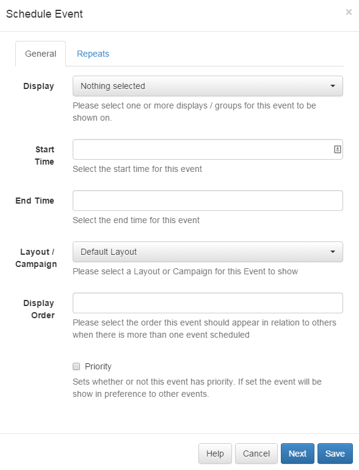

<!--toc=scheduling-->

# Events

Events are Layouts or Campaigns assigned to Displays at specific dates and
times. The event form can be launched from the Calendar Control buttons and by
clicking on any existing event in the calendar.

When launched the form looks like this:

## Event Type

Scheduling supports 3 types of event:

 - Campaign/Layout Events
 - Command Events
 - Overlay Layouts

These are chosen using the "Event Type" drop down select list on the Add/Edit
event form.

Campaign/Layout events are the main type of event and cause the selected
Campaign/Layout to be shown on the Player. Multiple items can be scheduled at
the same time and they will be shown in a loop according to the Display Order on
the event.

Command events are executed once per schedule against each display that applies.
They can be able [predefined command](displays_commands.html) with a command
string specified for the Display Settings Profile active on the Display.

Overlay Layouts are Layouts that can be overlaid over the existing schedule so
that they sit on top of the Campaign / Layout schedule playing. This is
particularly useful for having a company logo or Ticker that exists across all
Layouts being shown.

## Dayparting
Events are scheduled into "dayparts" which are blocks of time that split up the
day. By default the CMS contains a daypart for adhoc scheduling (called the custom
daypart) and for scheduling an event "always." More information can be found in 
[Dayparting](scheduling_dayparting.html).

Events scheduled with Dayparting only apply to a **single day**, meaning recurring
events should be used to create an event that covers more than 1 day. This is because
the Dayparting information is used to set the end time of the event.

To give your own From/To Dates then the "Custom" daypart should be selected.

Dayparting is not available for Command Events as these must be for a specific time.

## Recurring Events

The scheduler features the ability to create recurring events. To set recurrence
for events, select the required  "Repeats" value from the list and the
appropriate additional fields will be revealed.

A scheduled event can be repeated at defined interval (hourly, daily, weekly,
monthly or yearly) until the  specified date / time.

## Priority Events

Priority schedules allow an event to be added that overrides all other
non-priority events on the schedule. This  functionality is useful for
displaying temporary important notices, or overriding the schedule for a
specific event  without having to cancel the layouts that would normally be
running at that time.

When adding a new schedule, or when editing an existing schedule, tick the
"Priority" box to make the schedule  override the others.

Multiple priority events may be scheduled concurrently. They will be shown in a
cycle in the same way as non-priority  layouts would be.

## Deleting an Event

To delete an event, first open the Schedule Form and then select the "Delete"
button from the button bar on the form.  The Delete Event form will open
allowing confirmation of the Delete.

## Run at CMS time

The "Run at CMS time" checkbox is available on Add/Edit forms. It determines whether the
event runs using the time on the Display, or whether the event is synchronised to the 
CMS time. The default is for this option to be deselected.

Consider the following example:

 - CMS Time = GMT
 - Display 1 = GMT
 - Display 2 = GMT -4
 
An event scheduled for 11:00 with Run at CMS time deselected (the default) will run on
Display 1 at 11:00 and Display 2 at 11:00. These two Displays will not show the same 
content at the same time, because Display 2 is 4 hours behind.

With "Run at CMS time" selected Display 1 will run at 11:00 as before, but Display 2 will 
run at 07:00.

Please note that Schedule Now functionality will always create events with this option
selected.