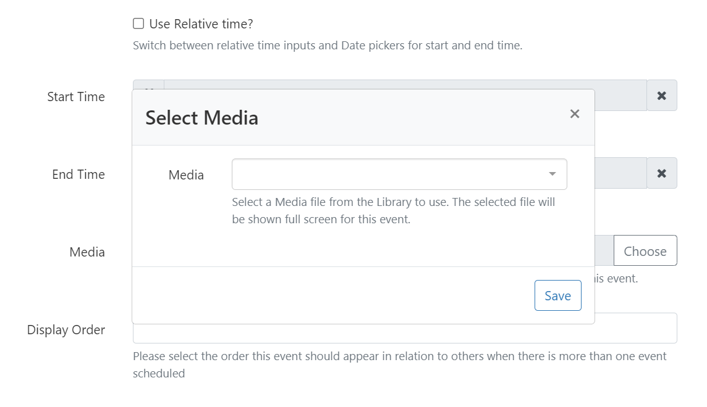
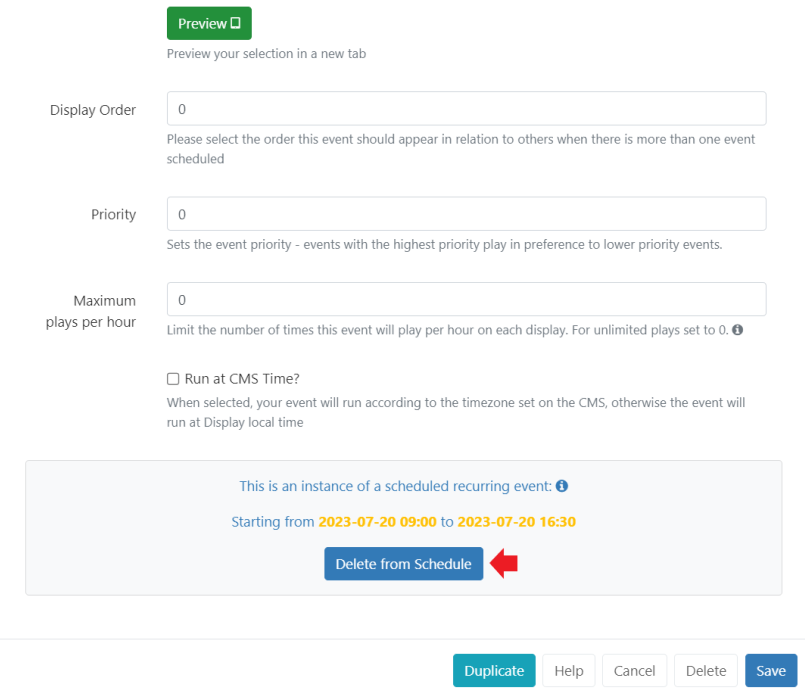

# Scheduling 

[[PRODUCTNAME]] has a sophisticated system to allow for the simple creation of complex schedules across one or more [Displays](displays.html)/[Display](displays_groups.html) Groups. 

## Creating a Schedule

Schedules are created from the **Schedule** page of the main CMS menu. 

Users can create one of the following:

- Schedule Event using the [Add Event](scheduling_events.html#content-add-event) button
- Synchronised Event using the [Add Synchronised Event](scheduling_events.html#content-synchronised-events) button

## Add Event

- Click on the **Add Event** button at the top of the schedule grid to open the **Schedule Event** form and start by selecting the **Event Type** to schedule.

{tip}
Schedules can also be easily created using the **row menu** for an object, selecting **Schedule**, with the exception of Interrupt Layout, Command and Action Event Types!
{/tip}

The CMS supports scheduling for the following types:

### Layout

Select a published [Layout](layouts.html)

### Command

Select a [Command](displays_command_functionality.html) to be executed by the Player at a specific point in time. 

{tip}
Command Events do not require a `toDt`. 

[Display Order](scheduling_events.html#content-display-order) and [Priority](scheduling_events.html#content-priority) are irrelevant when it comes to executing Commands, but may be set in the CMS for organisational purposes.
{/tip}

### Overlay Layout

Layouts that have been designed as an [Overlay Layout](layouts_overlay.html) will be scheduled at the same time as existing Layouts to create an overlay of content when displayed.

### Interrupt Layout

An Interrupt Layout will schedule a selected [Layout](layouts.html) to play **in-between** other Layouts in the 'usual schedule'.

[[PRODUCTNAME]] will work out when it will be played using how many **seconds per hour** or as a **Percentage** entered on the schedule.

{feat}Interrupt Layouts|v4{/feat}

{tip}
This can be useful if you have Announcements that need to be shown for a particular amount of time within the usual schedule!
{/tip}

- Select **Interrupt Layout** as the Event Type from the drop down menu when adding an [Event](scheduling_events.html).
- Complete the form fields to create the schedule.

#### Share of Voice

Enter the amount of time the Layout should be shown in seconds per hour or as a percentage (0 - 100%) of the events duration (the difference between the from date and the to date) that the **Interrupt Layout** should occupy the usual schedule.

{tip}
**Please note:** If your 'main' Layout has a long duration, the Interrupt Layout may show in a block in order to satisfy the SoV criteria entered!
{/tip}

### Campaign

Select a **Layout List** [Campaign](layouts_campaigns)

### Action

**Scheduled Actions** listen for a Trigger Code coming in on a webhook to Navigate to a Layout or to run a Command. 

{feat}Scheduled Action Events|v4{/feat}

- **Navigate to Layout** - enter the code identifier for the Layout the Player should navigate to when triggered. This code is created when adding a new Layout or from editing an existing from the Layouts grid.
- **Command** - select the Command to run.

### Media Scheduling 

Video and Image files saved to the [Library](media_library.html) or a [Playlist](media_playlists.html) can be scheduled to be shown full screen without having to first add it to a Layout.

- Complete the form fields to create the Schedule.

Clicking **Choose** from the **Media/Playlist** field will show a pop up:

Use the drop down menu to select the **Media** file or **Playlist** to use.

On **Saving**, further options will be shown:

- **Video/Image files** only: Override the Media duration set in the Library by providing a **Duration in loop**.
- Select a specific **Resolution** to use.
- Set a **Background Colour** to fill any gaps if the item does not fill the entire screen.

{tip}
Schedule Images and Videos directly from the [Library](media_library.html) and [Playlists](media_playlists.html) from the Playlists grid. Use the row menu and click Schedule!
{/tip}

## Synchronised Events

{feat}Sync Events|v4{/feat}

{tip}
Synchronised Events are used in conjunction with [Sync Groups](displays_sync_groups.html) to show mirrored or a video wall configuration across 2 or more Displays.

Ensure you have created and configured a **Sync Group** prior to scheduling!
{/tip}

Click on the **Add Synchronised Event** button at the top of the schedule grid to open the **Add Synchronised Event** form.

Select a [Sync Group](displays_sync_groups.html) from the drop down menu.

- Use the **Layout** drop down to select which content should be shown on each Display within the group.

{tip}
When selecting different content to show in a wall configuration on Displays, the total duration will be enforced by the content on the Lead Display.

The Lead Display will issue instructions to change the sequence based on its assigned content. Please bear in mind that other Displays within the group could fall out of sync if their content is not similar in design (same number of items, durations etc).
{/tip}

- Select **Mirror** to automatically set the same item on each Display within the group automatically.

{tip}
Sync [Playlists](media_module_playlist.html) on different Layouts by using a **Content Synchronisation Key**!
{/tip}

### Dayparts

- Events are scheduled using **Dayparting** information:
  - Select **Custom** to enter your own start and end times. Use the **Relative time** checkbox to input the Hours and Minutes when creating a Scheduled Event (not available for Synchronised Events). 
  - Select **Always** to have the content always scheduled on the selected Display. 

{tip}
Create your own defined [Dayparts](scheduling_dayparting.html) to select for even easier scheduling!
{/tip}

- Use the drop down to select what needs to be scheduled from the list.

### Display Order

- Use **Display Order** to determine the order in which the event will play in rotation with other content when scheduled at the same time as other events. Ordering is a simple numerical sort, lowest to highest numbers (events marked with 1 will be played before events marked with 2.)

{tip}
To ensure the play order of Layouts we recommend including them in a [Campaign](layouts_campaigns.html). The Display Order can then be used to determine the order in which entire Campaigns should play. If Campaigns have the same Display Order or nothing is set, the Campaigns will play according to the Play List order (**Interleaved** or **Block**) defined for the individual Campaign.
{/tip}

### Priority

- Set the **Priority** of an Event with 0 considered the lowest Priority.

Events of the same Event Type with the highest number will play in preference to lower numbers. 

{tip}
Layouts/Campaigns/Images/Videos and Playlists will be treated as the same Event Type when taking Priorities into consideration.
{/tip}

A good example to use Priority would be in a way to alter the scheduling of a loop of Layouts at a specific time. For example, a normal rotation of Layouts during the day with a Priority Event at lunchtime which shows specific ‘lunch’ information (i.e. Lunchtime specials on a cafe menu).

If a Player had a schedule containing Events of the same Event Type which were all Priority 0, then all of the Events will be shown in rotation together.

If 1 of these Events had a Priority of 1, then this would be the only Event shown.

If there were some Events with Priority 0, some with Priority 1 and some with Priority 2 only the Priority 2 Events will be shown, in a rotation for that Scheduled period (as the highest Priority)

### Maximum Plays per Hour

{feat}Max Plays per Hour|v4{/feat}

- Set a number to limit the amount of times this Event is shown per hour on Displays. 

Leave as the default 0 for unlimited plays.

### Run at CMS time

- Select this option to play the Event at the time determined by the **CMS** rather than using the local Display time.

{tip}
**Scenario** 

- CMS Time = GMT
- Display 1 = GMT
- Display 2 = GMT -4

An event scheduled for 11:00 with Run at CMS time **deselected** will show on **Display 1** at 11:00 and **Display 2** at 11:00. These two displays will not show the same content at the same time, because display 2 is 4 hours behind.

With Run at CMS time **selected**, **Display 1** will show at 11:00 as before but **Display 2** will run at 07:00.
{/tip}

## Repeats

Rather than creating numerous schedules to ensure that your content is shown, Events can be configured to Repeat Per Minute, Hourly, Daily, Weekly, Monthly or Yearly.

- From the **Repeats** tab, use the drop down to select the type of Repeat.
- Determine the Repeat frequency by entering a number here.

{tip}
For example with a **Weekly Repeat** you could select Wednesday and Friday as the days of the week to Repeat the Event, and enter a 2 to Repeat Every other week on those days.

**Monthly Repeats** can be configured by the Event date or by which day in the month the Event falls on. For example, an Event which is scheduled on Saturday 15/07/2023 can be set to Repeat every month on the 3rd Saturday.
{/tip}

- **Until** controls when the Repeat should finish. 

{tip}
Ensure the time selected here is after the final repetition of the defined Event so as to not cut the play back of content short!
{/tip}

**Recurring Events** can be removed from the Schedule in their entirety or by individual recurrence:

- Select **Delete** at the bottom of the Schedule form to completely remove all instances of the Recurring Event.
- From the [Calendar] view, click on the **Recurring Event** by date:

The instance details will be clearly shown at the bottom of the form:

- Click **Delete from Schedule** to remove only this instance from scheduling. All other instances will remain scheduled.

{tip}
Care should be taken if amendments are made to a recurring Schedule after deleting an individual instance. Previously deleted instances could be recreated with edits made to an existing recurring Schedule!
{/tip}

## Reminders

Create a set of **Reminders** to be sent to the [Notification Center](users_notifications.html#content-notification-drawer) or emailed.

{tip}
Please ensure that an Administrator has entered a **Sending Email address** in the [CMS Settings](tour_cms_settings.html#content-network)!
{/tip}

- From the **Reminder** tab, use the form fields to define a reminder. Use the `+` icon to add additional rows if required.

- Tick the box to send an email to the address set for your [User Profile](tour_user_access.html#content-edit-profile).

## Geo Location

Use the checkbox to make this Event location aware. Further information can be found at [Geo Scheduling](scheduling_geolocation.html)

## Edit / Delete

Make changes to Events from the Schedule grid or Calendar view. Further information can be found at [Schedule Management](scheduling_management.html)

## Duplicate

The Duplicate button at the bottom of the Schedule form allows for event details to be easily duplicated and configured to create new Events. 

{tip}
On clicking Duplicate, a pop up will appear to confirm that a new form has been loaded with the same details. The new loaded form will not have a Duplicate button.
{/tip}

{version}
**NOTE:** If at any time there are no Schedules to run, the [Default Layout](displays.html#content-default-layout) assigned for the Display will be shown!
{/version}

