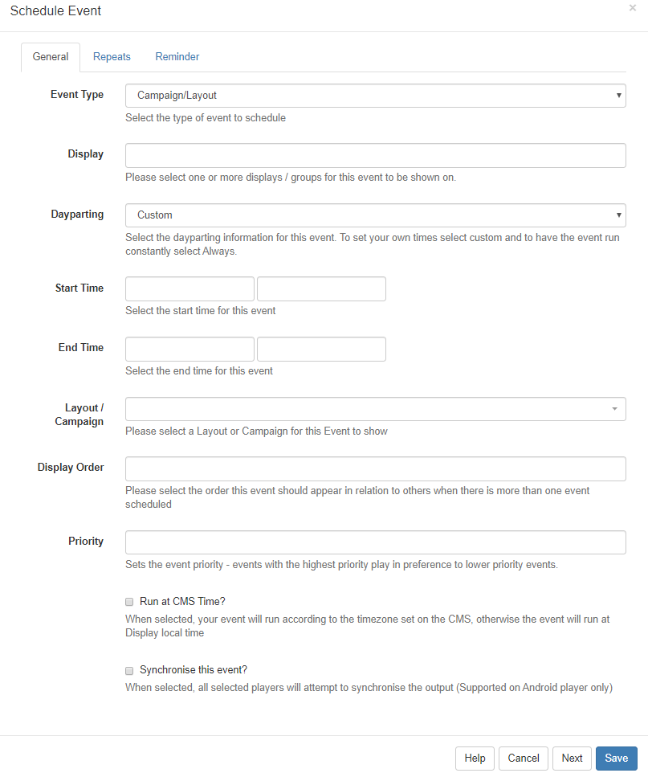

<!--toc=scheduling-->

# Events

Events are **Layouts**/**Campaigns**, **Overlay Layouts** or **Commands** assigned to Displays/Display Groups at specific dates and times. Events are administered from the Schedule section from the Menu.

## Add Event

Click on the **Add Event** button on the calendar to Schedule an Event.

### **General**

#### **Event Type**

Use the drop-down to select an Event from the 3 Event Types supported:

- **Campaign/Layout** - select designed Layouts and Campaigns.
- **Overlay Layout** - select a specifically designed Layout to Schedule as an [Overlay Layout](layouts_overlay.html).
- **Command** -  select from a predefined command.

<tip>
Events, with the exception of Command Events, can also be added using the [Schedule Now](scheduling_now.html) function.</tip>

#### **Display** 

Click in the field to select one or more Displays/Display Groups to show the Event content on.

#### **Dayparting**

**Custom**/**Always** or **User** created Dayparts can be selected using the drop-down menu. 

Select **Custom** to specify your own start/end dates/time. Click in the form field to open the date and time picker. 

<tip>
Start and end times can be free typed to get the exact timings required.
</tip>

#### **Layout/Campaign**

Use the drop-down menu to select the Layout/Campaign to Schedule.

<tip>
This list is dependent on the permissions for that User.
</tip>

#### **Preview**

Click on the Preview button to view the Layout/Campaign in another tab. 

<tip>
This is useful to use to ensure that the Correct Layout/Campaign has been selected and to make checks, such as the total duration, without having to leave the Schedule.
</tip>

#### **Display Order**

Determine the order in which the Layout/Campaign will play in rotation when Scheduled at the same time as other Layouts/Campaigns. Ordering is by a simple numerical sort, lowest to highest numbers, therefore **Layouts/Campaigns marked 1** will be played before **Layouts/Campaigns marked 2**.

The Display Order on Overlay Layouts determines the order in which the Layout Regions are applied to the overlay and compliments the Regions own layer settings.

<tip>
To ensure ordering of Layouts we would recommend that these are ordered within a **Campaign**. The Display Order could then be used to determine the order in which entire Campaigns should play out. If no Display Order is specified for Campaigns or they have the same Display order the Campaigns will play interleaved.

**Scenario**

Campaign A consists of Layout 1, Layout 2 Layout 3 - Display Order of 1
Campaign B consists of Layout 4, Layout 5, Layout 6 - Display Order of 1
When Scheduled at the same time the Campaigns will play out as follows:

A - Layout 1

B - Layout 4

A - Layout 2

B - Layout 5

A - Layout 3

B - Layout 6

A - Layout 1 and so on.

To ensure that the Campaigns played all the contained Layouts before rotating to the next, Campaign A would need a Display Order of 1 and Campaign B would need a Display Order of 2.
</tip>

#### **Priority**

Set the Priority of the Event with the **highest** number stated playing in preference to lower numbers. This can be used to override all other non-priority Events on the Schedule.

 <tip>
This functionality is useful for displaying temporary/important notices for overriding a Schedule for a specific Event without having to make any changes to your existing Schedule or cancelling Layouts/Campaigns that would be running at that time.
</tip>

#### **Run at CMS Time**

When selected, the Event will Play at the time determined by the **CMS** rather than using the local Display time.
<tip>
**Scenario**
CMS Time = GMT
Display 1 = GMT
Display 2 = GMT -4

An event scheduled for 11:00 with **Run at CMS time** deselected will run on Display 1 at 11:00 and Display 2 at 11:00. These two Displays will not show the same content at the same time, because Display 2 is 4 hours behind.

With **Run at CMS time** selected, Display 1 will run at 11:00 as before but Display 2 will run at 07:00.
</tip>

Please note **The Schedule Now** functionality will always create events with this option Selected.

### **Repeats**

An Event can be repeated at defined intervals (hourly, daily, weekly, monthly or yearly) until a specified time. Use the **Repeats** tab to create recurring Events. Select the type of Repeat from the drop-down and complete the form fields as required. Use **Repeat every** to further specify the frequency of the Repeat.

<tip>

E.g. With a **Weekly** Repeat you could specify to Repeat each Wednesday and Friday every other week by including a 2 in the Repeat every field.
</tip>

## Edit / Delete

Click on any **Event/Icon** in the calendar to Edit form fields or to remove completely from the Schedule by clicking Delete and confirming.

## Duplicate

Located at the bottom of the Edit form the **Duplicate** button allows for Event details to be Duplicated and configured for a new Event. Once clicked a pop up will appear to confirm that a new form has been loaded so that amendments can be made.

<tip>
The new loaded form will not have a Duplicate button.
</tip>

**It is important to note that if at any time there are no Layouts/Campaigns Scheduled to run, the Default Layout for the Display will run automatically.**