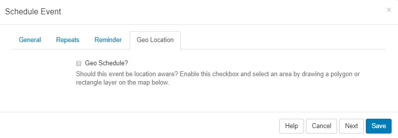
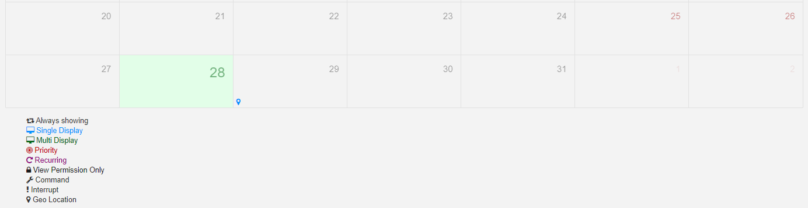

<!--toc=scheduling-->

# Geo Scheduling

From version 2.3.0, **Events** can be scheduled to be location aware.

{tip}
**Please note:** This feature is currently supported in the Windows Player from v2 R253 and Android Players from v2 R206. We are currently working to bring this feature to all Players.
{/tip}

Click on the **Geo Location** tab on the **Schedule Event** form.

Tick in the **Geo Schedule** box to enable and define the location.

{tip}
On opening, the map will default to what is entered for DEFAULT_LAT and DEFAULT_LONG in **CMS Settings**, under the **Displays** Tab.
{/tip}

Use the buttons in the top left of the map to Zoom in and out. Click on the search icon to enter details for a particular area.

Define an area by drawing a Polygon or Rectangle layer on the map.

Once an area has been defined, click on the edit icon to to drag the markers to make adjustments to the existing Layer. Click on the grey Save button located here to ensure that edits are saved.

To remove the area, use the bin icon and click into the area to delete, click the grey Save button to save the removal of the layer.

Once scheduled, the scheduler will identify this event as being Geo Location aware by showing the map marker icon. 

Click on the icon to open the **Edit Event** form to make any required changes to your scheduled event.

