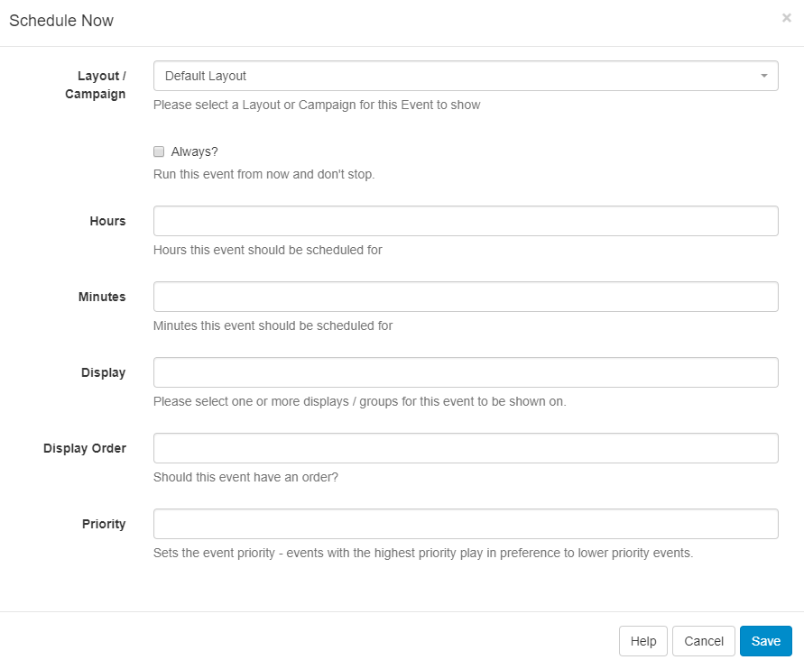

<!--toc=scheduling-->

# Schedule Now

Schedule Now provides a quick way to Schedule a **Campaign** or **Layout** for a specific amount of time.
{tip}
This is useful for displaying temporary/important notices on Displays.

{/tip}

Schedule Now is available across the CMS and is available from the following pages:

- **Campaign** - row menu for selected Campaign
- **Layout** - row menu for selected Layout
- **Layout Designer** - on the Actions tab
- **Display** - row menu for selected Display

Complete the form fields as required.

## Time zones 

Events created using **Schedule Now** will always have the **Run at CMS time** option selected. This means that the event will be adjusted for each Display time zone and forced to run from the time "Save" is pressed. Please see [Run at CMS time](scheduling_events.html) for further information.