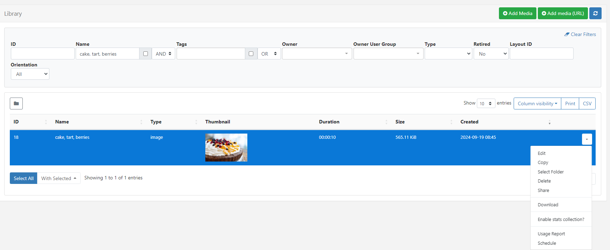

# Showing an Image on Displays

Add an **Image** file to your **Media Library** and **Schedule** to play on **Displays**.

You may have image content created outside of the Layout Editor, e.g. created by an agency, in house marketing team etc, ready to be shown full screen on your Display network.

Image files are first added to the Library by upload or by URL. For this example an Image file will be uploaded to the CMS Media Library.

{nonwhite} 
## How-to Video

{video}yYv0B0B9MIc|how_to_show_an_image.png{/video}
{/nonwhite}

### Add Media

- Click on **Media** under the **Library** section of the main CMS menu.
- Click the **Add Media** button.
- Select **Add files** and select the Image file to upload.
- Provide a new **Name** or leave this field blank to keep the original file name.
- Click **Start upload**.

- Once uploaded click **Done**.

{version}
Caution should be taken when uploading very large images. Users should check the **Resolution** of the Image and keep it within the intended screen size for best results.
{/version}

### Select Media

- From the **Media** grid use the filters to make it easier to find the uploaded **Image** file if required.
- Use the row menu and select **Schedule**:

 

The **Select Media** form will open to provide further configuration options for the Image:

**Duration in loop** determines how long this Image should be shown each time it appears in a **Schedule Loop**. 

- Specify a **duration** to override the Image file duration.
- Select a a specific **Resolution** to use.
- Set a **colour** to fill any gaps in the background if the Image will not fill the screen.
- **Save** to close the **Select Media** form and continue with scheduling.

### Schedule Event

 Complete the fields in the **Schedule Event** form:

- Give the event a **Name** for easier identification in the CMS.

- Select which **Displays** this Image will be shown on.

- From **Dayparting**, select **Custom** to set specific start and end dates/times or choose **Always** to show the Image on Displays constantly.

- Click **Save.**

The CMS will now update a Schedule change and the Image will be shown on Displays for the timings set in the schedule.

## Further Reading 

[Use Playlists to show a carousal/slideshow of images](showing_a_playlist_on_displays.html)

[Use the Layout Editor to create your own content](layout_editor_overview.html) 

## FAQ's

***What are Schedule Loops?*** 

A Schedule Loop is how media content will play when in schedules with other media content. For example, if you have scheduled 2 media items each with a 10 second duration to be shown at the same time for 1 hour, both items will play for their 10 second durations in fair rotation for the scheduled time.

***What file extensions are supported on upload?***

Valid file extensions: jpg,jpeg,png,bmp,gif,webp.

***Can I upload an animated gif?***

Animated gif's are not supported.

