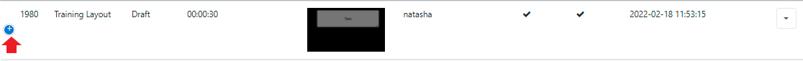
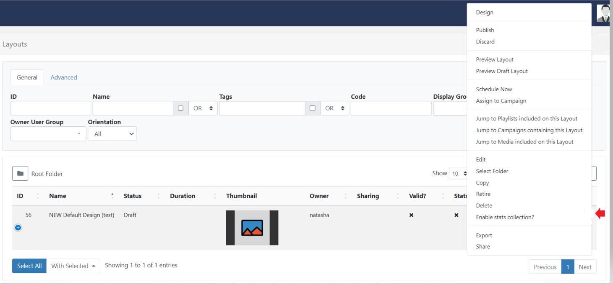
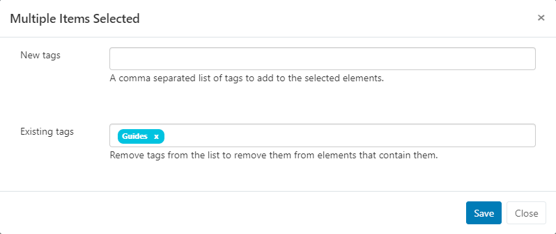
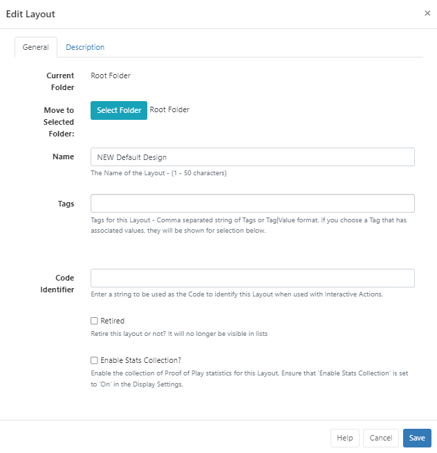
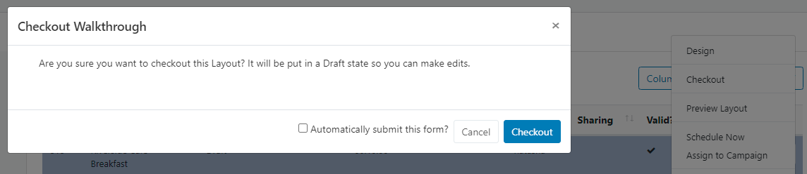

# Navigating the CMS

All pages within the CMS are categorised into sections and accessible from the **CMS main menu** for all Users.

The menu will only show the sections/pages which have been [Feature](users_features_and_sharing.html) enabled for the logged in User to access.

{tip}
Select where this menu can be placed, vertically on the left hand side or horizontally along the top of the CMS,  from the [User Preference](tour_user_access.html#content-preferences) settings!
{/tip}

Click on **Dashboard** to take you back to your [User Dashboard](users_dashboards.html) homepage. 

## Grids 

The CMS presents many of the entities, **Layouts**, **Media** and **Displays** for example, as tabular data in **Grids**. These grids have a number of elements that combine to create a flexible administration tool that is easy to read and understand.

The following screenshot shows the **Layout Grid**  as an example, annotated with each of its elements:

- #### Action Buttons

Common Action buttons for each page, such as **Add Layout**, are located in the top right of grids for ease of access across the CMS.

- #### Tabs

Tabs provide filtering options to make finding items easier. Use the **Advanced** tab to access further filtering options:

- #### Filters

Use the multiple **filter** fields to restrict criteria for returned results. For example all Layouts belonging to a particular **Owner** can be the only results shown in the grid.

{tip}
Use the checkbox to apply advanced filtering options for Names using Regex. Provide AND/OR criteria using comma separated terms!
{/tip}

- #### Folders

 [Folders](tour_folders.html) are used to organise, search and easily [Share](users_features_and_sharing.html) User objects with other Users/User Groups.

- Click on a Folder/sub-folder to search the contents of only the selected Folder and return results based on any filters applied.

or

- Tick **All Folders** to include searching in the Root Folder and return results based on any filters applied.

{tip}
Click the Folders menu to toggle on/off from view.  When the Folder tree is hidden from view, the file path for the selected folder will be shown!
{/tip}

- #### Results 

Returned results are shown in columns. 

{tip}
Most columns can be sorted by default. Where the column has an up or down arrow the **Shift** key can be used to multi-sort the column!
{/tip}

Use the **Column Visibility** button to see available columns. 

- Select/de-select which columns should be visible in the data table:

If too many columns have been selected to fit your screen size additional rows will be hidden. These can be viewed by clicking on the + icon at the beginning of the row:

- #### Row Menu

Select an item and use the row menu to access a list of shortcuts and actions:

{tip}
Row menu contents for items will differ dependent on the page selected!
{/tip}

### Multi-select - With Selected

At the bottom of selected grids a **With Selected** option is available to multi-select rows to easily perform bulk actions:

- #### Edit Tags

  This function allows you to add new [Tags](tour_tags.html) in bulk with the option of also removing any existing Tags from multiple selections:

  

- #### Share

  Use to edit multiple [Sharing](users_features_and_sharing.html) options for selected items.

  Elements that are shown with an indeterminate status `-` are the result of a difference in options already set. Any changes made here will be applied to all selected elements.

  {tip}

  **Example scenario**:

  Two Layouts are selected which already have the following Share options applied:

  Layout 1 - view 1, Edit 0, Delete 0

  Layout 2 - View 1, Edit 1, Delete 0

  When multi-selected it would show the following:

  View 1, Edit `-`, Delete 0

  A User makes changes and toggles to:

  View 0, Edit `-`, Delete 1 (leaving Edit in its current status)

  The two Layouts would now have the following Share options set:

  Layout 1 - View 0, Edit 0, Delete 0

  Layout 2 - View 0, Edit 1, Delete 1

  {/tip}

{tip}
Available multi-select options are dependent on the page selected!
{/tip}

## Forms

The CMS presents most transactions (actions that **add**/**edit** or **delete** in some way) using **Forms**.

The screenshot below gives an example of a how a form may look using the **Edit Layout** form:

- #### Tabs

Forms may only have one or could have multiple tabs which provide further details and options to Users. 

#### Folders

 [Folders](tour_folders.html) are used to organise, search and easily [Share](users_features_and_sharing.html) User objects with other Users/User Groups.

Click on **Select Folder** and select/create the destination folder to save the item into.

{tip}
Right click a Folder/sub-folder to view further options in the **Folder Menu**.

Items that are saved in Folders will inherit the View, Edit, Delete **Share** options that have been applied to the destination Folder for User/User Group access!
{/tip}

#### Form Fields

Each Form has fields that require completion as well as optional fields.

Each field has a title that explains what the field represents and help text for additional guidance.

#### Check Boxes

Options which can be enabled/disabled are presented with check boxes.

{tip}
Forms accessed from a row menu may contain an ['auto submit capability'](tour_cms_navigation.html#content-automatic-submission-of-forms), which when selected allows for forms to be automatically submitted.
{/tip}

#### Buttons

Every form has a button bar at the bottom to commit or cancel the additions/edits they have made.

{tip}
Most forms also include a **Help** button, which provides a link to sections of this **User Manual** for additional guidance.
{/tip}

### Automatic Submission of Forms

Selected actions, such as, **Checkout** from the Layouts grid **Check Licence** and **Authorise** from the **Displays** grid or **Clear Cache** from the **Modules** grid, allow for **Forms** to be automatically submitted by clicking on the action from the row menu.

Actions that have an 'auto submit' capability will clearly display a checkbox option to enable on the form:

Once saved, this particular action will be automatically submitted the next time it is selected.

{tip}
Forms that you have enabled to 'auto submit' can be reset from your [User Profile](tour_user_access.html#content-user-profile) settings.
{/tip}

