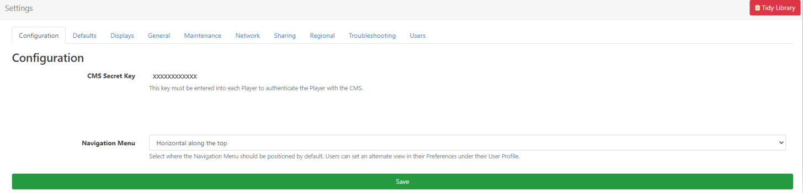

# CMS Administrator Settings

{nonwhite}
Once your CMS is installed, there is some additional set up required to enable all functionality. Please see the following guidance: [CMS Post Installation Set up](/docs/setup/xibo-cms-post-installation-setup-guide.html)
{/nonwhite}

Like any complex application, the [[PRODUCTNAME]] CMS comes with a number of configurable options.  These are located from the **Settings** page under the **Administration** section of the main CMS menu.

{nonwhite}
{cloud}
**Xibo Cloud** hosted customers will have some of these fields pre-populated as part of the service. Some can be changed with others locked to disable editing. For further information please refer to this page: [Xibo Cloud CMS Defaults and Restrictions](/docs/setup/xibo-in-the-cloud.html#content-xibo-cloud-cms-defaults-and-restrictions).
{/cloud}
{/nonwhite}

Settings are split into related category tabs:

## Configuration

From this tab view the **CMS Secret Key** which is used to authenticate Players with the CMS and apply a **Theme** to pages (if applicable) as well as setting the default positioning for the [Navigation Menu](tour_cms_navigation.html).

## Defaults 

Use this tab to apply defaults to all [Media](media_library.html) files and set default [Transitions](tour_transitions.html).

You can also set Layouts to **automatically Publish** 30 minutes after the last recorded edit by enabling the checkbox for this setting.

### Resizing Images

Default thresholds and limits can be specified which are then considered in the event an image should be resized. This could be when uploading an image or an image being downloaded by a Widget - NASA RSS in a Ticker Widget for example.

- #### Resize Threshold

Set a maximum threshold (based on the longest side) that should be considered for resizing an image.

{tip}
If you set a Resize Threshold of 1920 and you upload/download an image which is 800, this image would not need resizing. If you uploaded/downloaded an image which was 2400, this would then be resized to 1920.
{/tip}

- #### Resize Limit

Set a limit (based on the longest side) for uploaded/downloaded images. Images that exceed this limit will not be processed and should be replaced with another image that is within the limit.

This setting will determine whether the image file is too large to be processed.

- #### DataSet maximum number of Rows

Set the maximum permitted number of rows a User can create in a DataSet.

{nonwhite}
{cloud}
The default for Cloud customers is set at 10,000 rows per DataSet.
{/cloud}
{/nonwhite}

## **Displays**

Set defaults for **Latitude** and **Longitude** for all Geo aware previews throughout the CMS.

### Default Layout

The Default Layout set here will be automatically assigned to all Displays to be shown when no other content is scheduled or if there is an issue which prevents a scheduled Event from being shown. 

{nonwhite}
{tip}
You can create your own Layout to replace the pre-set default, but keep in mind that designs should be kept simple with no complex media or web content.
{/tip}
{/nonwhite}

This global Default Layout can be overridden for individual Displays by selecting an alternative [Default Layout](displays.html#content-default-layout) to be used.

### Proof of Play Default Settings

Set the **Aggregation level** of collection of [Proof of Play](displays_metrics.html) statistics to be applied to all **Layouts** / **Media** and **Widget items** as default.

- **Individual** - statistics are recorded at the start and finish of each item individually and sent back to the CMS at each collection interval.
- **Hourly** - records each item once, and includes the total number of times played and the length of time played during the hour and is sent back to the CMS on the next collection interval after the hour period has expired.
- **Daily** - records each item once, and includes the total number of times played and the length of time played during the day and is sent back to the CMS on the next collection interval after the day has expired.

{tip}
Players aggregate ‘completed records’ only, with collection made at the end of the Widgets duration so if a Widget has a duration of 3 hours, the stat will be recorded once the Widget has expired!
{/tip}

- Use this box to **enable the collection** of Proof of Play statistics to all **Displays** as default.

{tip}
This can be toggled on/off by editing [Display Setting Profiles](displays_settings.html#content-editing-profiles).
{/tip}

- Tick the box to set the default to on for the collection of Proof of Play statistics for all newly added **Layouts**.

{tip}
Collection can be disabled by unticking the box on the **Add/Edit** Layout form.
{/tip}

Use the settings to enable the collection of Proof of Play statistics to apply to all **Media**, **Playlist** and **Widgets** (Off/On/Inherit).

{tip}
It is intended to have **Widget** always set to Inherit so that Layout and Media options control the collection!
{/tip}

## General

View/set the address for the **User Manual** and tick to send **anonymous statistics** to help improve the software.

### Tidy Library (Global)

The Library can be *tidied* by a Super Administrator or User so that it is kept clean and small. 
**Actions cannot be reversed so this must be used with caution.**

{tip}
This might be of particular interest if the CMS is installed on a web server that has quotas or if Users have been assigned their own quotas.
{/tip}

Administrators can initiate a system-wide Library tidy operation by clicking the **Tidy Library** button in the right hand corner of the Settings page:

As this functionality is system-wide and therefore operates on **ALL** User files, confirmation is required to remove unused and old revisions.

This option is more comprehensive and removes:

- Temporary files
- Orphaned files
- Thumbnails
- Media revisions that aren't used anywhere
- Media that isn't used anywhere (on any Layouts / Display Groups / Displays)
- Generic files uploaded to the CMS

#### Orphaned files

Orphaned files are a rare occurrence where a file stored on disk in the Library folder is not deleted when the Media item is deleted from the Library. This means that the file exists but the CMS doesn't know anything about it.

### Tidy from User Library

{nonwhite}
{cloud}
The Tidy Library function is turned off by default for **Xibo Cloud Hosting** customers as it can be potentially destructive if the options are not fully understood. 
{/cloud}
{/nonwhite}

Allow a User to tidy files from the [Library](media_library.html#content-tidy-library) page by using the checkbox to **Enable Library Tidy**.

## Maintenance 

From here **Enable Maintenance** and **Email Alerts** to be sent and set the maximum retention ages for **Logs** and **Statistics**.

## Network 

From the Network tab complete an **Admin email address** for the overall CMS administrator. All email notifications generated by the CMS will be sent to this address.

Ensure that the **Sending email address** and **name** is completed prior to setting up any further email notifications throughout the CMS.

{nonwhite}
{noncloud}
You can also provide Proxy Server information (if your CMS is behind a proxy) force **HTTPS** and set monthly **Bandwidth** and **Library** size limits.
{/noncloud}
{/nonwhite}

## Sharing

Use the dropdown to change how Widget colour appears in Playlists for Users.

- **Media Colouring** will use the colours from the **theme** for each Widget.
- **Sharing Colouring** will show the Widget colour based on **User access** from **Sharing** options. (Green = editable)

From here you can set if Users should have the ability to schedule to Displays when [Share](users_features_and_sharing.html#content-2-share) options are set to View for the User as well as being able to set whether Users should be able to see the names of Layouts in schedules that have not been shared with them.

Tick to allow Users to save their content into the top level [Root Folder](tour_folders.html) or disable to force Users to select a Folder to save to.

## Regional

From this tab set the **Language** and default **Timezone** and **Date Format** to use across the CMS.

{tip}
Select the nearest major city in your timezone!
{/tip}

Use the checkbox to detect the **browser language** to use for the CMS and select which type of **Calendar** should be used.

## Troubleshooting

This tab is used to to set Log Levels which are useful for capturing php errors and environment issues.

## Users

Select the System User and set the Default User Group and User Type when onboarding new Users.

{tip}
We recommend that the **Default User Type** is set to **User**!
{/tip}

### Password Policy

Enter any valid regular expression in the **Password Policy Regular Expression** field so all password change requests and newly created passwords are tested against this.

{tip}
A text description will be shown to Users when their passwords do not meet the required policy as a prompt!
{/tip}

{nonwhite}
{cloud}
Customers with [Xibo Cloud Hosting](/hosting) have a **set default policy** which requires a password of at least 10 characters.
{/cloud}
{/nonwhite}

### Password Reminder

Enable to provide a **Forgotten your Password** reset link for **Users** at login so they can easily regain access to the CMS.

{tip}
Ensure that a valid **Sending email address** has been entered on the **Network** tab before enabling this functionality!
{/tip}

The User will be shown a link which once clicked will send a **Password Reset Notification** to their email address as recorded on their User Profile.

{tip}
**Users** can also change their own passwords, once logged into the CMS, from their [User Profile](tour_user_access.html#content-edit-profile)
{/tip}

## Two Factor Authentication

[Two Factor Authentication](tour_user_access.html#content-two-factor-authentication) can be set by a User for added security once logged in. 

Once configured, a User would need to enter the code sent via email or as displayed in the Google Authenticator app to complete login to gain access to the CMS. 

{tip}
Ensure that an Email address has been provided by the user to receive the generated email!
{/tip}

Set a valid **Sending email address** has been entered on the **Network** tab and a name has been entered in the **Two Factor Issuer** field to make it clear on the Google Authenticator app and email when authenticated codes are generated for login to the CMS.

[Reset Two Factor Authentication](users_administration.html#content-reset-two-factor-authentication) for Users from their User Profile.

## Applications

[[PRODUCTNAME]] contains an API that allows 3rd party applications to connect and consume its data.

Applications are added and configured from **Applications** under the **Administration** section of the main CMS menu.

{tip}

Before using an Application, each User must authorise the application to act on their behalf within the CMS.
Users can view authorised Applications from the [My Applications](tour_user_access.html#content-my-applications) section of their **User Profile**.
{/tip}

At the current time the CMS does not provide individual Users with a method of revoking access to an application. Only an Administrator can remove an application completely.

## Fonts

[[PRODUCTNAME]] comes with a set of standard fonts which can be set on many Widgets:

- Aileron Heavy Regular (Aileron-Heavy.otf)
- Aileron Regular (Aileron-Regular.otf)
- Dancing Script Regular (DancingScript-Regular.ttf)
- Railway Regular (Railway.ttf)
- Linear Regular (linear-by-braydon-fuller.otf)

{version}
**IMPORTANT:** it is possible to set a custom font on many Widgets, either via a property called **Font Family** or via the visual editor **Font** select list. If a font is not chosen the Player will show its own default "sans-serif" font, referred to as the system font. E.g. on Android this is usually Roboto.

We recommend always choosing a font where available to avoid Players showing differing fonts.{/version}

Manage from the **Fonts** page under the **Administration** section of the main CMS menu.

- Use the row menu to view a Fonts **Details** and see an example of the font style:

Additional fonts can be added by clicking the **Upload Font** button and using the file uploader tool.

{tip}
If the new font does not show in the text editor after upload, try clearing the browser cache! 
{/tip}

{version}
**NOTE:** Fonts have preferences built into them known as **OS/2 tags**. [[PRODUCTNAME]] checks for OS/2 preferences and can use **fonts with OS/2 tags 0 or 8**. 

Fonts with other OS/2 tags may produce an error on uploading and may not display correctly.
{/version}

#### Next...

### Further Administration set up

Please see the following pages for further **Administration** set up:

- [User Administration](users_administration.html)
- [User Groups](users_groups.html)
- [Modules](media_modules.html)
- [Transitions](tour_transitions.html)
- [Tags](tour_tags.html)
- [Folders](tour_folders.html#content-folder-management)

