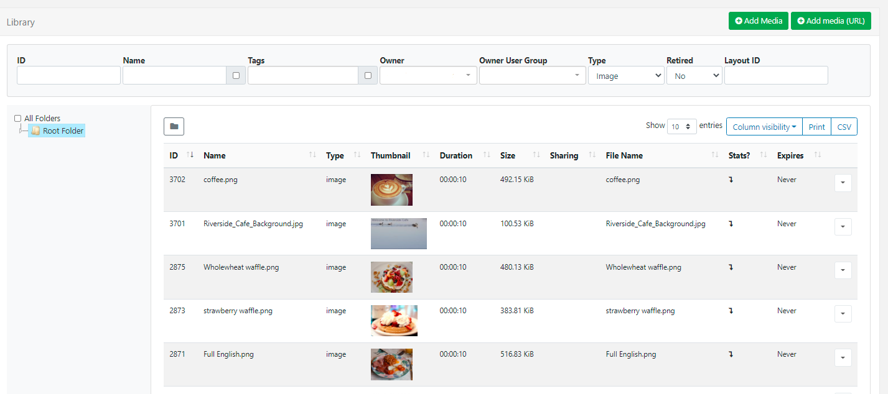
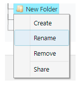
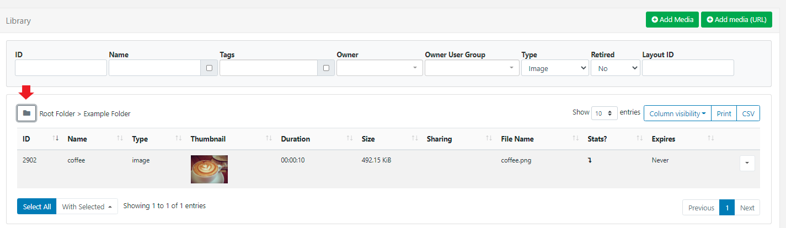
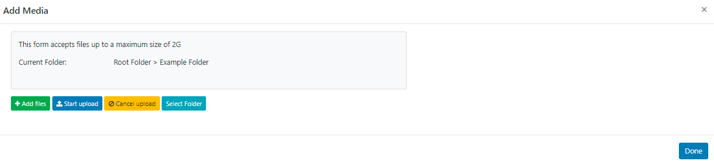
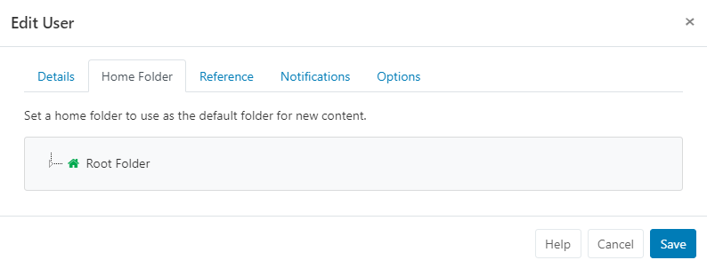

# Folders

From v3.0.0 **Folders** can be used throughout the CMS to search, organise and easily control User/User Group [Share](users_features_and_sharing.html) options for items held within a specific Folder.

## Creating Folders

Folders can be created to hold **Library Media**, **DataSets**, **Playlists**, **Layouts**, **Campaigns**, **Templates**, **Displays** and **Display Groups** and are accessed from multiple [Grids](tour_grids.html) by clicking the **Folder** icon to open the Folder Tree:

- Right click the **Root Folder** to **Create** a new Folder to add to the tree.

-  Right click to access a menu with options to **Create** a sub-folder, **Rename**, **Remove** **Share** and [Move Folder](/manual/en/tour_folders.html#move_and_merge_folders):

{tip}
Only empty folders can be removed! 
{/tip}

Folders can be created, renamed and removed from **Add** and **Edit** [Forms](tour_forms.html) and by using the **Select Folder** option from the **Row Menu** for an object (dependent on [Feature](users_features_and_sharing.html) access).

From v3.2.0 a **Folders management** page has been added for Super Admin access only. 

The **Folders** page is located under the **Administration** section of the main CMS menu. 

Super Admins can manage all aspects of Folders (right click a Folder to access the context menu) as well as see detailed information about Folders such as who it has been shared with,  a breakdown of its contents!

## Sharing Options

Each folder can have [Share options](users_features_and_sharing.html) set for Users/User Groups by clicking on **Share** from the menu.

{tip}
**Share** options for folders can only be set by Super Administrator users!
{/tip}

- Select from the list of Users and User Groups (User Groups are shown in **bold**) and assign **View**, **Edit** and **Delete** options as required for the selected folder.

Once Share options have been set for a folder, all objects contained or moved to that folder will inherit the View, Edit, Delete options that  have been enabled for Users/User Groups.

{tip} 
New Users can have **Folders** assigned from the start by following the onboarding wizard to [Add Users](users_administration.html)!
{/tip}

## Folder Search

The Folder tree will open by default on a grid and can be toggled off from view by clicking on the folder icon:

{tip} 
When folders are hidden from view, the file path for a selected folder will be shown so you always know where you are looking!

With folders open, highlight a folder/sub-folder to search the contents and return results based on any filters that have been applied to the Grid. 

Use the **All Folders** tick box to include searching in the Root Folder!
{/tip}

## Saving to Folders

Items can be saved to folders from **Add**/**Edit** forms and from the Row menu using **Select Folder** to open.

{tip}
If you already have a folder selected, objects added via the Add form will be automatically saved into the selected folder!
{/tip}

## Folder Menu 
Control access for Users/User Groups using [Features and Share](users_features_and_sharing.html) options:

**For Users that need access to Create on the Folders menu:**
1. Enable **Create new Folders** from the Content tab of the Folders Feature set.

 **For Users that need access to Rename on the Folders menu:**
1. Enable **Rename and Delete existing folders** from the Content tab on the Folders Feature set.
2. Enable **Edit** from the **Share options** for the folder(s) that can be renamed by the User/User Group.

**For Users that need access to Delete on the Folders menu:**
1. Enable **Rename and Delete existing Folders** from the Content tab on the Folders Feature set.
2. Enable **Delete** from the **Share options** for the folder(s) that can be removed by the User/User Group.

## Home Folders

From v3.2.0 Users/User Groups can have Home Folders assigned.

Users can always select their Home Folder and the Root Folder from the Folder Tree. When a Folder has been selected, the grid will update to show only objects inside the Folder.

For Users to see other Users content, it must be shared with them (called Direct Sharing). Users can also see other Users content if the Folder has been shared with them (Folder Sharing).

Admins are encouraged to assign User Groups to their Users, and then use Folder Sharing to give these Users appropriate access to each other's content (View/Edit/Delete options can be configured).

{tip}
Users can view/edit and delete objects they own by selecting **All Folders**, even if they are in a Folder they cannot view.
Conversely, users cannot view/edit or delete other Users objects unless shared with them by Direct/Folder sharing.
{/tip}

From v3.2.0 an Administrator can prevent Users from saving into the Root Folder which forces them to select a Folder before saving.
First disable the use of the Root Folder as a default:

- Navigate to **Settings** under the **Administration** section of the main CMS menu.
- Click on the **Sharing** tab:

- Untick **Allow saving in the root folder** option.
- Click the **Save** button at the bottom.

A Users Home Folder is shown to them in the Folder Tree with a house icon. If a Folder is not selected, or the Folders Feature has been disabled, new content will automatically save into the Home Folder.

{tip}
If you require Group Admins to set a Home Folder for Users, ensure that they have the appropriate [Feature](/manual/en/users_features_and_sharing) enabled!
{/tip}

#### Admins / Group Admins

Assign a Home Folder for an existing User:

- Go to **Users** under the **Administration** section of the main CMS menu. 
- Use the row menu for the User and select **Edit**.
- Click on the **Home Folder** tab:

- Select a Folder to use, or right click the Root Folder to create a new Folder.

{tip}
If a new Folder is created, ensure that the correct View/Edit/Delete **Share** options are applied to the Folder from the Folders page found under the Administration section of the main CMS menu or from any of the object grids (Layouts, Library Media, Playlists, Displays etc) so that any objects placed into the Folder inherit these set options. 

A Home Folder can be selected when [Onboarding new Users](/manual/en/users_administration)!
{/tip}

{tip}
Users with a Home Folder assigned will have full access to their own Media, Layouts, Schedules etc, with access to all other Folder contents as per the Share options set for the Home Folder.

Users can have a Home Folder assigned and Folders disabled as a [Feature](/manual/en/users_features_and_sharing.html), Users would automatically save to their default Home Folder location without the need to view or interact with Folders in the CMS.
{/tip}

## Move and Merge Folders

From v3.2.0 Folders can be moved to another Folder location to be added as a Sub-Folder.

- Select the **Folder**
- Right click and select **Move**
- Highlight the Folder destination to move to
- **Save**

The Folder and any contained sub-folders will now be moved as a new sub-folder within the new Folder location maintaining the original Folder structure.

You can also select the **Merge** option to add the original Folder contents to the main Folder location, with the original Folder being deleted from the Folder tree.

{tip}
**Please note:** If you move a Folder that does not have any Share options set, it will inherit the applied Share options of the destination Folder!
{/tip}