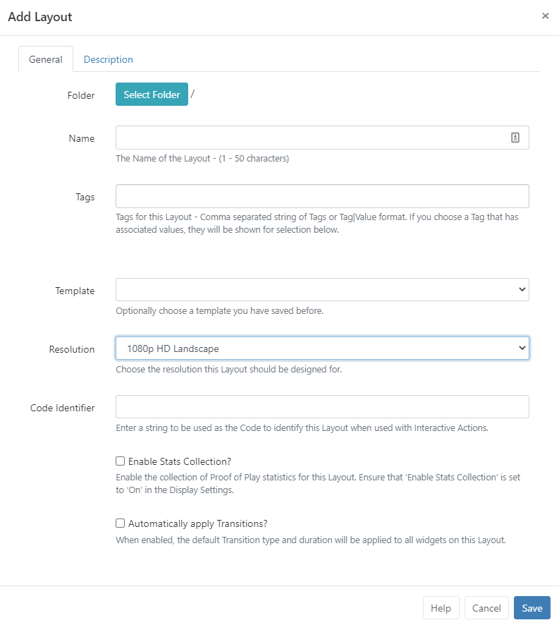

<!--toc=tour-->

# Forms

If you are using a CMS earlier than v3.0.0, please use the following link: [Forms](tour_forms_2.html)

The CMS presents most transactions (actions that **add**/**edit** or **delete** in some way) using **Forms**.

The screenshot below gives an example of a how a form may look using the **Add Layout** form:

## Tabs

Forms can have one or multiple tabs to provide further details and options, complete as required. 

## Folders

Use Folders to easily organise items by clicking on **Select Folder** and selecting the destination folder from the list. 

{tip}
Items that are saved in Folders will inherit the View, Edit, Delete **Share** options that have been applied to the destination Folder for User/User Group access!
{/tip}

The selected folder file path will be shown next to the **Folder** field on the form.

Users can also right click a folder to create a new folder to save to and access further options:

{tip}
Available selections are based on enabled [Features and Sharing](users_features_and_sharing.html) options for a User/User Group.
{/tip}

{nonwhite}
Further information for Administrators regarding Folder access and set-up can be found [here](https://xibo.org.uk/docs/setup/folders-administration)
{/nonwhite}

{white}
For further information regarding Folder access and set-up, please speak to your Administrator.
{/white}

## Form Fields

Each Form has fields that require completion. Each field has a title that explains what the field represents and help text for additional guidance.

## Check Boxes

Options that can be enabled/disabled are presented by check boxes.

{tip}
Forms accessed from a Row Menu may contain an 'auto submit capability', which when selected allows for forms to be automatically submitted. Take a look at the [Grids](tour_grids.html) page for further information.
{/tip}

## Buttons

Every form has a button bar at the bottom for the User to commit or cancel the additions/edits they have made.

{tip}
Most forms also include a **Help** button, which provides a link to sections of this **User Manual** for additional guidance.
{/tip}

