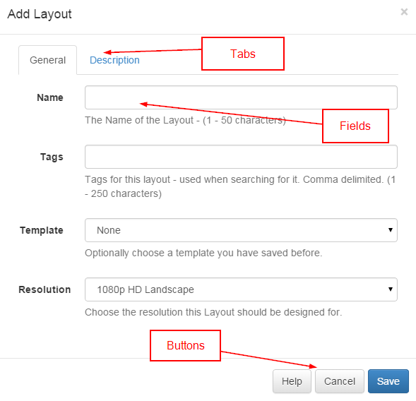

<!--toc=tour-->
#Forms
The CMS presents most transactions (actions that edit the content in some way) using forms.

The forms have been designed to be consistent across the application and provide as much information as possible.

A typical form looks like the Add Layout form below.

##Tabs
Forms can have 1 or more tabs, where the additional tabs are used to hold less important attributes or settings.

Tabs can be accessed by clicking on the tab header.

Some tabs may cause the form to expand to better fit the content inside them.

##Form Fields
The form fields sit inside tabs and represent the attributes on whichever item is being edited. There are different field types for different types of data and most are self-explanatory.

Each field will have a title that explains what the field represents. Each field will also have a grey explanation entry above or below it that better explains.

##Buttons
Every form has a button bar at the bottom for the user to commit or cancel the additions / edits they have made.

Most forms also include a "Help" link to this manual for more information.