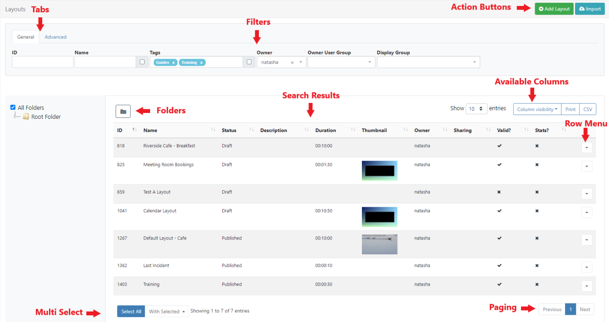
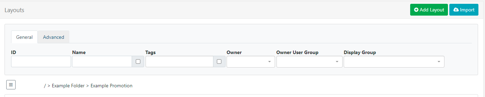
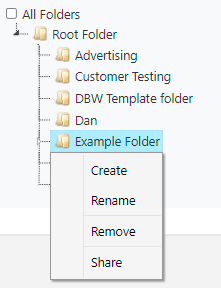
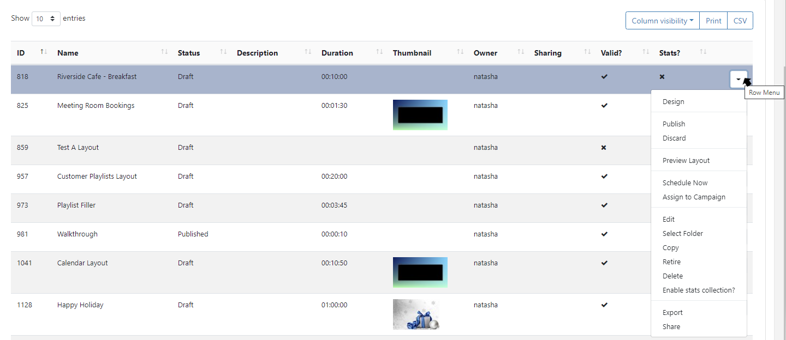

<!--toc=tour-->

# Grids 

{tip}
If you are using a CMS earlier than v3.0.0, please use the following link: [Grids](tour_grids_2.html)
{/tip}

The CMS presents many of the entities,**Layouts**, **Media**, **Displays** for example, as tabular data called **Grids**. Each Grid has a number of elements that combine to create a flexible administration tool that is easy to read and understand.

The following screenshot shows the **Layout Grid** annotated with each of its elements.

## Action Buttons

Common Actions for each page, such as **Add Layout** are located in the top right for ease of access.

## Tabs

Use the available tabs to access **Advanced** filtering options for Grids.

## Filters

Grids have multiple **Filter** fields which can be used to restrict the criteria for returned results.

{tip}
For example all Layouts belonging to a particular **Owner** can be the only results shown in the Grid.
{/tip}

{tip}
Use the checkbox to apply advanced filtering options for Names using Regex!
{/tip}

## Folders

Folders allow Users to easily organise,search and share object easily.  

Available on selected Grids, the Folder tree will open by default.

- Click on a Folder/ sub-folder to search the contents and return results based on any filters applied to the Grid.

or

- Tick **All Folders** to include searching in the Root Folder and return results based on any filters applied to the Grid.

{tip}
Click the Folders menu to toggle on/off from view.  When Folders is hidden from view, the file path for the selected folder will be shown!

{/tip}

Right click a folder to access further options:

{tip}
The Folder tree and menu options are based on enabled [Features and Share](users_features_and_sharing.html) options for a User/User Group.
{/tip}

Items can be saved to Folders when adding/editing or from the Row Menu of an item using the **Select Folder** option.

{tip}
If Share options have been set for a Folder, all objects contained or moved to that Folder will inherit the View, Edit, Delete options applied for Users/User Groups!
{/tip}

{nonwhite}
Further information for Administrators regarding Folder access and set-up can be found [here](https://xibo.org.uk/docs/setup/folders-administration)
{/nonwhite}

{white}
For further information regarding Folder access and set-up, please speak to your Administrator.
{/white}

## Results 

Returned results are shown in available columns. 

{tip}
Most columns can be sorted by default. Where the column has an up or down arrow the **Shift** key can be used to multi-sort the column.
{/tip}

Use the **Column Visibility** button to select/de-select which columns to present in the data table.

## Row Menu

Each row has its own 'Actions' menu which is accessed from a **Row Menu**. 

{tip}
Actions will differ dependant on the page selected.
{/tip}

{tip}
Objects can be moved between **Folders** using the Row Menu **Select Folder** option.
{/tip}

## Automatic Submission of Forms

Selected actions allow for [Forms](tour_forms.html) to be automatically submitted by just clicking on the action from the Row Menu, such as **Checkout** for Layouts **Check Licence** and **Authorise** from the **Displays** page or **Clear Cache** from the **Modules** page. 

Actions that have an 'auto submit' capability will display an option to enable on the form.

Once selected and Saved, forms will be automatically submitted the next time this particular action is selected.

{tip}
Auto form submissions preferences can be reset from the [User Profile](tour_user_profile.html)
{/tip}

## Multi-select - With Selected

Grids include the ability to multi-select rows to perform bulk actions. Available actions that can be applied in multiples are shown by clicking the **With Selected** button at the bottom of the page. 

- #### Edit Tags

  Allows a User to add new Tags with the option of removing any existing Tags from multiple selections.

  

- #### Share

  This option allows Users to edit multiple [Sharing](users_features_and_sharing.html) options at the same time. 

  Elements that are shown with an indeterminate status `-` are the result of a difference in options already set. Any changes made here will be applied to all selected elements.

  {tip}

  **Example scenario**:

  Two Layouts are selected which already have the following Share options applied:

  Layout 1 - view 1, Edit 0, Delete 0

  Layout 2 - View 1, Edit 1, Delete 0

  When multi-selected it would show the following:

  View 1, Edit `-`, Delete 0

  A User makes changes and toggles to:

  View 0, Edit `-`, Delete 1 (leaving Edit in its current status)

  The two Layouts would now have the following Share options set:

  Layout 1 - View 0, Edit 0, Delete 0

  Layout 2 - View 0, Edit 1, Delete 1
  
  {/tip}

{tip}
Available actions are dependent on the page selected.
{/tip}

## Paging

If available, a paging control option will be shown to allow a User to switch between pages of results.

