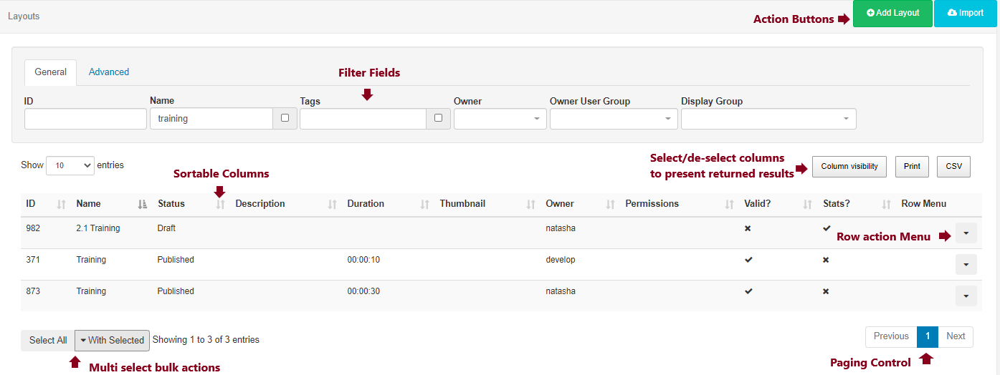

<!--toc=tour-->
#Grids
The CMS presents many of the entities (layouts, media, campaigns, etc) as tabular data called Grids. Each grid has a number of elements that combine to create a flexible administration tool that is easy to read and understand.

The following diagram is the Layout grid annotated with each of its elements.

## Action Buttons
Action buttons are located at the top right of the grid container and provide access to any page wide actions that can be performed. The most common action to feature here is the filter form action to show / hide the filter form (if one is available on the grid). Other common actions include the ability to "Add" a new item.

## Filter Form
Most grids have a filter form which is used to restrict the results in some way. The restriction is typically a filter - for example all Layouts belonging to a particular user. The filter is shown/hidden using the **Filter** button in the action menu and can be kept open using the **Keep Open** checkbox.

Filter forms consist of:
 - text boxes
 - check boxes
 - select lists
 
Text boxes accept 3 special characters:

 - `%`: Matches any set of characters (e.g. "Default Layout" would be matched by D%lt).
 - `_`: Matches exactly one character (e.g. "Default Layout" would not be matched by De_lt but would be by De___lt).
 - `-`: Excluded the subsequent word (e.g. "Default Layout" would not be matched by "Default -Layout"
 - `\`: Used before `%` and `_` removes the special meaning and matches the character

### Keep Open
The selections in the filter form can be memorised for future visits to the same page by ticking the "Keep Open" check box.

## Results
Once the CMS has searched for the filter criteria and returned the results they will be shown in the Grid Data Table below the filter form. The column visibility button which appears to the right and below the filter form is used to select which columns should be presented in the data table. 

### Sortable Columns
Most columns are sortable by default, and where the column has an up or down arrow the "SHIFT" key can also be used to multi-sort the column.

### Row Menu
Each row may also have an action menu for things can can be done to that specific row. This menu can be accessed by clicking the down arrow in the right-most column of each row.

## Multi-select
Some grids include the ability to multi-select rows and perform bulk actions. These are actions that can be run on all of the selected rows at the same time. Once the rows have been selected the "With Selected" button is used to access the bulk actions menu for those rows.

### Paging
If available a paging control will be shown that allows the user to switch between multiple pages of results.