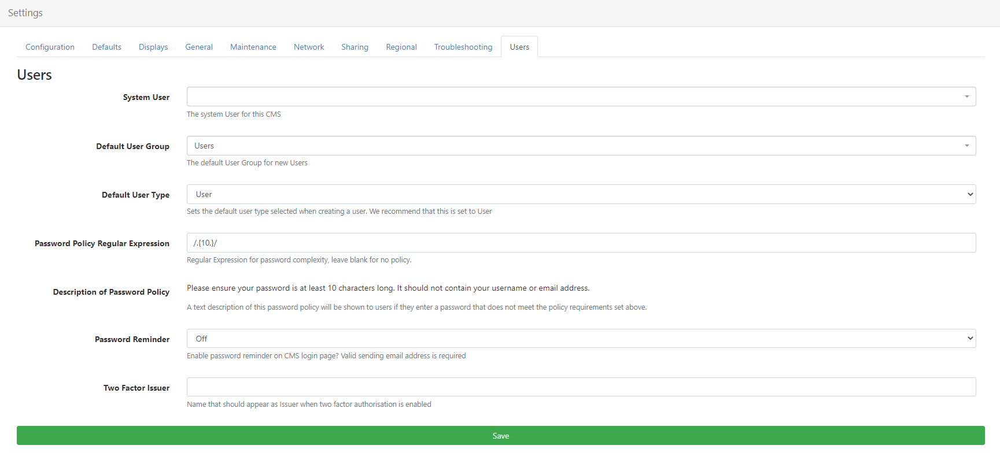

<!--toc=tour-->

# Logging In

The CMS is protected by an authentication system that requires a **Username** and **Password**.

During the installation process,  a Username and Password is provided which grants **unrestricted** access to all areas of the CMS, as a top level **Super Admin** User. 

After installation the Username and Password provided must be used to access the CMS for the first time as a [Super Administrator User](https://xibo.org.uk/manual/en/users_user_types.html#super_admin).

### Password Policy

Once logged in, Administrators can set a **Password Policy Regular Expression** to test password complexity from the **Settings** page under the **Administration** section of the main CMS menu. 

- Click on the **Users** tab:

Complete any valid regular expression in this field, which will cause all password change requests and newly created passwords to be tested against this expression.

{tip}
A text description prompt will be shown to Users when their passwords do not meet the required policy!
{/tip}

{nonwhite}
{cloud}
Customers with [Xibo Cloud Hosting](https://xibo.org.uk/hosting) have a set default policy which requires a password of at least 10 characters.
{/cloud}
{/nonwhite}

### Users

[Users](users.html) can be created by Administrators and given access to the system. The Username and Password for any new User should be shared in a private and secure manner. We highly recommend that the User changes their password after first time log in.

{tip}
Take a look at the **Force Password Change** option on User records!
{/tip}

**All pages** in the CMS are authenticated and if the User is not logged in a login form will appear.

### Password Reminder

Provide a **Forgotten your Password** reset link for **Users** at login. Users can then click the link which will send a **Password Reset Notification** to their stored email address as recorded on their [User Profile](https://xibo.org.uk/manual/en/users_administration.html).

{tip}
**Users** can change their own passwords, once logged into the CMS, by clicking on the Profile Icon located in the top right-hand corner of the CMS.
{/tip}

### Force Password Change at next login

Ensure that new Users change the password first given to them to access the system or use if a User account password has been reset. 

Edit the [User Profile](https://xibo.org.uk/manual/en/users_administration.html) and select the **Options** tab.

### Two Factor Authentication

[Two Factor Authentication](tour_two_factor_authentication.html) can be set by Users for added security. Once configured a User would need to enter a code sent via email or displayed in the Google Authenticator app to complete login and gain access to the CMS. 

Complete the name you wish to appear as the **Two Factor Issuer** for Users who enable Two Factor Authentication. This will appear on the Google Authenticator app and email when authenticated codes are generated.

### Cookies

The CMS uses cookies to track whether Users are logged in or not. If you are experiencing trouble logging in you may need to adjust your browser settings for cookies.

### Successful login

Each User is assigned a [Dashboard](tour_status_dashboard.html) which they will be taken to after login.