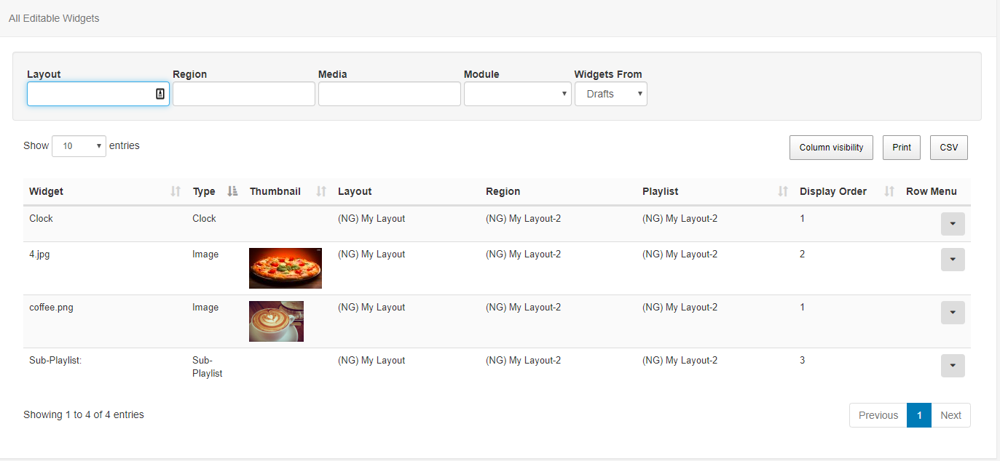

<!--toc=tour-->
#Media Dashboard
The CMS Media Dashboard is intended as a restricted access view of the system for users who should only edit the media they have been given permission for.

It presents a grid style interface which lists out each item the user has permissions to edit and offers the media edit form.

## Settings to enable this view

You want to set your Homepage to 'Media Dashboard'.
Go to User page, click on the row menu and click 'set Homepage' or click edit and set homepage from there. 

## Permisions for a new user

Minimal required permissions to access media manager and view/edit content of your layouts.

Page Security:
* Content
* Homepage and Login

Layout permissions, you will need to assign permissions for each layout you will want your user to have access to in media manager.

Layouts page -> row menu for specific layout -> Permissions
* Check view/edit columns for your user/userGroup
* Check "Update these permissions on all layouts, regions and media."

After all of that, when you log in as your new user, you will see the media manager homepage and will be able to view/edit assigned media items.